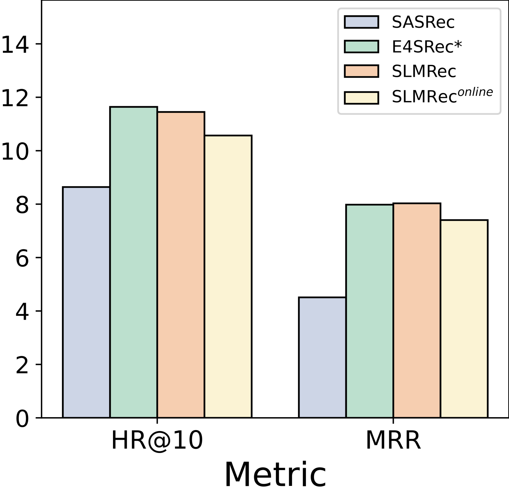

# SLMRec：小型语言模型在序列推荐中的赋能

发布时间：2024年05月28日

`LLM应用

这篇论文主要探讨了大型语言模型（LLMs）在序列推荐任务中的应用，并针对其效率问题提出了改进方案，即开发了一种小型语言模型（SLMRec）。论文通过实验验证了SLMRec在保持性能的同时，显著提高了训练和推理的效率。因此，这篇论文属于LLM应用类别，因为它关注的是如何将LLMs应用于特定的实际问题（序列推荐），并提出了具体的解决方案。` `推荐系统` `电子商务`

> SLMRec: Empowering Small Language Models for Sequential Recommendation

# 摘要

> 序列推荐任务旨在预测用户基于过往交互可能选择的下一个物品。SR模型通过分析用户行为序列，揭示复杂的行为模式和时间动态。研究表明，大型语言模型对序列推荐系统影响深远，无论是将其视为语言建模还是作为用户表示的核心。尽管这些方法性能卓越，但对于在序列推荐中是否必须使用大型语言模型以及所需模型的大小，证据尚不充分。此外，由于LLMs的庞大体积，在日常需处理数十亿流量日志的实际应用中，使用基于LLM的模型效率低下且不切实际。本文通过大规模工业数据集上的广泛实验，揭示了LLMs深度的影响，并意外发现大多数中间层是多余的。基于这一发现，我们开发了SLMRec，一种专为序列推荐设计的小型语言模型，采用简单高效的知识蒸馏技术。SLMRec与其他后训练效率技术兼容，如量化和剪枝，可协同提升性能。实验结果显示，SLMRec以仅13%的参数达到了基于LLM模型的最佳性能，同时训练和推理速度分别提升了6.6倍和8.0倍。

> The sequential Recommendation (SR) task involves predicting the next item a user is likely to interact with, given their past interactions. The SR models examine the sequence of a user's actions to discern more complex behavioral patterns and temporal dynamics. Recent research demonstrates the great impact of LLMs on sequential recommendation systems, either viewing sequential recommendation as language modeling or serving as the backbone for user representation. Although these methods deliver outstanding performance, there is scant evidence of the necessity of a large language model and how large the language model is needed, especially in the sequential recommendation scene. Meanwhile, due to the huge size of LLMs, it is inefficient and impractical to apply a LLM-based model in real-world platforms that often need to process billions of traffic logs daily. In this paper, we explore the influence of LLMs' depth by conducting extensive experiments on large-scale industry datasets. Surprisingly, we discover that most intermediate layers of LLMs are redundant. Motivated by this insight, we empower small language models for SR, namely SLMRec, which adopt a simple yet effective knowledge distillation method. Moreover, SLMRec is orthogonal to other post-training efficiency techniques, such as quantization and pruning, so that they can be leveraged in combination. Comprehensive experimental results illustrate that the proposed SLMRec model attains the best performance using only 13% of the parameters found in LLM-based recommendation models, while simultaneously achieving up to 6.6x and 8.0x speedups in training and inference time costs, respectively.

[Arxiv](https://arxiv.org/abs/2405.17890)