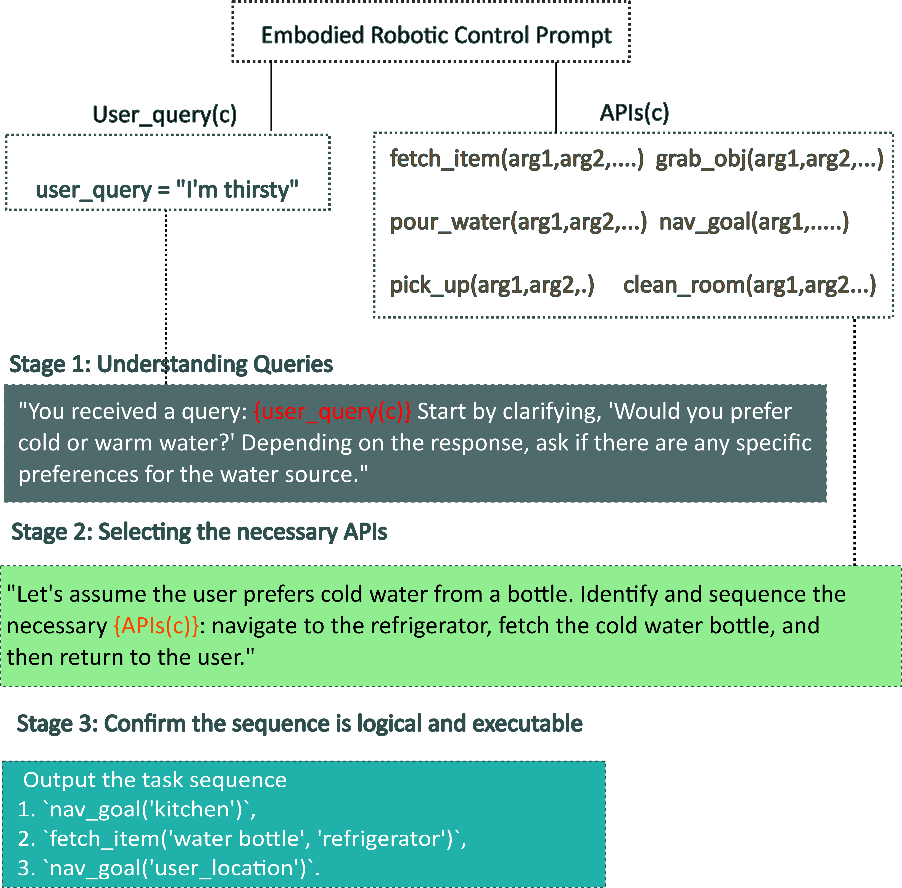
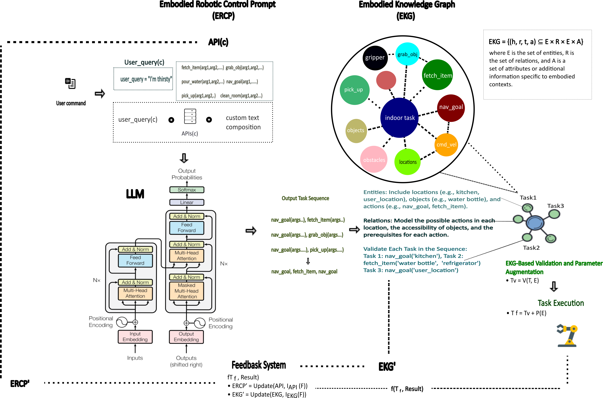
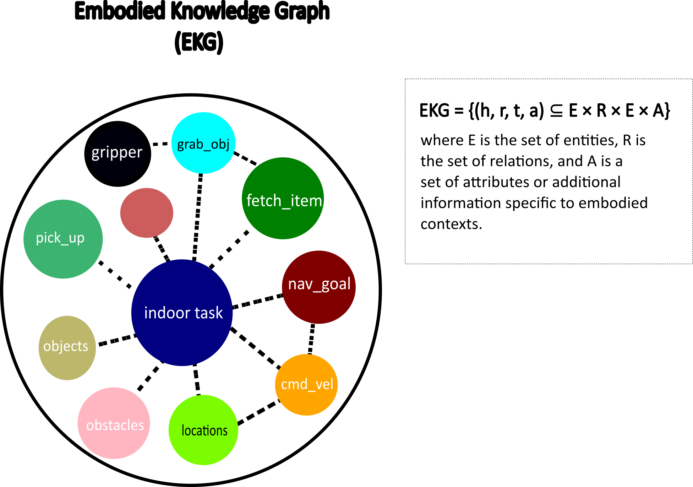
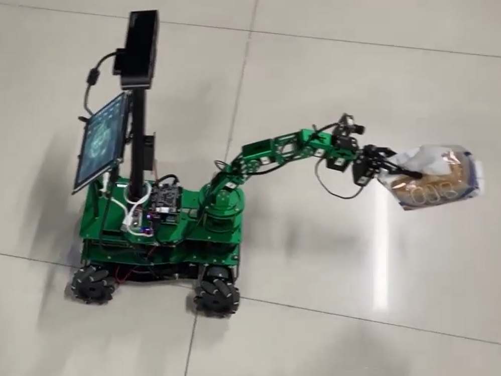
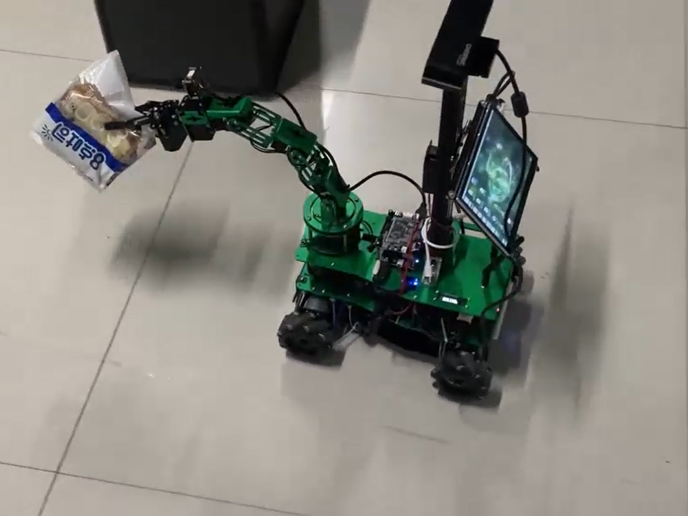
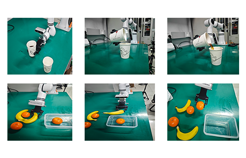

# 结合大型语言模型与具身知识图谱，提升服务机器人的安全控制水平

发布时间：2024年05月28日

`Agent

这篇论文主要探讨了如何通过结合大型语言模型（LLMs）、具身机器人控制提示（ERCPs）和具身知识图谱（EKGs）来强化服务机器人的安全框架，确保机器人在执行任务时遵守安全标准。这种方法涉及到了具体的机器人操作和控制，以及如何利用LLMs来生成安全且精确的响应，并通过EKGs进行验证。因此，这篇论文更符合Agent分类，因为它关注的是如何通过技术手段提升机器人的自主性和安全性，这是Agent领域的一个重要研究方向。` `服务机器人` `人工智能安全`

> Safety Control of Service Robots with LLMs and Embodied Knowledge Graphs

# 摘要

> 跨行业服务机器人的安全限制引发了对于确保机器人遵守安全实践的强大机制的需求，以防止可能伤害人类或造成财产损失的行为。尽管技术进步，如知识图谱（KGs）与大型语言模型（LLMs）的结合，但在确保自主机器人行动的持续安全方面仍面临挑战。本文提出了一种创新方法，将大型语言模型与具身机器人控制提示（ERCPs）和具身知识图谱（EKGs）结合，以强化服务机器人的安全框架。ERCPs作为预设指令，确保LLMs生成安全和精确的响应，这些响应再由EKGs验证，EKGs提供全面知识库，确保机器人行动始终遵循安全协议，从而在各种情境中提升操作安全性。我们的实验涵盖了多样化的现实任务，结果显示，采用我们框架的机器人比传统方法更严格遵守安全标准。此整合不仅促进了安全的人机互动，也将我们的方法推向了服务机器人领域AI驱动安全创新的前沿。

> Safety limitations in service robotics across various industries have raised significant concerns about the need for robust mechanisms ensuring that robots adhere to safe practices, thereby preventing actions that might harm humans or cause property damage. Despite advances, including the integration of Knowledge Graphs (KGs) with Large Language Models (LLMs), challenges in ensuring consistent safety in autonomous robot actions persist. In this paper, we propose a novel integration of Large Language Models with Embodied Robotic Control Prompts (ERCPs) and Embodied Knowledge Graphs (EKGs) to enhance the safety framework for service robots. ERCPs are designed as predefined instructions that ensure LLMs generate safe and precise responses. These responses are subsequently validated by EKGs, which provide a comprehensive knowledge base ensuring that the actions of the robot are continuously aligned with safety protocols, thereby promoting safer operational practices in varied contexts. Our experimental setup involved diverse real-world tasks, where robots equipped with our framework demonstrated significantly higher compliance with safety standards compared to traditional methods. This integration fosters secure human-robot interactions and positions our methodology at the forefront of AI-driven safety innovations in service robotics.

[Arxiv](https://arxiv.org/abs/2405.17846)