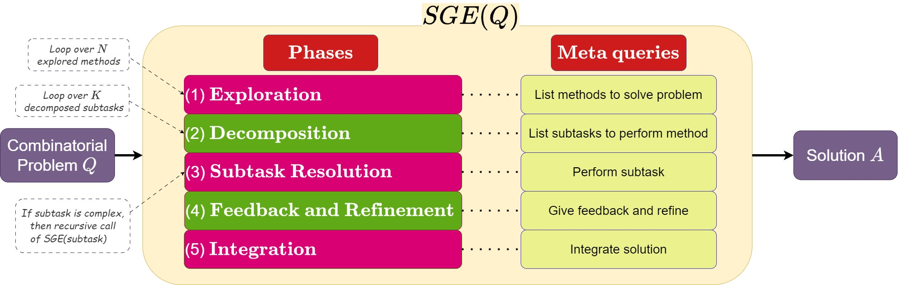
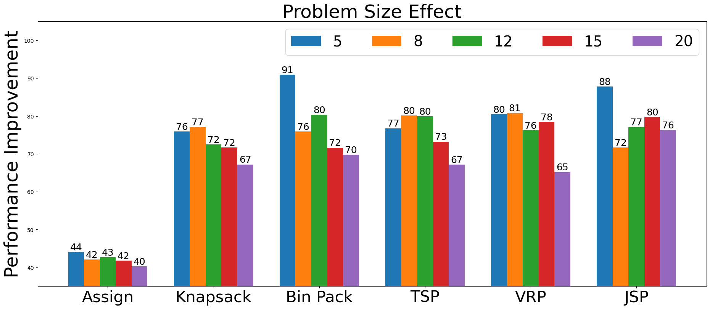
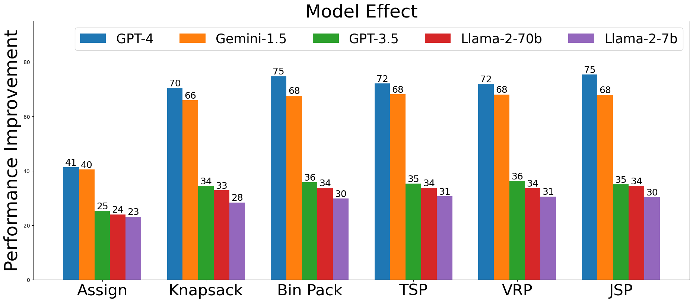

# 组合问题中的自引导探索策略

发布时间：2024年05月28日

`LLM应用

这篇论文探讨了大型语言模型（LLMs）在解决组合问题（CPs）中的应用，并提出了一种新的提示策略——自我引导探索（SGE）。这种方法通过自主生成多条思维路径，分解子任务并逐一执行，最终通过细化确保最佳结果。论文的主要贡献在于将LLMs应用于CPs，并展示了SGE在提升问题解决效率和准确性方面的优越性。因此，这篇论文属于LLM应用类别，因为它专注于LLMs在特定问题领域的实际应用和改进。` `资源管理`

> Self-Guiding Exploration for Combinatorial Problems

# 摘要

> 大型语言模型（LLMs）已成为解决跨领域推理任务的关键，如算术、常识和符号推理，通过使用探索思维、分解和细化等提示技术。然而，对于NP难度高且在物流和资源管理中至关重要的组合问题（CPs），LLMs的应用尚未充分探索。为此，我们提出了一种创新的提示策略——自我引导探索（SGE），旨在提升CPs的解决效率。SGE能自主生成多条思维路径，将它们分解为子任务并逐一执行，最终通过细化确保最佳结果。我们的研究首次将LLMs广泛应用于CPs，并证明SGE在CP优化性能上超越现有策略27.84%，同时在其他推理任务上的准确性也提高了2.46%。

> Large Language Models (LLMs) have become pivotal in addressing reasoning tasks across diverse domains, including arithmetic, commonsense, and symbolic reasoning. They utilize prompting techniques such as Exploration-of-Thought, Decomposition, and Refinement to effectively navigate and solve intricate tasks. Despite these advancements, the application of LLMs to Combinatorial Problems (CPs), known for their NP-hardness and critical roles in logistics and resource management remains underexplored. To address this gap, we introduce a novel prompting strategy: Self-Guiding Exploration (SGE), designed to enhance the performance of solving CPs. SGE operates autonomously, generating multiple thought trajectories for each CP task. It then breaks these trajectories down into actionable subtasks, executes them sequentially, and refines the results to ensure optimal outcomes. We present our research as the first to apply LLMs to a broad range of CPs and demonstrate that SGE outperforms existing prompting strategies by over 27.84% in CP optimization performance. Additionally, SGE achieves a 2.46% higher accuracy over the best existing results in other reasoning tasks (arithmetic, commonsense, and symbolic).

[Arxiv](https://arxiv.org/abs/2405.17950)