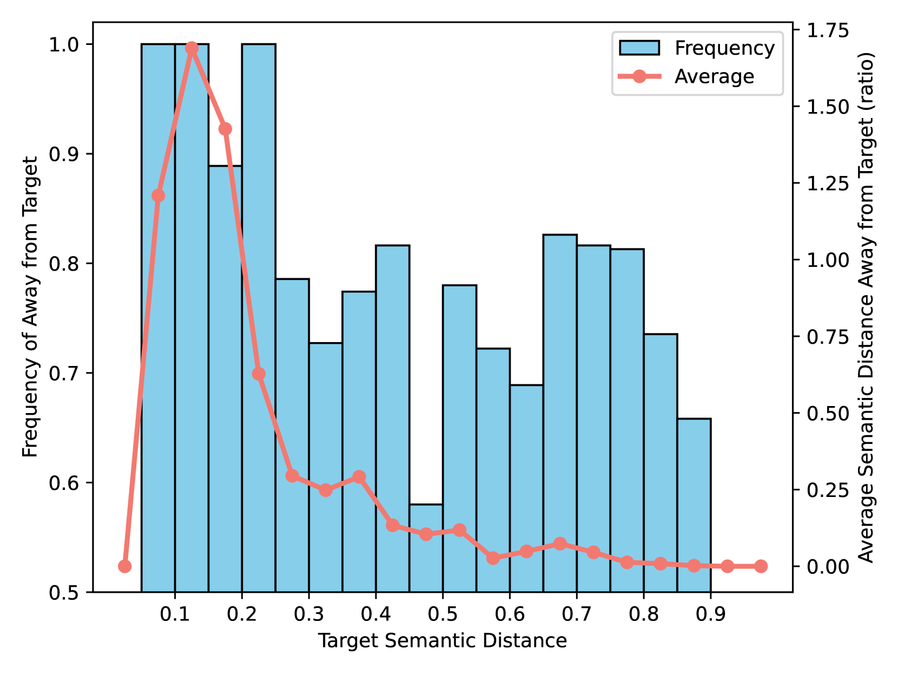

# 语义如灯塔：探索知识学习中参数高效微调的语义视角

发布时间：2024年05月28日

`LLM理论

这篇论文主要探讨了参数高效的微调（PEFT）方法在大型语言模型（LLMs）中应用时，特别是在精确的事实知识学习方面遇到的问题。论文通过分析PEFT方法在知识学习上的局限性，提出了数据过滤与重新加权学习策略来改进这一过程。这些策略的提出和实验验证，以及对PEFT方法在语义层面挑战的深入分析，都更偏向于对LLM理论的探讨和改进，而非具体的应用、Agent设计或RAG架构。因此，将其归类为LLM理论是合适的。` `机器学习`

> Semantic are Beacons: A Semantic Perspective for Unveiling Parameter-Efficient Fine-Tuning in Knowledge Learning

# 摘要

> 参数高效的微调（PEFT）方法让大型语言模型（LLMs）轻松适应多变下游应用，但一旦涉及精确的事实知识学习，其效果便大打折扣。本文从语义视角深入探讨，揭示了PEFT在知识学习上的短板：一方面，PEFT可能误导模型偏离知识目标；另一方面，知识间的相互干扰阻碍了特征的学习与表达。为此，我们提出数据过滤与重新加权学习策略，前者剔除不利于知识学习的数据，后者则让模型在知识学习中更注重语义距离。实验证明，这些策略在开源大型语言模型上成效显著，不仅验证了PEFT面临的语义挑战，也为未来研究指明了方向。

> Parameter-Efficient Fine-Tuning (PEFT) methods enable efficient adaptation of Large Language Models (LLMs) to various downstream applications. However, the effectiveness of the PEFT diminishes notably when downstream tasks require accurate learning of factual knowledge. In this paper, we adopt a semantic perspective to investigate this phenomenon, uncovering the reasons behind PEFT's limitations in knowledge learning task. Our findings reveal that: (1) PEFT presents a notable risk of pushing the model away from the intended knowledge target; (2) multiple knowledge interfere with each other, and such interference suppresses the learning and expression of knowledge features. Based on these insights, we introduce a data filtering strategy to exclude data that is detrimental to knowledge learning and a re-weighted learning strategy to make the model attentive to semantic distance during knowledge learning. Experimental results demonstrate the effectiveness of the proposed method on open-source large language model, further validate the semantic challenge in PEFT, thus paving the way for future research.

[Arxiv](https://arxiv.org/abs/2405.18292)