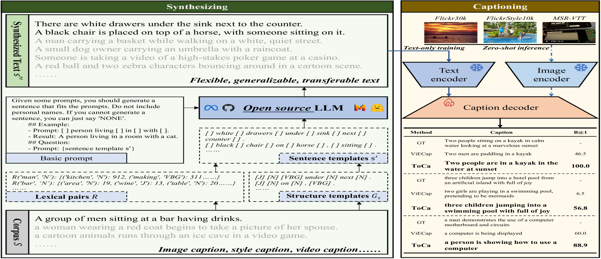

# 图像标题生成中的纯文本合成

发布时间：2024年05月28日

`LLM应用

这篇论文介绍了一种名为ToCa的方法，用于仅文本合成图像标注，旨在减少对高质量大规模数据标注的依赖。该方法通过将标注文本分解为结构和词汇元素，并利用大型语言模型生成多样化的标注，从而提升模型的零-shot泛化能力。论文还定义了三种合成场景，并通过实验验证了ToCa在这些场景中的有效性。因此，这篇论文属于LLM应用类别，因为它展示了如何应用大型语言模型来解决实际问题，即图像标注。` `图像标注`

> Text-only Synthesis for Image Captioning

# 摘要

> 在图像标注领域，从依赖配对图像-文本训练转向仅文本训练，我们始终致力于降低对高质量大规模数据标注的依赖。本文提出的仅文本合成图像标注（ToCa）方法，通过减少人力和计算时间，进一步推动了这一目标。我们巧妙地将标注文本分解为结构和词汇元素，作为构建标注的基础。通过将这些元素组合输入大型语言模型，我们能够生成包含多样化词汇模式的大量标注。这种方法不仅接近目标领域，还通过创造新标注超越了它，显著提升了模型的零-shot泛化能力。针对现实世界中不同级别的数据访问，我们定义了三种合成场景：跨域合成、域内合成和数据高效合成。实验结果显示，ToCa在这些场景中表现出色，零-shot跨域标注的CIDEr提升了近5分，数据高效标注的最大增幅超过20分，证明了其广泛的应用潜力和实用性。

> From paired image-text training to text-only training for image captioning, the pursuit of relaxing the requirements for high-cost and large-scale annotation of good quality data remains consistent. In this paper, we propose Text-only Synthesis for Image Captioning (ToCa), which further advances this relaxation with fewer human labor and less computing time. Specifically, we deconstruct caption text into structures and lexical words, which serve as the fundamental components of the caption. By combining different structures and lexical words as inputs to the large language model, massive captions that contain various patterns of lexical words are generated. This method not only approaches the target domain but also surpasses it by generating new captions, thereby enhancing the zero-shot generalization ability of the model. Considering the different levels of data access in the real world, we define three synthesis scenarios: cross-domain synthesis, in-domain synthesis, and data-efficient synthesis. Experiments in these scenarios demonstrate the generalizability, transferability and practicability of ToCa with a nearly 5 CIDEr improvement for zero-shot cross-domain captioning and a maximum increase of over 20 CIDEr for data-efficient captioning.

[Arxiv](https://arxiv.org/abs/2405.18258)