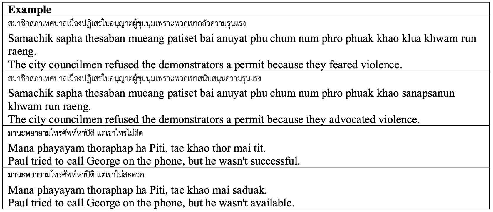

# 泰国Winograd模式：泰国常识推理的新基准

发布时间：2024年05月28日

`LLM应用

理由：这篇论文主要关注的是在泰语环境下对大型语言模型（LLM）进行常识推理能力的评估，并推出了一个泰语Winograd模式数据集。这属于对LLM在特定语言环境下的应用研究，因此归类为LLM应用。论文并未深入探讨LLM的理论基础，也没有涉及Agent或RAG的相关内容。` `常识推理`

> Thai Winograd Schemas: A Benchmark for Thai Commonsense Reasoning

# 摘要

> 常识推理在自然语言理解中占据重要地位，但多数评估基准仅限于英语。本研究推出了一套泰语Winograd模式，旨在通过跨语言评估深入理解不同语言。这一新颖数据集通过母语者、专业翻译者的参与及严格验证，精准捕捉泰语的细微之处、习语及文化元素，同时保留了常识推理的挑战性。我们对主流大型语言模型进行了测试，揭示了它们在泰语环境下的表现差异，强调了多语言常识推理技术的提升空间。尽管GPT-4和Claude-3-Opus在英语中表现出色，但在泰语中的准确率却大幅下降，凸显了该领域的研究需求。

> Commonsense reasoning is one of the important aspect of natural language understanding, with several benchmarks developed to evaluate it. However, only a few of these benchmarks are available in languages other than English. Developing parallel benchmarks facilitates cross-lingual evaluation, enabling a better understanding of different languages. This research introduces a collection of Winograd Schemas in Thai, a novel dataset designed to evaluate commonsense reasoning capabilities in the context of the Thai language.
  Through a methodology involving native speakers, professional translators, and thorough validation, the schemas aim to closely reflect Thai language nuances, idioms, and cultural references while maintaining ambiguity and commonsense challenges. We evaluate the performance of popular large language models on this benchmark, revealing their strengths, limitations, and providing insights into the current state-of-the-art. Results indicate that while models like GPT-4 and Claude-3-Opus achieve high accuracy in English, their performance significantly drops in Thai, highlighting the need for further advancements in multilingual commonsense reasoning.

[Arxiv](https://arxiv.org/abs/2405.18375)