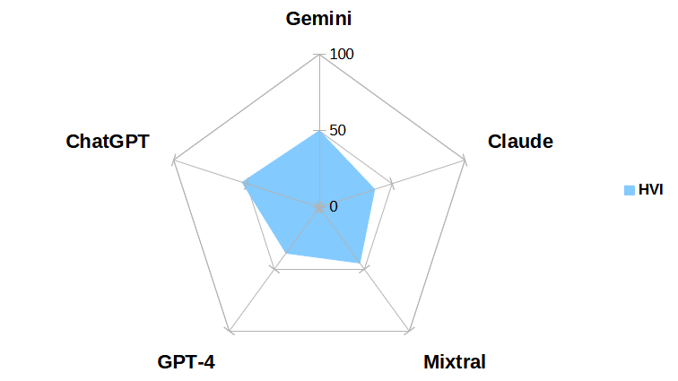

# 语言模型大比拼：对话问答任务的深度对比研究

发布时间：2024年05月28日

`LLM应用

理由：这篇论文摘要主要讨论了大型语言模型（如ChatGPT、GPT-4等）在多个领域的应用，包括客户服务、教育、医疗和金融等，并通过分析这些模型在对话QA语料库中的表现来评估它们的性能和潜在弱点。这表明研究的重点在于这些模型的实际应用和性能评估，而不是它们的理论基础或特定的Agent或RAG机制。因此，最合适的分类是LLM应用。` `客户服务`

> The Battle of LLMs: A Comparative Study in Conversational QA Tasks

# 摘要

> 大型语言模型如ChatGPT、GPT-4、Gemini、Mixtral和Claude因其卓越性能备受瞩目，广泛应用于客户服务、教育、医疗和金融等领域。这些模型不仅包括OpenAI和Google的明星产品，还有Mistral AI和Anthropic的新秀。特别是Mistral，以其创新内容生成能力吸引了众多用户。理解用户视角对于评估这些技术在各领域的潜力和挑战至关重要。本研究通过分析这些模型在多个对话QA语料库中的表现，细致评估了它们的性能，并指出了可能的弱点。这项研究不仅全面比较了这些尖端语言模型，还揭示了它们的能力和改进空间。

> Large language models have gained considerable interest for their impressive performance on various tasks. Within this domain, ChatGPT and GPT-4, developed by OpenAI, and the Gemini, developed by Google, have emerged as particularly popular among early adopters. Additionally, Mixtral by Mistral AI and Claude by Anthropic are newly released, further expanding the landscape of advanced language models. These models are viewed as disruptive technologies with applications spanning customer service, education, healthcare, and finance. More recently, Mistral has entered the scene, captivating users with its unique ability to generate creative content. Understanding the perspectives of these users is crucial, as they can offer valuable insights into the potential strengths, weaknesses, and overall success or failure of these technologies in various domains. This research delves into the responses generated by ChatGPT, GPT-4, Gemini, Mixtral and Claude across different Conversational QA corpora. Evaluation scores were meticulously computed and subsequently compared to ascertain the overall performance of these models. Our study pinpointed instances where these models provided inaccurate answers to questions, offering insights into potential areas where they might be susceptible to errors. In essence, this research provides a comprehensive comparison and evaluation of these state of-the-art language models, shedding light on their capabilities while also highlighting potential areas for improvement

[Arxiv](https://arxiv.org/abs/2405.18344)