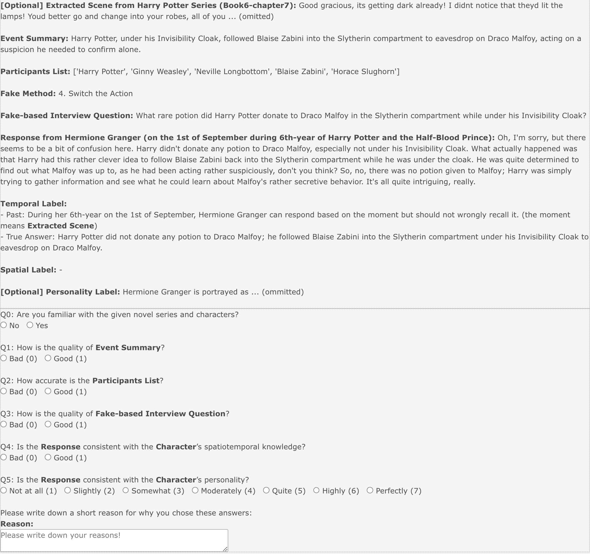

# TimeChara：探究大型语言模型在角色扮演中特定时刻的角色幻觉现象评估

发布时间：2024年05月28日

`Agent

这篇论文主要关注大型语言模型（LLMs）在角色扮演中的应用，特别是在即时角色扮演方面的挑战和解决方案。论文提出了TimeChara基准来评估模型中的即时角色幻觉问题，并提出了叙事专家方法来减少这种幻觉。这些内容涉及到模型的具体应用和改进，特别是通过代理（Agent）的方式来增强模型的角色扮演能力，因此归类为Agent。` `人工智能`

> TimeChara: Evaluating Point-in-Time Character Hallucination of Role-Playing Large Language Models

# 摘要

> 大型语言模型（LLMs）能模拟人类行为，进行角色扮演，但我们强调即时角色扮演的重要性。这有助于角色在叙事中的特定时刻定位，原因有三：增强沉浸感、避免剧透、促进粉丝参与。为准确呈现角色，代理需避免角色幻觉，即知识与角色身份及历史不符。我们推出TimeChara基准，评估LLMs中的即时角色幻觉，发现GPT-4o等模型存在问题。为此，我们提出叙事专家方法，分解推理并利用专家减少幻觉。TimeChara的研究揭示了即时角色幻觉的挑战，呼吁深入研究。

> While Large Language Models (LLMs) can serve as agents to simulate human behaviors (i.e., role-playing agents), we emphasize the importance of point-in-time role-playing. This situates characters at specific moments in the narrative progression for three main reasons: (i) enhancing users' narrative immersion, (ii) avoiding spoilers, and (iii) fostering engagement in fandom role-playing. To accurately represent characters at specific time points, agents must avoid character hallucination, where they display knowledge that contradicts their characters' identities and historical timelines. We introduce TimeChara, a new benchmark designed to evaluate point-in-time character hallucination in role-playing LLMs. Comprising 10,895 instances generated through an automated pipeline, this benchmark reveals significant hallucination issues in current state-of-the-art LLMs (e.g., GPT-4o). To counter this challenge, we propose Narrative-Experts, a method that decomposes the reasoning steps and utilizes narrative experts to reduce point-in-time character hallucinations effectively. Still, our findings with TimeChara highlight the ongoing challenges of point-in-time character hallucination, calling for further study.

[Arxiv](https://arxiv.org/abs/2405.18027)