# 从FP8到回归：探究精度降低对大型语言模型训练稳定性的量化影响

发布时间：2024年05月28日

`LLM理论

理由：这篇论文主要探讨了大型语言模型（LLM）预训练中使用降低精度浮点表示（如BF16和FP8）的稳定性和敏感性问题。论文通过提出新的评估技术和度量来量化自回归语言模型的损失景观锐度，并探讨了表示能力与训练稳定性的关系。这些内容属于对LLM训练方法的理论研究，特别是关于训练精度和稳定性的理论探讨，因此归类为LLM理论。` `机器学习` `计算优化`

> To FP8 and Back Again: Quantifying the Effects of Reducing Precision on LLM Training Stability

# 摘要

> 大型语言模型（LLM）预训练的高昂计算成本促使研究者们探索降低精度浮点表示，以加速训练过程。BrainFloat16（BF16）已成为LLM训练的标准，新加速器已提供硬件支持。最新处理器中，FP8的引入更是推动了这一趋势。然而，FP16的不稳定性经验让人担忧，位数更少的FP8是否能成为经济高效的训练选择。我们认为，降低精度的训练方案需保持与高精度方案相当的稳定性和敏感性，才能真正经济。目前FP8训练方法的不足促使我们深入研究其在不同随机种子和学习率下的稳定性。为此，我们提出新的评估技术和度量，用以量化自回归语言模型的损失景观锐度，并通过模拟浮点精度的逐步降低，探讨表示能力与训练稳定性的关系，以期为该领域的未来研究提供指导。

> The massive computational costs associated with large language model (LLM) pretraining have spurred great interest in reduced-precision floating-point representations to accelerate the process. As a result, the BrainFloat16 (BF16) precision has become the de facto standard for LLM training, with hardware support included in recent accelerators. This trend has gone even further in the latest processors, where FP8 has recently been introduced. However, prior experience with FP16, which was found to be less stable than BF16, raises concerns as to whether FP8, with even fewer bits than FP16, can be a cost-effective option for LLM training. We argue that reduced-precision training schemes must have similar training stability and hyperparameter sensitivities to their higher-precision counterparts in order to be cost-effective. However, we find that currently available methods for FP8 training are not robust enough to allow their use as economical replacements. This prompts us to investigate the stability of reduced-precision LLM training in terms of robustness across random seeds and learning rates. To this end, we propose new evaluation techniques and a new metric for quantifying loss landscape sharpness in autoregressive language models. By simulating incremental bit reductions in floating-point representations, we analyze the relationship between representational power and training stability with the intent of aiding future research into the field.

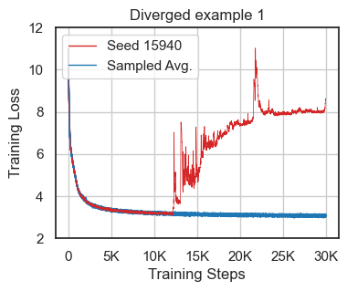

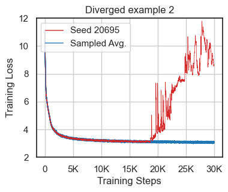

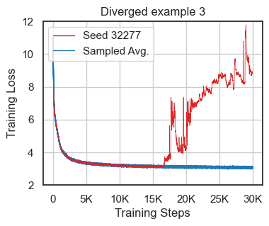

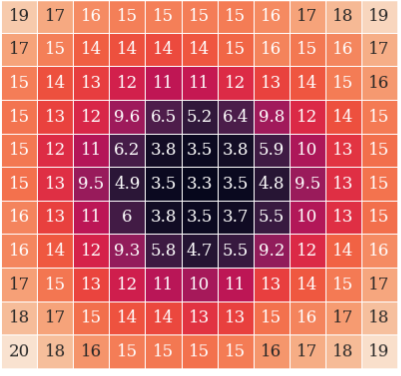

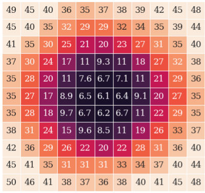

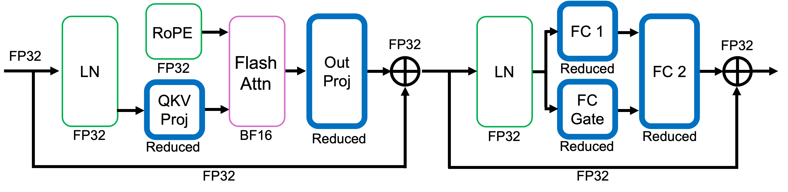

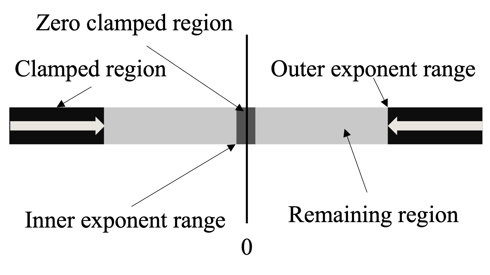

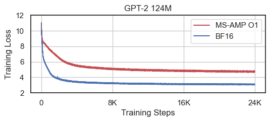

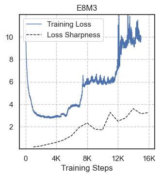

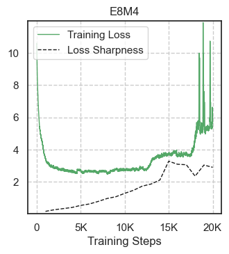

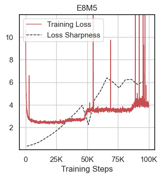

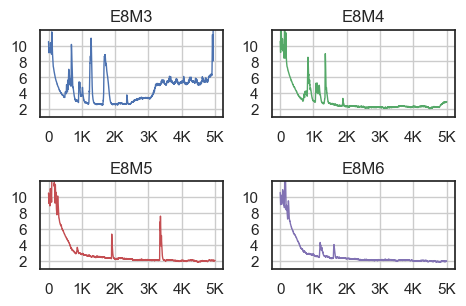

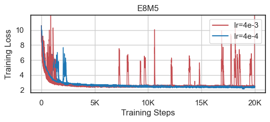

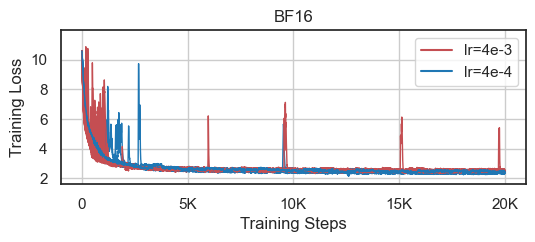

[Arxiv](https://arxiv.org/abs/2405.18710)