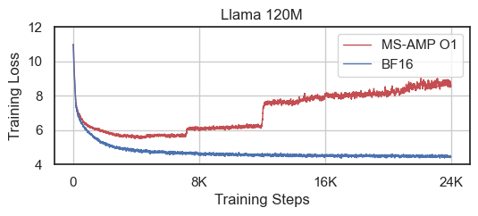

# 从FP8到回归：探究降低精度对大型语言模型训练稳定性的量化影响

发布时间：2024年05月28日

`LLM理论

这篇论文主要探讨了大型语言模型（LLM）预训练中降低精度的浮点表示法，如BF16和FP8，以及它们对训练稳定性和敏感性的影响。研究者关注的是如何通过降低精度来加速训练过程，同时保持模型的稳定性和性能。这涉及到对LLM训练方法的理论分析和改进，因此属于LLM理论分类。` `机器学习` `计算效率`

> To FP8 and Back Again: Quantifying the Effects of Reducing Precision on LLM Training Stability

# 摘要

> 大型语言模型（LLM）预训练的高昂计算成本促使研究者探索降低精度的浮点表示法，以加速训练过程。BrainFloat16（BF16）已成为LLM训练的事实标准，并得到最新加速器的硬件支持。最新处理器中甚至引入了更低的FP8精度。然而，鉴于FP16稳定性不如BF16，人们担心FP8是否能成为经济高效的训练选择。我们认为，降低精度的训练方案需保持与高精度方案相似的稳定性和敏感性。目前，FP8训练方法的鲁棒性不足，无法作为经济替代方案。因此，我们研究了降低精度LLM训练在不同随机种子和学习率下的稳定性，并提出了新的评估技术和度量标准，以量化自回归语言模型的损失景观锐度。通过模拟浮点表示精度的逐步降低，我们探讨了表示能力与训练稳定性的关系，旨在为该领域的未来研究提供指导。

> The massive computational costs associated with large language model (LLM) pretraining have spurred great interest in reduced-precision floating-point representations to accelerate the process. As a result, the BrainFloat16 (BF16) precision has become the de facto standard for LLM training, with hardware support included in recent accelerators. This trend has gone even further in the latest processors, where FP8 has recently been introduced. However, prior experience with FP16, which was found to be less stable than BF16, raises concerns as to whether FP8, with even fewer bits than FP16, can be a cost-effective option for LLM training. We argue that reduced-precision training schemes must have similar training stability and hyperparameter sensitivities to their higher-precision counterparts in order to be cost-effective. However, we find that currently available methods for FP8 training are not robust enough to allow their use as economical replacements. This prompts us to investigate the stability of reduced-precision LLM training in terms of robustness across random seeds and learning rates. To this end, we propose new evaluation techniques and a new metric for quantifying loss landscape sharpness in autoregressive language models. By simulating incremental bit reductions in floating-point representations, we analyze the relationship between representational power and training stability with the intent of aiding future research into the field.

[Arxiv](https://arxiv.org/abs/2405.18710)