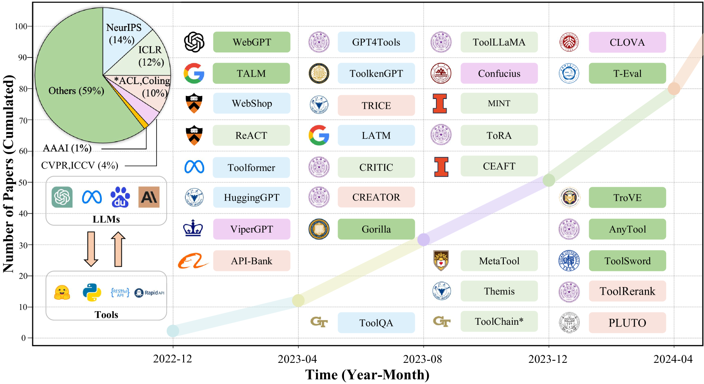

# 大型语言模型在工具学习领域的应用综述

发布时间：2024年05月28日

`LLM应用

这篇论文摘要主要讨论了大型语言模型（LLMs）在工具学习方面的应用，包括工具集成、工具学习范式的优势、工具学习流程的关键阶段以及相关的基准测试和评估方法。此外，论文还探讨了当前的挑战和未来的发展方向。这些内容主要集中在LLMs的实际应用层面，即如何通过工具学习提升LLMs解决复杂问题的能力，因此适合归类为LLM应用。` `人工智能` `教育研究`

> Tool Learning with Large Language Models: A Survey

# 摘要

> 近期，借助大型语言模型（LLMs）的工具学习崭露头角，成为提升LLMs解决复杂问题能力的一种有前景的方法。尽管该领域日益受到关注且进展迅速，但现有文献仍显零散，缺乏系统性，为新入行者设置了障碍。鉴于此，我们进行了一项关于LLMs工具学习的全面调查。本次调查聚焦于两个核心问题：工具学习的益处及其实施方式，以期全面理解LLMs的工具学习。我们首先从六个具体角度探讨了工具集成及工具学习范式的优势。接着，我们依据工具学习流程的四个关键阶段（任务规划、工具选择、工具调用和响应生成），系统地梳理了相关文献。此外，我们还详细总结了现有的基准测试和评估方法，并根据它们与不同阶段的关联性进行了分类。最后，我们探讨了当前面临的挑战，并展望了未来的发展方向，旨在激发研究人员和工业开发者对这一新兴领域的进一步探索。

> Recently, tool learning with large language models (LLMs) has emerged as a promising paradigm for augmenting the capabilities of LLMs to tackle highly complex problems. Despite growing attention and rapid advancements in this field, the existing literature remains fragmented and lacks systematic organization, posing barriers to entry for newcomers. This gap motivates us to conduct a comprehensive survey of existing works on tool learning with LLMs. In this survey, we focus on reviewing existing literature from the two primary aspects (1) why tool learning is beneficial and (2) how tool learning is implemented, enabling a comprehensive understanding of tool learning with LLMs. We first explore the "why" by reviewing both the benefits of tool integration and the inherent benefits of the tool learning paradigm from six specific aspects. In terms of "how", we systematically review the literature according to a taxonomy of four key stages in the tool learning workflow: task planning, tool selection, tool calling, and response generation. Additionally, we provide a detailed summary of existing benchmarks and evaluation methods, categorizing them according to their relevance to different stages. Finally, we discuss current challenges and outline potential future directions, aiming to inspire both researchers and industrial developers to further explore this emerging and promising area.

[Arxiv](https://arxiv.org/abs/2405.17935)