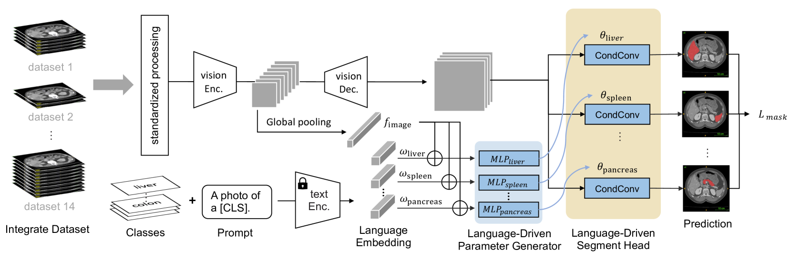
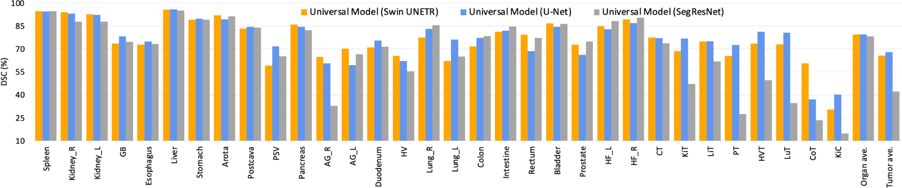
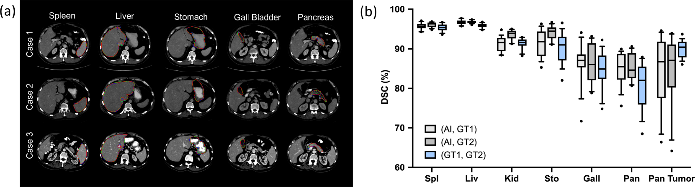
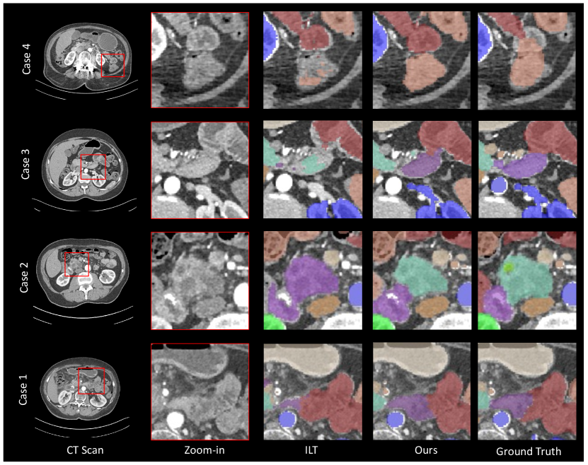
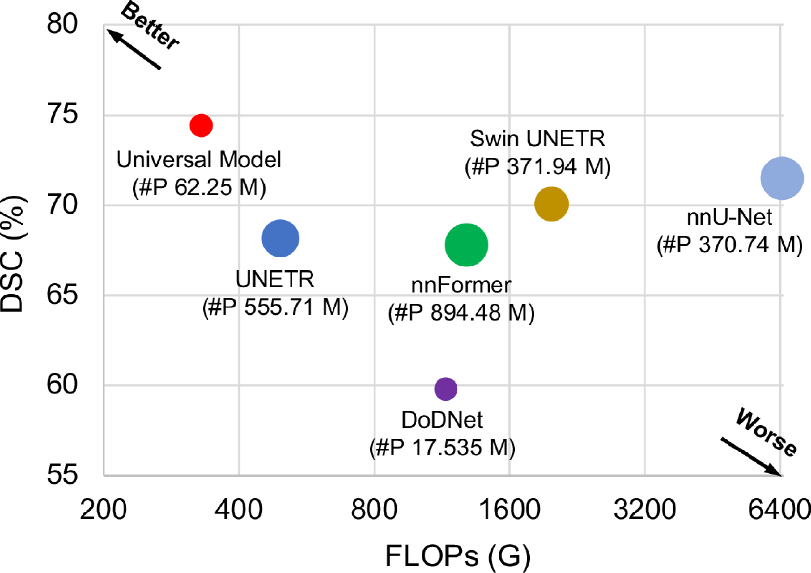

# 针对腹部CT扫描的器官分割与肿瘤检测，我们开发了一种通用且可扩展的语言-视觉模型。

发布时间：2024年05月28日

`LLM应用

理由：这篇论文介绍了一种利用大型语言模型（LLM）的语言嵌入来增强语义编码的通用模型，该模型用于处理医学图像分割和肿瘤检测。这种方法展示了LLM在特定应用领域（如医学图像处理）的实际应用，因此属于LLM应用类别。论文中提到的模型设计和实现，以及其在多个数据集上的测试结果，都强调了LLM在解决实际问题中的应用价值。` `人工智能`

> Universal and Extensible Language-Vision Models for Organ Segmentation and Tumor Detection from Abdominal Computed Tomography

# 摘要

> 随着计算机断层扫描（CT）数据集的增多，人工智能（AI）在器官分割和肿瘤检测领域取得了显著进展。然而，AI模型在处理部分注释数据集和适应新类别时面临挑战，这源于独热编码、架构设计和学习方案的局限。为此，我们开发了一种通用且可扩展的框架，即通用模型，它能处理多源公共数据集并灵活适应新类别。该模型首先采用语言驱动参数生成器，借助大型语言模型的语言嵌入增强语义编码；其次，用轻量级、类别特定的头部替换传统输出层，实现对25个器官和6种肿瘤的同时分割，并简化新类别的添加。我们在14个公开数据集的3,410个CT卷上训练通用模型，并在四个外部数据集的6,173个CT卷上测试，结果显示其在医学分割十项全能（MSD）和超越颅骨（BTCV）数据集上均取得顶尖成绩。通用模型不仅计算效率高（比其他模型快6倍），且在不同医疗机构间泛化能力强，能有效迁移至多种下游任务，同时在新类别扩展时减轻了先前学习内容的遗忘问题。相关代码、模型和数据集已公开于https://github.com/ljwztc/CLIP-Driven-Universal-Model。

> The advancement of artificial intelligence (AI) for organ segmentation and tumor detection is propelled by the growing availability of computed tomography (CT) datasets with detailed, per-voxel annotations. However, these AI models often struggle with flexibility for partially annotated datasets and extensibility for new classes due to limitations in the one-hot encoding, architectural design, and learning scheme. To overcome these limitations, we propose a universal, extensible framework enabling a single model, termed Universal Model, to deal with multiple public datasets and adapt to new classes (e.g., organs/tumors). Firstly, we introduce a novel language-driven parameter generator that leverages language embeddings from large language models, enriching semantic encoding compared with one-hot encoding. Secondly, the conventional output layers are replaced with lightweight, class-specific heads, allowing Universal Model to simultaneously segment 25 organs and six types of tumors and ease the addition of new classes. We train our Universal Model on 3,410 CT volumes assembled from 14 publicly available datasets and then test it on 6,173 CT volumes from four external datasets. Universal Model achieves first place on six CT tasks in the Medical Segmentation Decathlon (MSD) public leaderboard and leading performance on the Beyond The Cranial Vault (BTCV) dataset. In summary, Universal Model exhibits remarkable computational efficiency (6x faster than other dataset-specific models), demonstrates strong generalization across different hospitals, transfers well to numerous downstream tasks, and more importantly, facilitates the extensibility to new classes while alleviating the catastrophic forgetting of previously learned classes. Codes, models, and datasets are available at https://github.com/ljwztc/CLIP-Driven-Universal-Model

[Arxiv](https://arxiv.org/abs/2405.18356)