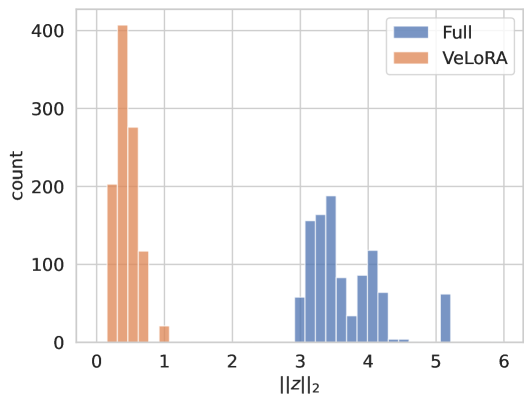

# VeLoRA：借助秩-1 子令牌投影实现内存高效训练

发布时间：2024年05月28日

`LLM理论

理由：这篇论文主要探讨了大型语言模型（LLMs）在训练和微调过程中的效率问题，并提出了一种新的算法来提高这些过程的效率。论文的核心贡献在于理论上的创新，即通过压缩中间激活来实现模型的高效收敛。这与LLM的理论研究相关，因为它涉及到模型训练的优化方法，而不是直接的应用或特定的Agent或RAG系统。因此，这篇论文更适合归类为LLM理论。` `机器学习`

> VeLoRA: Memory Efficient Training using Rank-1 Sub-Token Projections

# 摘要

> 大型语言模型（LLMs）近期崭露头角，成为解决众多语言处理任务的利器。尽管成就斐然，但训练与微调这些模型依旧计算与内存密集。本文中，我们揭示并阐述了梯度下降下实现模型高效收敛的关键要素。我们发现，反向传播中使用的中间激活可大幅压缩而不损性能。这一发现催生了一种经济且内存友好的算法，适用于LLMs的微调与预训练。该算法在正向传播时将令牌细分为子令牌，并投影至固定的一维空间。反向传播时，这些特征被粗略重构以执行更新。我们在VTAB-1k微调基准上验证了此算法的效能，并发现它与顶尖PEFT方法相辅相成。此外，我们在LLaMA微调上超越了QLoRA，并在C4大规模数据集上与其他内存高效的预训练方法竞争中表现出色。

> Large language models (LLMs) have recently emerged as powerful tools for tackling many language-processing tasks. Despite their success, training and fine-tuning these models is still far too computationally and memory intensive. In this paper, we identify and characterise the important components needed for effective model convergence using gradient descent. In doing so we find that the intermediate activations used to implement backpropagation can be excessively compressed without incurring any degradation in performance. This result leads us to a cheap and memory-efficient algorithm for both fine-tuning and pre-training LLMs. The proposed algorithm simply divides the tokens up into smaller sub-tokens before projecting them onto a fixed 1-dimensional subspace during the forward pass. These features are then coarsely reconstructed during the backward pass to implement the update rules. We confirm the effectiveness of our algorithm as being complimentary to many state-of-the-art PEFT methods on the VTAB-1k fine-tuning benchmark. Furthermore, we outperform QLoRA for fine-tuning LLaMA and show competitive performance against other memory-efficient pre-training methods on the large-scale C4 dataset.

[Arxiv](https://arxiv.org/abs/2405.17991)