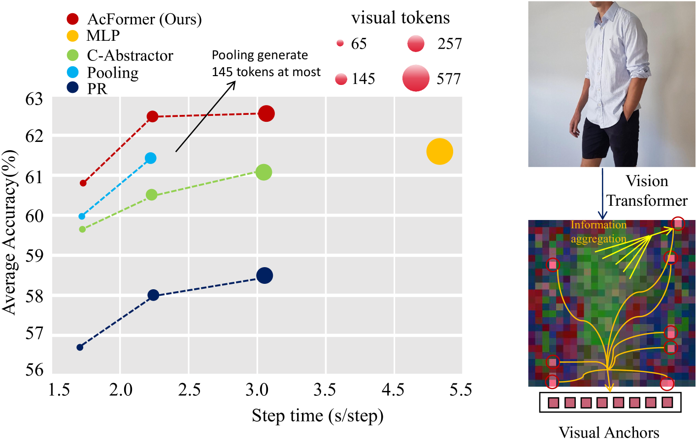
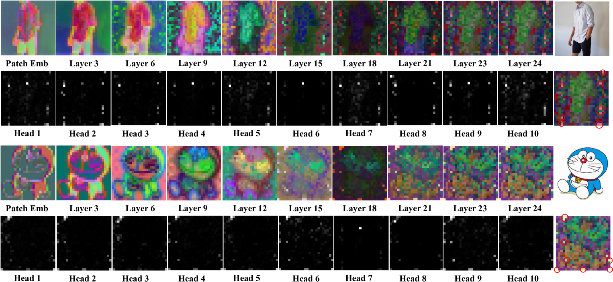
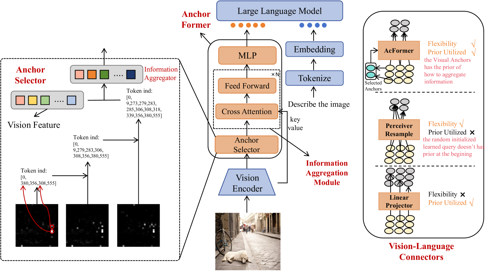
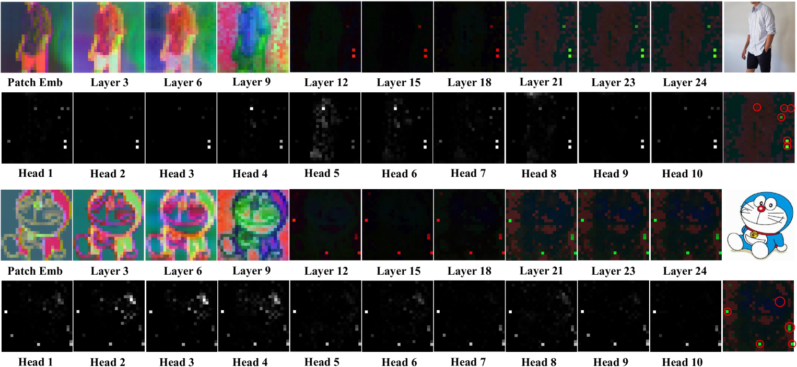
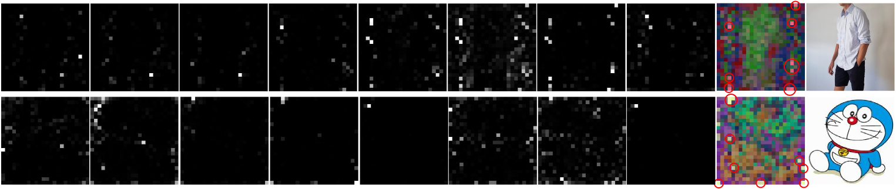
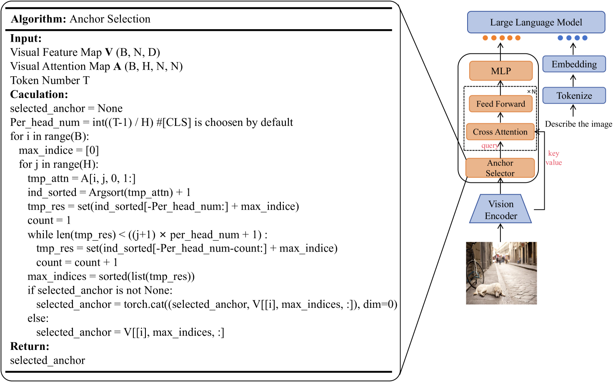

# 视觉锚点在多模态大型语言模型中扮演着强大的信息聚合角色。

发布时间：2024年05月28日

`LLM应用

理由：这篇论文主要关注的是多模态大型语言模型（MLLMs）中的视觉-语言连接器的设计和优化，具体提出了一个名为锚点Transformer（AcFormer）的新型连接器。这种连接器旨在提高模型的准确性并降低计算成本，这是在实际应用中对大型语言模型进行优化的一个实例。因此，这篇论文属于LLM应用类别，因为它专注于改进和应用现有的LLM技术，而不是理论研究或Agent的设计。` `人工智能` `计算机视觉`

> Visual Anchors Are Strong Information Aggregators For Multimodal Large Language Model

# 摘要

> 在多模态大型语言模型（MLLMs）的研究中，我们发现视觉-语言连接器的作用至关重要，它连接了预训练的视觉编码器与大型语言模型（LLMs）。尽管其重要性，这一领域的研究却相对较少。为此，我们提出了一种高效的视觉-语言连接器——锚点Transformer（AcFormer），旨在提升MLLMs的准确性同时降低计算成本。我们揭示了视觉Transformer中的视觉锚点，并开发了一种经济高效的算法来提取这些锚点。AcFormer利用这些锚点在预训练中积累的丰富知识，优化信息聚合。实验结果显示，AcFormer不仅将计算成本降低了近三分之二，而且性能显著优于现有方法，证明了其高效性和有效性。

> In the realm of Multimodal Large Language Models (MLLMs), vision-language connector plays a crucial role to link the pre-trained vision encoders with Large Language Models (LLMs). Despite its importance, the vision-language connector has been relatively less explored. In this study, we aim to propose a strong vision-language connector that enables MLLMs to achieve high accuracy while maintain low computation cost. We first reveal the existence of the visual anchors in Vision Transformer and propose a cost-effective search algorithm to extract them. Building on these findings, we introduce the Anchor Former (AcFormer), a novel vision-language connector designed to leverage the rich prior knowledge obtained from these visual anchors during pretraining, guiding the aggregation of information. Through extensive experimentation, we demonstrate that the proposed method significantly reduces computational costs by nearly two-thirds compared with baseline, while simultaneously outperforming baseline methods. This highlights the effectiveness and efficiency of AcFormer.

[Arxiv](https://arxiv.org/abs/2405.17815)