# 随着语言模型复杂度的提升，基于这些模型的fMRI预测器成功揭示了大脑左半球的侧化特征。

发布时间：2024年05月28日

`LLM理论

理由：这篇论文主要探讨了大型语言模型（LLM）与大脑活动之间的关系，通过分析fMRI数据集和不同规模的预训练模型，研究了模型参数数量与大脑活动拟合度之间的关系，以及模型规模对大脑左右半球激活不对称性的影响。这些研究内容涉及LLM的理论分析和模型性能的探讨，因此属于LLM理论分类。` `神经科学`

> fMRI predictors based on language models of increasing complexity recover brain left lateralization

# 摘要

> 过去十年，研究参与者在听连续文本时接受扫描的自然语言处理研究蓬勃发展。从最初的词嵌入到大型语言模型，研究人员开发了编码模型来解析大脑信号。通过向这些模型展示与参与者相同的文本，我们能够识别出大脑中与模型预测的人工神经元活动显著相关区域。这些研究揭示了一个有趣的现象：高度对称的双侧激活模式，这与语言处理中普遍认为的左半球优势有所冲突。在本研究中，我们分析了一个fMRI数据集，通过调整大型语言模型的复杂性，测试了来自8个不同家族的28个预训练模型，参数规模从1.24亿到142亿不等。首先，我们发现模型预测大脑反应的性能遵循一个缩放规律，即与大脑活动的拟合度随着模型参数数量的对数线性增长而增加。其次，随着模型规模的增大，我们观察到左-右不对称逐渐显现，并且左右大脑相关性的差异也遵循类似的缩放规律。尽管最小的模型未显示不对称性，但更大规模的模型与左半球激活的拟合度明显优于右半球。这一发现不仅与失语症患者的经典观察相吻合，即左半球在语言处理中占主导地位，也为使用大型语言模型分析大脑活动提供了新的视角。

> Over the past decade, studies of naturalistic language processing where participants are scanned while listening to continuous text have flourished. Using word embeddings at first, then large language models, researchers have created encoding models to analyze the brain signals. Presenting these models with the same text as the participants allows to identify brain areas where there is a significant correlation between the functional magnetic resonance imaging (fMRI) time series and the ones predicted by the models' artificial neurons. One intriguing finding from these studies is that they have revealed highly symmetric bilateral activation patterns, somewhat at odds with the well-known left lateralization of language processing. Here, we report analyses of an fMRI dataset where we manipulate the complexity of large language models, testing 28 pretrained models from 8 different families, ranging from 124M to 14.2B parameters. First, we observe that the performance of models in predicting brain responses follows a scaling law, where the fit with brain activity increases linearly with the logarithm of the number of parameters of the model (and its performance on natural language processing tasks). Second, we show that a left-right asymmetry gradually appears as model size increases, and that the difference in left-right brain correlations also follows a scaling law. Whereas the smallest models show no asymmetry, larger models fit better and better left hemispheric activations than right hemispheric ones. This finding reconciles computational analyses of brain activity using large language models with the classic observation from aphasic patients showing left hemisphere dominance for language.

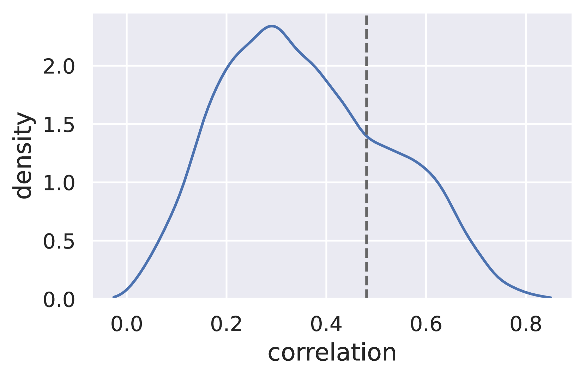

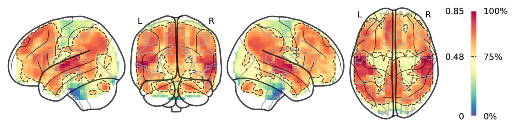

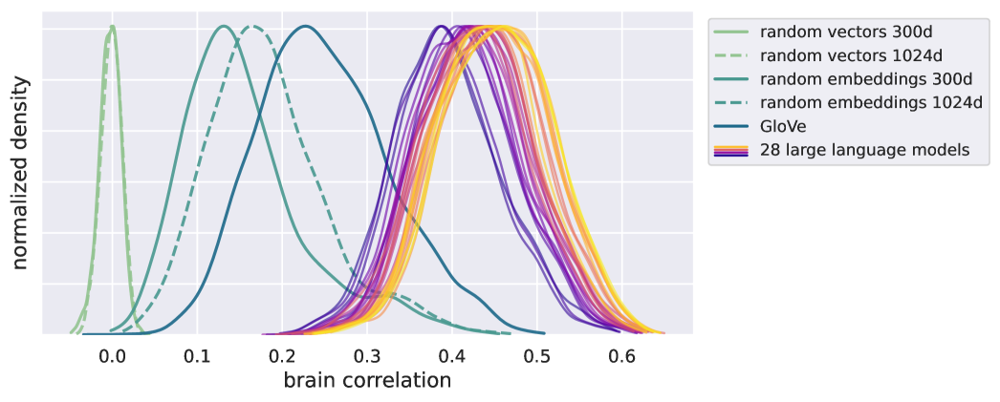

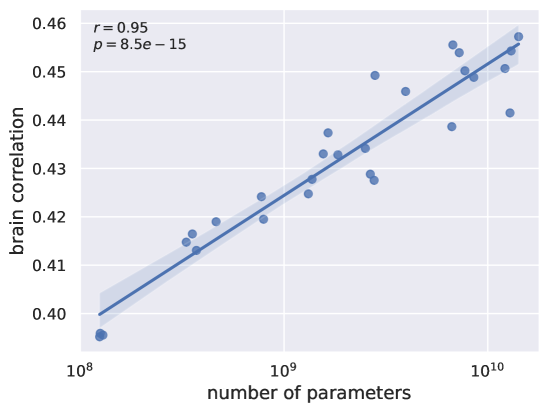

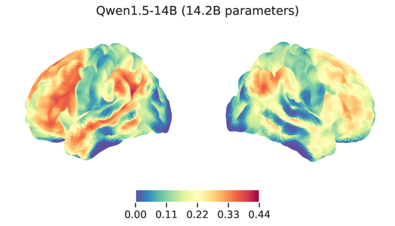

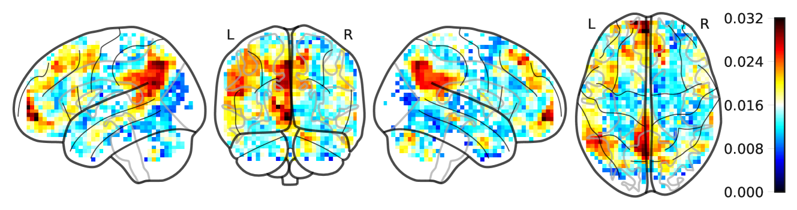

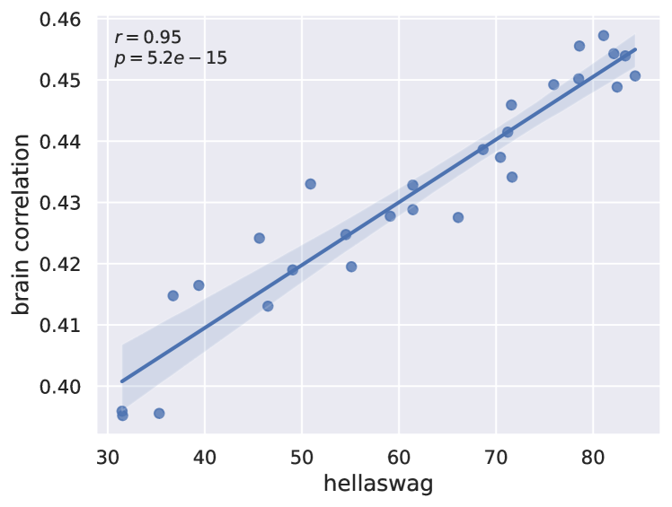

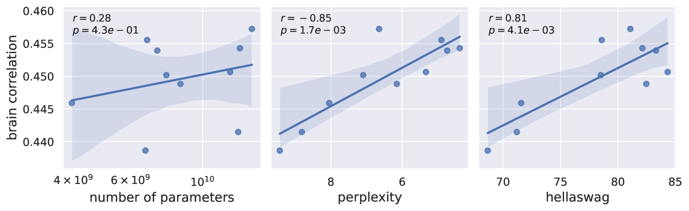

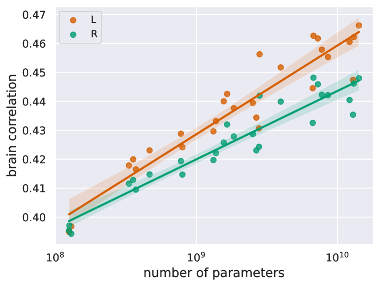

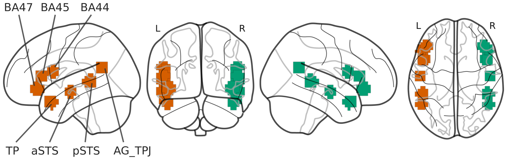

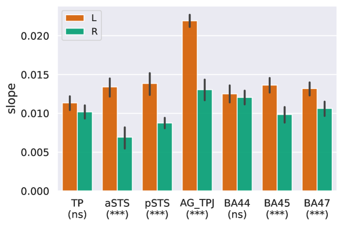

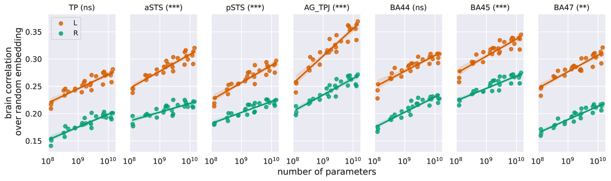

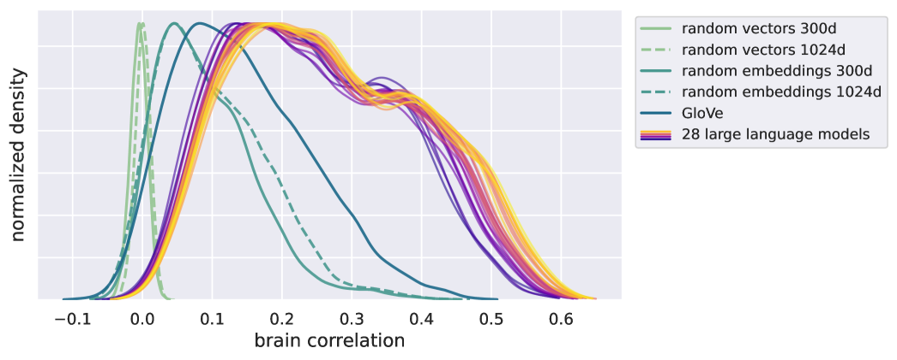

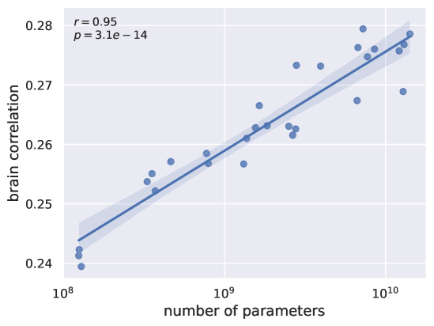

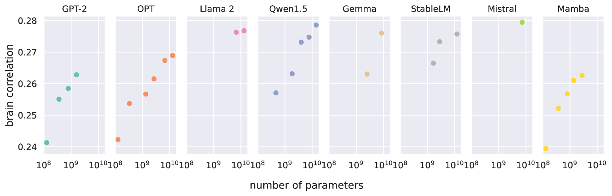

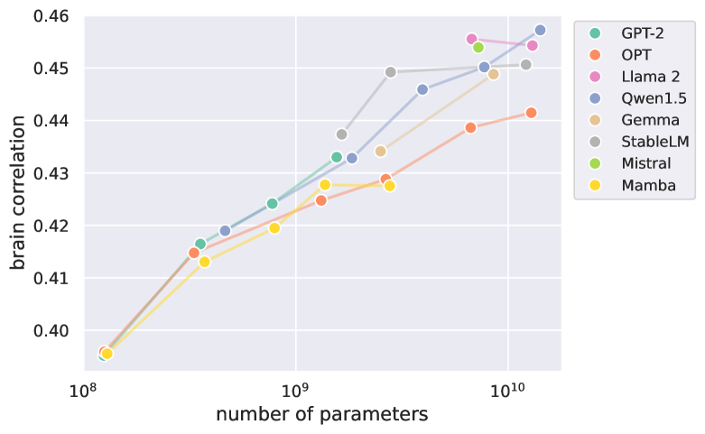

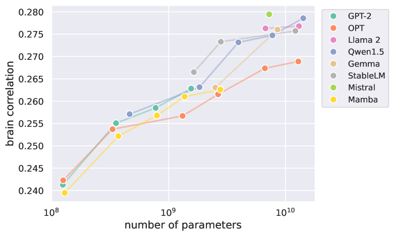

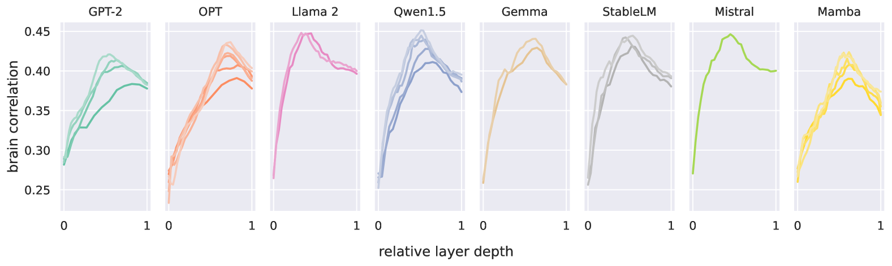

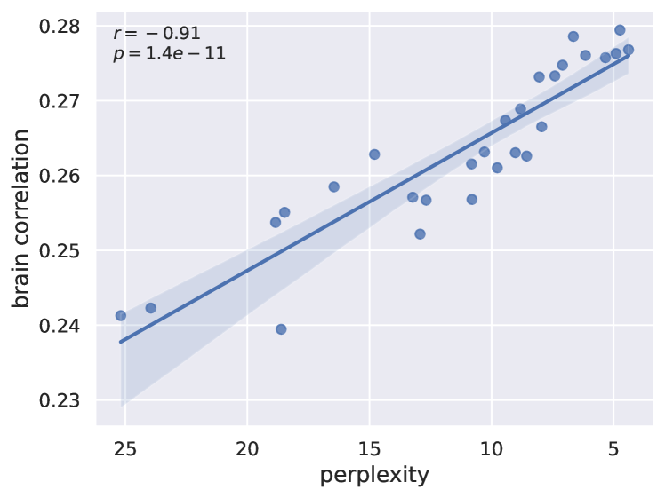

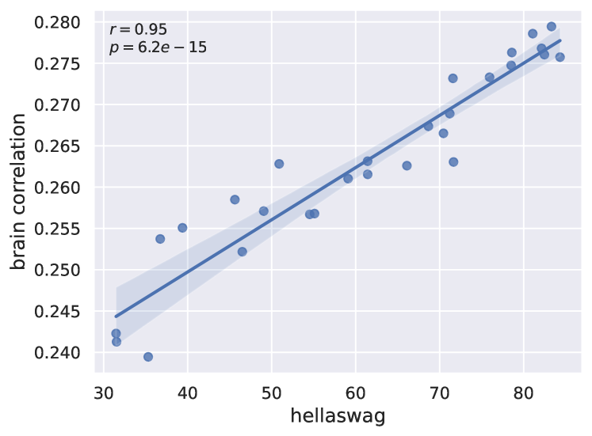

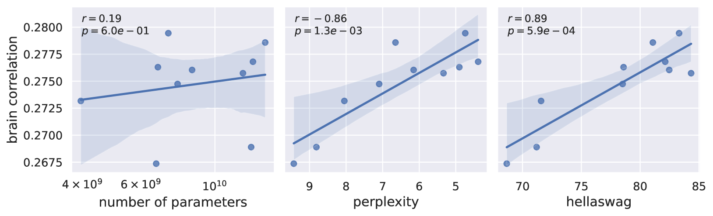

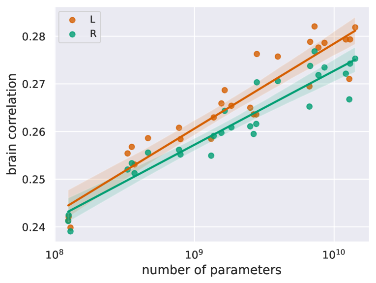

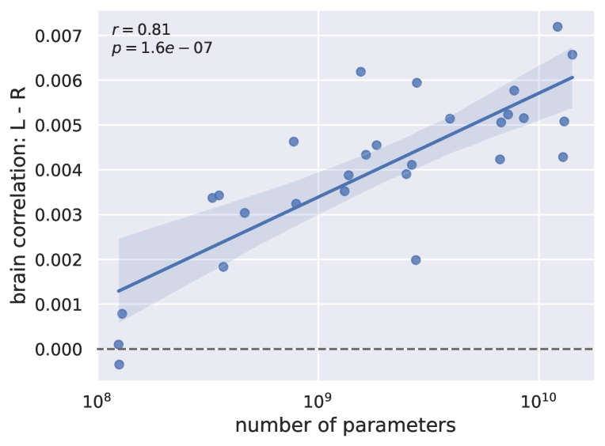

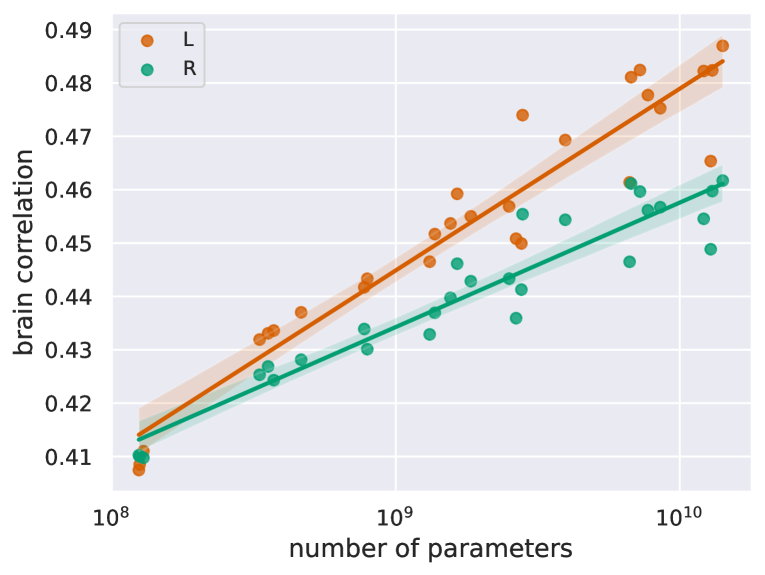

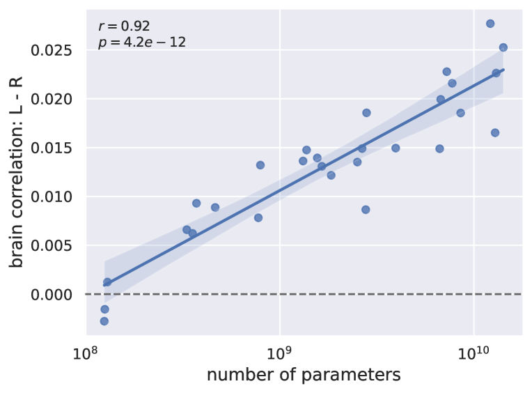

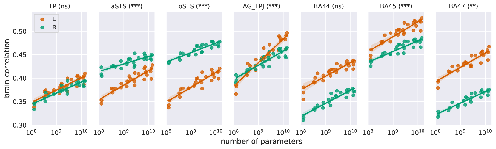

[Arxiv](https://arxiv.org/abs/2405.17992)