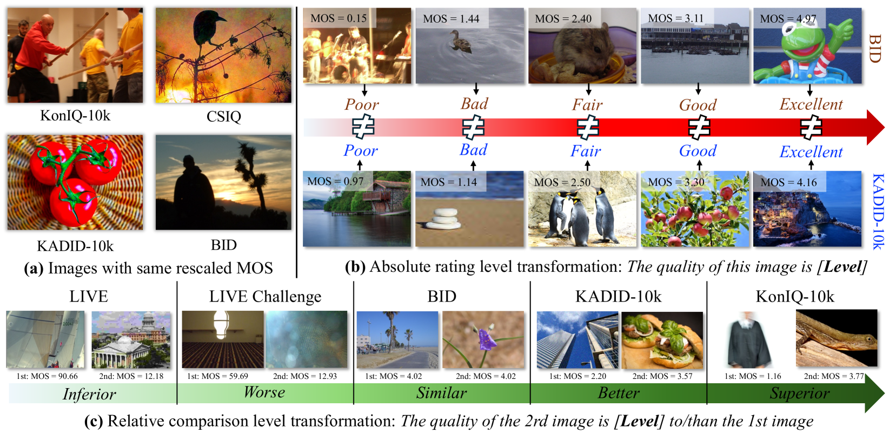
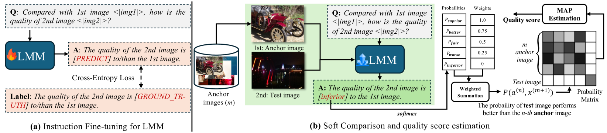
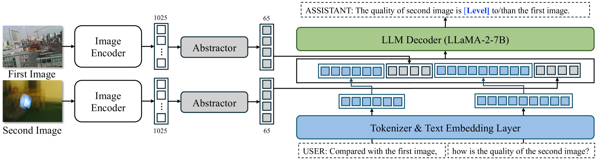
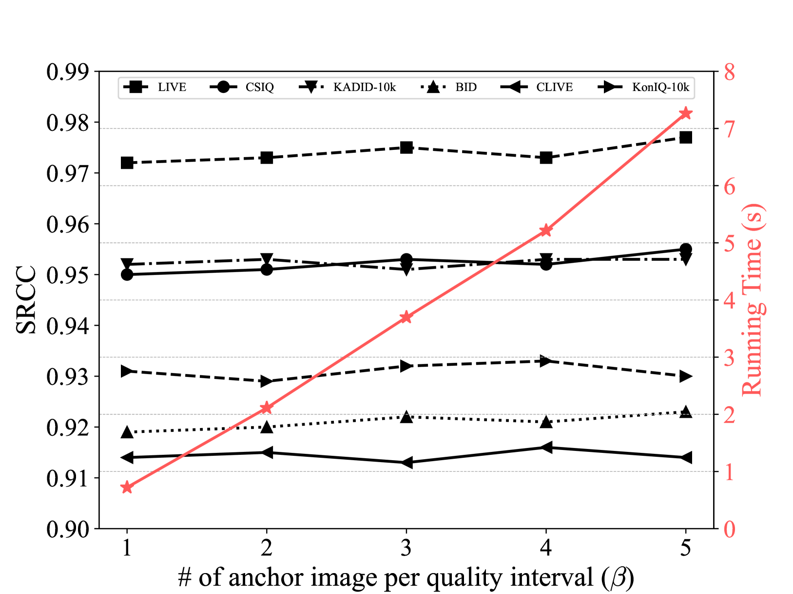
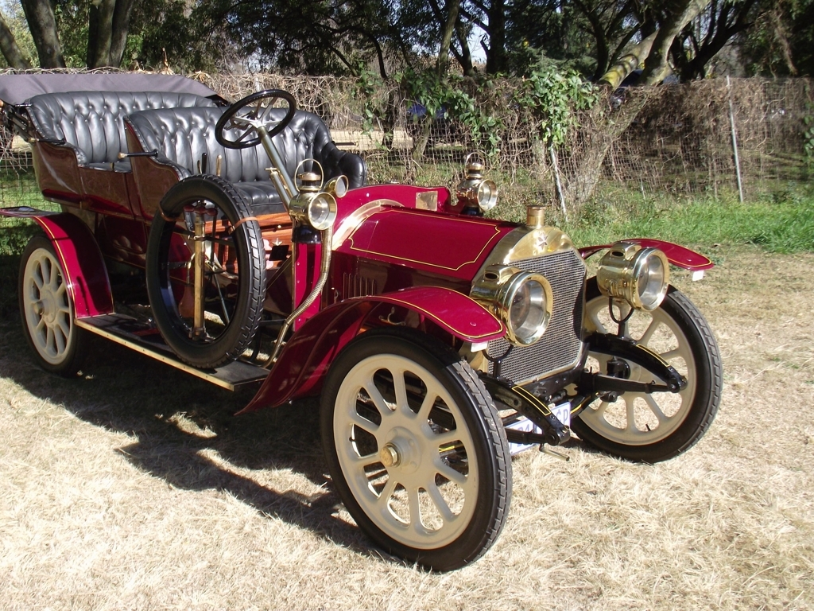
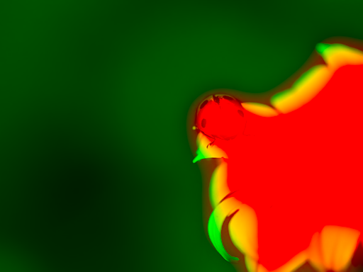
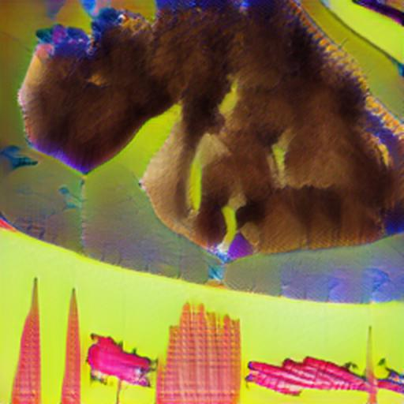

# 借助大型多模态模型进行比较学习，实现图像质量的自适应评估

发布时间：2024年05月29日

`LLM应用

这篇论文介绍了一种基于大型多模态模型（LMM）的全能无参考图像质量评估模型Compare2Score，它能够将离散的图像质量比较结果转化为连续的质量分数。该模型通过大规模训练语料库构建，并在多个IQA数据集上进行了测试，显示出超越现有技术水平的性能。这种方法的应用性质明显，因此归类为LLM应用。` `图像质量评估` `多模态模型`

> Adaptive Image Quality Assessment via Teaching Large Multimodal Model to Compare

# 摘要

> 尽管大型多模态模型在图像质量评估方面的能力因绝对质量评级而显著提升，但将相对质量比较结果转化为连续感知质量分数的方法仍未被充分探索。为此，我们推出了Compare2Score——一种基于LMM的全能无参考图像质量评估模型，它能生成定性比较结果，并将离散比较级别转化为连续质量分数。在训练中，我们通过比较同一数据集中的图像来生成更灵活的比较指令，整合多样化的IQA数据集。借助大规模训练语料库，我们构建了类似人类的视觉质量比较器。在推理时，我们采用了一种软比较策略，计算测试图像相对于多个锚定图像的偏好概率，并通过最大后验估计优化质量分数。在九个IQA数据集上的实验表明，Compare2Score成功地将训练中的文本比较级别与推理中的单图像质量分数相结合，超越了现有技术水平。此外，这种基于概率矩阵的转换方法不仅提高了Compare2Score的准确性，还增强了零-shot通用LMMs的性能，显示了其内在的有效性。

> While recent advancements in large multimodal models (LMMs) have significantly improved their abilities in image quality assessment (IQA) relying on absolute quality rating, how to transfer reliable relative quality comparison outputs to continuous perceptual quality scores remains largely unexplored. To address this gap, we introduce Compare2Score-an all-around LMM-based no-reference IQA (NR-IQA) model, which is capable of producing qualitatively comparative responses and effectively translating these discrete comparative levels into a continuous quality score. Specifically, during training, we present to generate scaled-up comparative instructions by comparing images from the same IQA dataset, allowing for more flexible integration of diverse IQA datasets. Utilizing the established large-scale training corpus, we develop a human-like visual quality comparator. During inference, moving beyond binary choices, we propose a soft comparison method that calculates the likelihood of the test image being preferred over multiple predefined anchor images. The quality score is further optimized by maximum a posteriori estimation with the resulting probability matrix. Extensive experiments on nine IQA datasets validate that the Compare2Score effectively bridges text-defined comparative levels during training with converted single image quality score for inference, surpassing state-of-the-art IQA models across diverse scenarios. Moreover, we verify that the probability-matrix-based inference conversion not only improves the rating accuracy of Compare2Score but also zero-shot general-purpose LMMs, suggesting its intrinsic effectiveness.

[Arxiv](https://arxiv.org/abs/2405.19298)