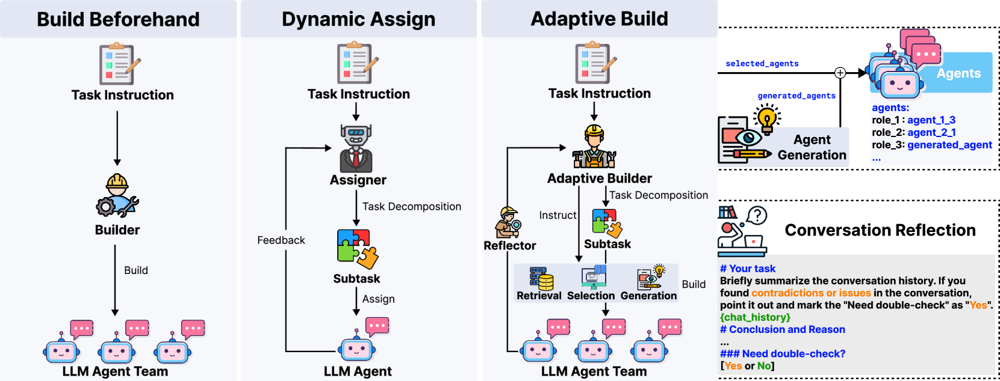
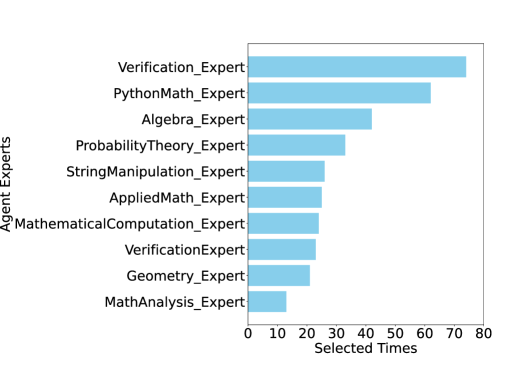
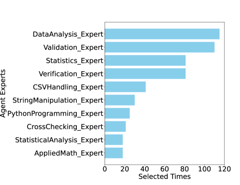
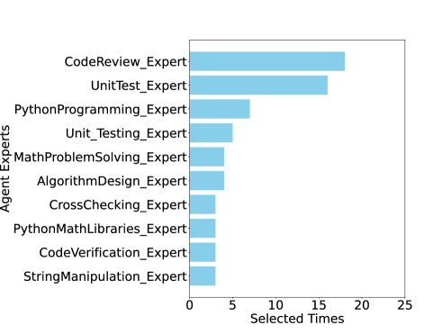
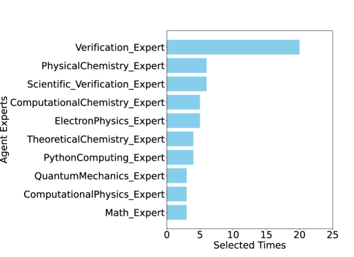
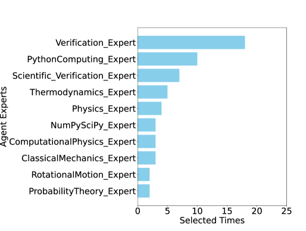
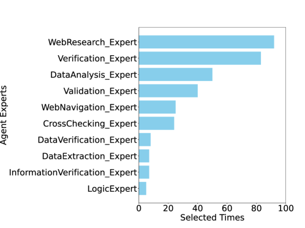

# 语言模型代理的自适应对话团队构建

发布时间：2024年05月29日

`Agent

这篇论文探讨了如何通过多个大型语言模型（LLM）代理协同工作来应对复杂任务，并提出了一个创新的“自适应团队构建模式”，其中“队长代理”能够动态组建和管理团队。这种方法强调了代理之间的协作和任务适应性，属于Agent领域的研究。` `人工智能` `团队协作`

> Adaptive In-conversation Team Building for Language Model Agents

# 摘要

> 通过多个大型语言模型（LLM）代理协同工作，已被证实是应对复杂任务的有效策略。然而，如何巧妙地为特定应用设计这些代理，仍是一门艺术。我们面临的核心挑战是：如何为特定任务组建一支高效的LLM代理团队？我们的创新——自适应团队构建模式，提供了一种灵活的解决方案，其核心是“队长代理”这一新颖设计。队长代理能够根据任务解决的每一步动态组建和管理团队，通过嵌套对话和反思机制，确保团队拥有多元化的专业技能，避免单一化的输出。这种方法不仅灵活，而且结构化，有效减少了冗余，提升了输出的多样性。在六个真实场景的广泛测试中，队长代理的平均准确性比现有方法提升了21.94%，展现出卓越性能，且无需针对特定任务进行提示工程的调整。

> Leveraging multiple large language model (LLM) agents has shown to be a promising approach for tackling complex tasks, while the effective design of multiple agents for a particular application remains an art. It is thus intriguing to answer a critical question: Given a task, how can we build a team of LLM agents to solve it effectively? Our new adaptive team-building paradigm offers a flexible solution, realized through a novel agent design named Captain Agent. It dynamically forms and manages teams for each step of a task-solving process, utilizing nested group conversations and reflection to ensure diverse expertise and prevent stereotypical outputs. It allows for a flexible yet structured approach to problem-solving and can help reduce redundancy and enhance output diversity. A comprehensive evaluation across six real-world scenarios demonstrates that Captain Agent significantly outperforms existing multi-agent methods with 21.94% improvement in average accuracy, providing outstanding performance without requiring task-specific prompt engineering.

[Arxiv](https://arxiv.org/abs/2405.19425)