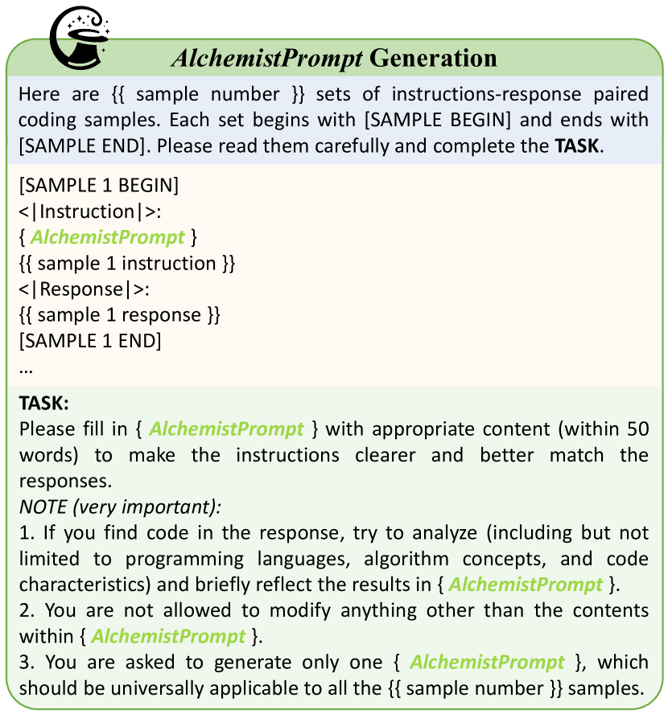

# 炼金术士编码器：借助多源数据的事后调优，巧妙融合并提升代码潜能

发布时间：2024年05月29日

`LLM应用

这篇论文介绍了AlchemistCoder系列，这是一个通过在多源数据上进行微调来提升代码生成和泛化能力的大型语言模型。论文中提到了如何通过AlchemistPrompts来协调数据与指令，并将数据构建过程融入微调中，以提升模型的性能。这些内容主要关注于如何应用LLM来改进代码生成和理解，因此属于LLM应用类别。` `软件开发` `人工智能`

> AlchemistCoder: Harmonizing and Eliciting Code Capability by Hindsight Tuning on Multi-source Data

# 摘要

> 近期，开源大型语言模型（LLMs）及其专业变体，尤其是代码LLMs，表现卓越。但以往的代码LLMs多基于质量与多样性有限的单一数据源进行微调，未能充分挖掘预训练模型的潜力。本文推出的AlchemistCoder系列，通过在多源数据上微调，显著提升了代码生成与泛化能力。我们首创揭示了多源代码语料中的内在冲突，并设计了AlchemistPrompts，通过事后重标记协调数据与指令。同时，我们将数据构建过程融入微调，作为代码理解任务，涵盖指令演变、数据筛选及代码审查。实验证明，AlchemistCoder在同尺寸模型中领先，甚至超越了更大模型，彰显了我们方法在提升指令遵循能力及拓展代码智能领域的成效。

> Open-source Large Language Models (LLMs) and their specialized variants, particularly Code LLMs, have recently delivered impressive performance. However, previous Code LLMs are typically fine-tuned on single-source data with limited quality and diversity, which may insufficiently elicit the potential of pre-trained Code LLMs. In this paper, we present AlchemistCoder, a series of Code LLMs with enhanced code generation and generalization capabilities fine-tuned on multi-source data. To achieve this, we pioneer to unveil inherent conflicts among the various styles and qualities in multi-source code corpora and introduce data-specific prompts with hindsight relabeling, termed AlchemistPrompts, to harmonize different data sources and instruction-response pairs. Additionally, we propose incorporating the data construction process into the fine-tuning data as code comprehension tasks, including instruction evolution, data filtering, and code review. Extensive experiments demonstrate that AlchemistCoder holds a clear lead among all models of the same size (6.7B/7B) and rivals or even surpasses larger models (15B/33B/70B), showcasing the efficacy of our method in refining instruction-following capabilities and advancing the boundaries of code intelligence.

[Arxiv](https://arxiv.org/abs/2405.19265)