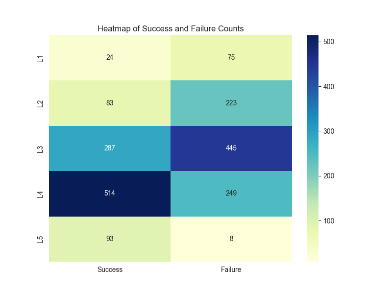
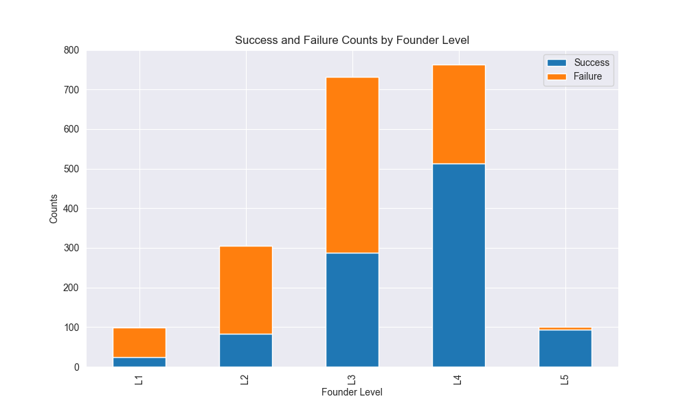
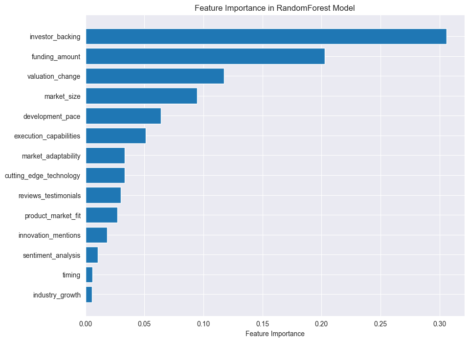
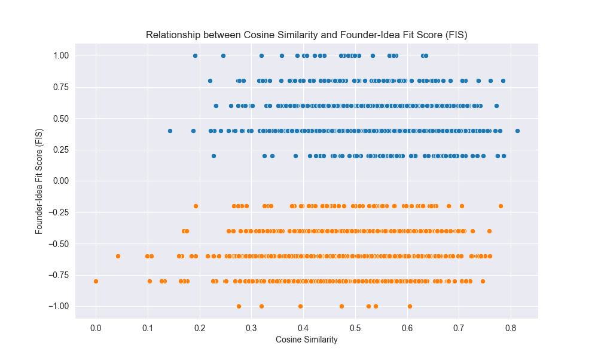
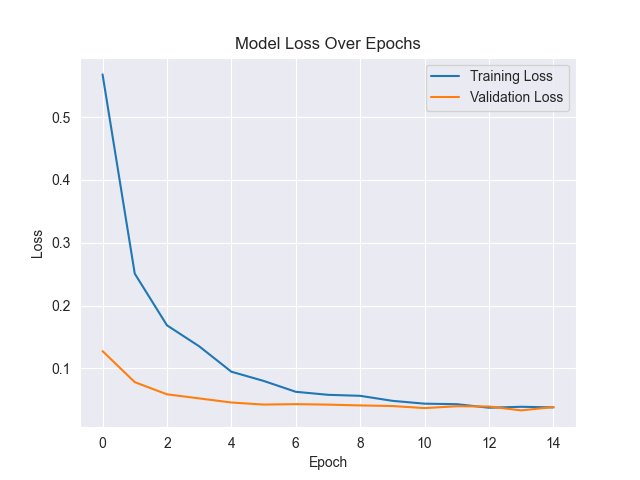
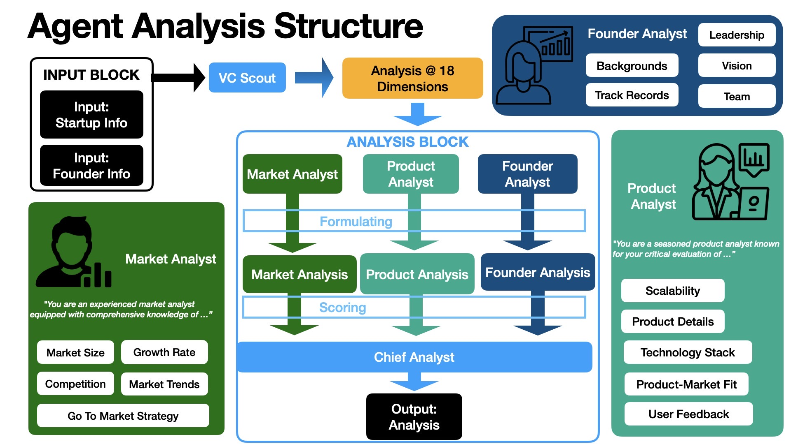
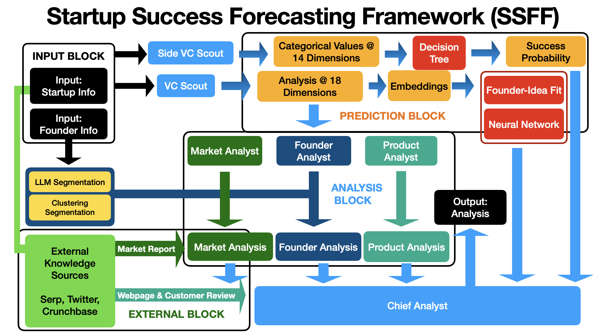

# 创业成功预测框架（SSFF）：一套自动化评估创业潜力的流程。

发布时间：2024年05月29日

`Agent

这篇论文介绍了一个名为初创企业成功预测框架（SSFF）的系统，它采用智能代理架构来模拟风险资本家的思维和决策过程。该框架通过融合传统机器学习与先进语言模型，实现了对初创企业早期阶段的自动化评估。因此，它属于Agent分类，因为它涉及使用智能代理来执行特定的任务和决策过程。` `初创企业` `风险投资`

> An Automated Startup Evaluation Pipeline: Startup Success Forecasting Framework (SSFF)

# 摘要

> 评估初创企业的早期阶段是一项复杂任务，需要专家深入分析。尽管自动化这一过程能大幅提升企业效率，但其内在复杂性也带来了挑战。本文提出的初创企业成功预测框架（SSFF）正是为了应对这一挑战，它是一个融合了传统机器学习与先进语言模型的自动化系统。SSFF采用智能代理架构，模拟风险资本家的思维和决策过程，实现端到端分析。该框架包含三个核心部分：预测块利用随机森林和神经网络进行精准预测；分析师块通过模拟风险投资分析场景，运用前沿提示技术；外部知识块则实时汇集外部信息。SSFF仅需创始人和初创企业描述的基本信息，结合外部数据源，自动进行高精度的全面分析。

> Evaluating startups in their early stages is a complex task that requires detailed analysis by experts. While automating this process on a large scale can significantly impact businesses, the inherent complexity poses challenges. This paper addresses this challenge by introducing the Startup Success Forecasting Framework (SSFF), a new automated system that combines traditional machine learning with advanced language models. This intelligent agent-based architecture is designed to reason, act, synthesize, and decide like a venture capitalist to perform the analysis end-to-end. The SSFF is made up of three main parts: - Prediction Block: Uses random forests and neural networks to make predictions. - Analyst Block: Simulates VC analysis scenario and uses SOTA prompting techniques - External Knowledge Block: Gathers real-time information from external sources. This framework requires minimal input data about the founder and startup description, enhances it with additional data from external resources, and performs a detailed analysis with high accuracy, all in an automated manner

[Arxiv](https://arxiv.org/abs/2405.19456)