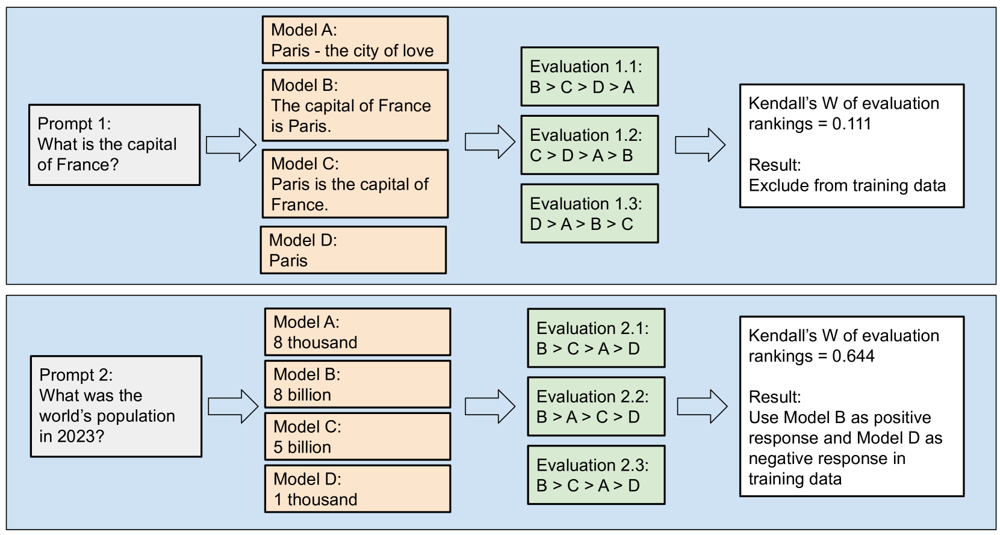
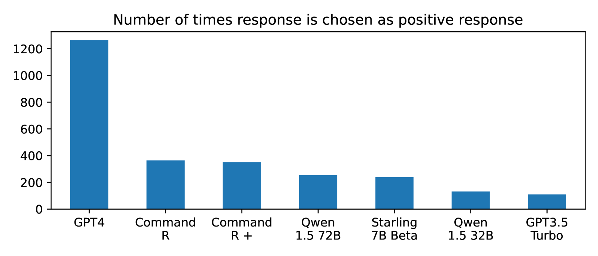
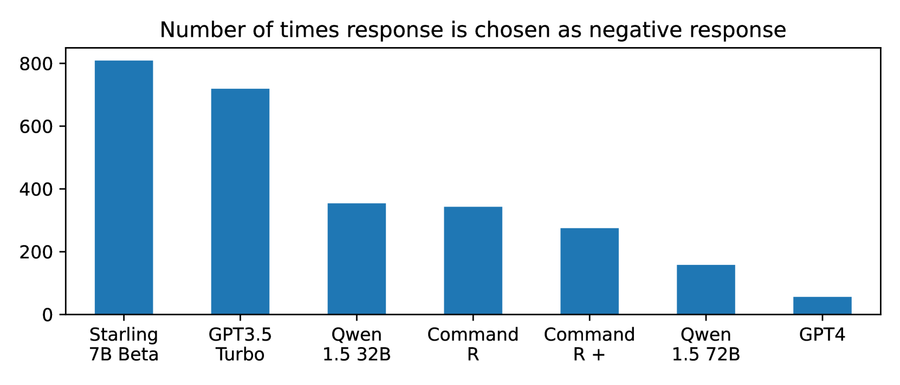

# 真的确定吗？再来一次排名：通过反复排名优化偏好数据集

发布时间：2024年05月29日

`RAG

理由：这篇论文主要探讨了通过AI反馈的强化学习（RLAIF）来训练大型语言模型（LLMs），并提出了“重复排名法”来提高模型输出的质量。这种方法涉及到对模型输出的评估和排序，是RAG（Retrieval-Augmented Generation）领域的一个重要应用，因为它关注的是如何通过改进数据集的质量来优化模型的性能。虽然这种方法也与LLM应用相关，但其核心在于通过特定的评估和训练策略来改进模型，更符合RAG的范畴。` `人工智能`

> Are You Sure? Rank Them Again: Repeated Ranking For Better Preference Datasets

# 摘要

> 通过AI反馈的强化学习（RLAIF）训练大型语言模型（LLMs），能更精准地使模型输出符合人类偏好。这一过程需要评估模型对用户提示的多个候选响应进行排序。然而，诸如GPT-4等评估模型的排名结果可能并不一致。为此，我们提出了“重复排名法”——对同一响应进行多次评估，并仅针对那些一致高排名的响应进行训练。我们在62种语言中使用了2,714个提示，生成了来自7个顶级多语言LLMs的响应，并让GPT-4对它们进行了五次排名。在六种语言的MT-Bench聊天基准测试中，我们的方法超越了传统的训练所有可用提示的做法。本研究凸显了RLAIF数据集生成中质量与数量的平衡问题，并提供了一种可叠加的策略，以提升数据集质量，进而优化模型性能。

> Training Large Language Models (LLMs) with Reinforcement Learning from AI Feedback (RLAIF) aligns model outputs more closely with human preferences. This involves an evaluator model ranking multiple candidate responses to user prompts. However, the rankings from popular evaluator models such as GPT-4 can be inconsistent. We propose the Repeat Ranking method - where we evaluate the same responses multiple times and train only on those responses which are consistently ranked. Using 2,714 prompts in 62 languages, we generated responses from 7 top multilingual LLMs and had GPT-4 rank them five times each. Evaluating on MT-Bench chat benchmarks in six languages, our method outperformed the standard practice of training on all available prompts. Our work highlights the quality versus quantity trade-off in RLAIF dataset generation and offers a stackable strategy for enhancing dataset and thus model quality.

[Arxiv](https://arxiv.org/abs/2405.18952)