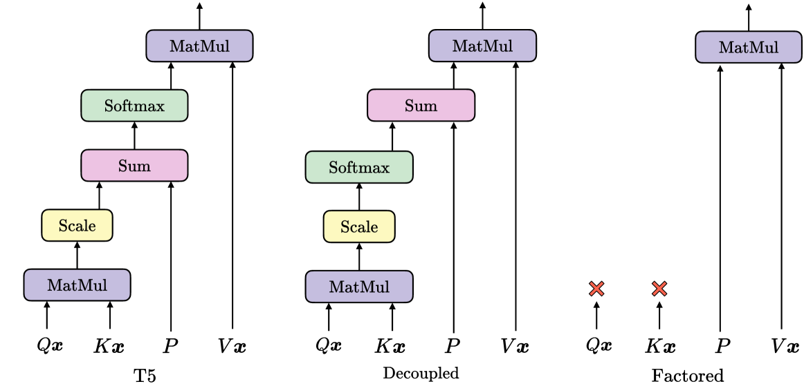
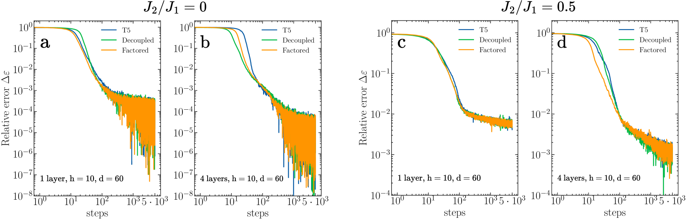
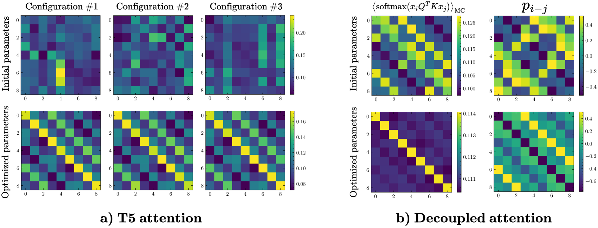
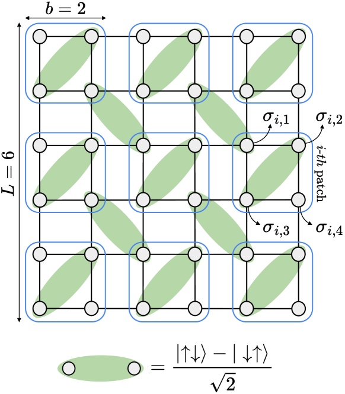

# 查询与键是否始终紧密相连？本文通过Transformer波函数的案例研究，探讨了这一问题。

发布时间：2024年05月29日

`LLM理论

理由：这篇论文主要探讨了Transformer模型中的点积注意力机制，并将其应用于量子多体自旋系统的基态近似问题中。虽然研究涉及了Transformer模型的应用，但其核心在于理论分析和改进注意力机制，特别是在大系统研究中的理论优化，这与大型语言模型（LLM）的理论研究更为相关。因此，将其归类为LLM理论是合适的。` `量子物理`

> Are queries and keys always relevant? A case study on Transformer wave functions

# 摘要

> 点积注意力机制，作为现代Transformer的核心，最初专为NLP任务设计，能精准捕捉词对间的语义联系。本研究聚焦于Transformer的注意力机制，探索其在量子多体自旋系统基态近似中的应用，特别是在二维$J_1$-$J_2$海森堡模型上的表现。我们比较了标准注意力机制与一种简化版（仅基于位置，无需查询和键）的性能，发现后者在减少计算负担的同时，效果同样出色。分析标准注意力机制的注意力图显示，优化后其权重与输入无关。通过分析计算，我们揭示了在大系统研究中，理论上应省略查询和键的原因，这一发现甚至可延伸至NLP领域，尤其在处理长句时。

> The dot product attention mechanism, originally designed for natural language processing (NLP) tasks, is a cornerstone of modern Transformers. It adeptly captures semantic relationships between word pairs in sentences by computing a similarity overlap between queries and keys. In this work, we explore the suitability of Transformers, focusing on their attention mechanisms, in the specific domain of the parametrization of variational wave functions to approximate ground states of quantum many-body spin Hamiltonians. Specifically, we perform numerical simulations on the two-dimensional $J_1$-$J_2$ Heisenberg model, a common benchmark in the field of quantum-many body systems on lattice. By comparing the performance of standard attention mechanisms with a simplified version that excludes queries and keys, relying solely on positions, we achieve competitive results while reducing computational cost and parameter usage. Furthermore, through the analysis of the attention maps generated by standard attention mechanisms, we show that the attention weights become effectively input-independent at the end of the optimization. We support the numerical results with analytical calculations, providing physical insights of why queries and keys should be, in principle, omitted from the attention mechanism when studying large systems. Interestingly, the same arguments can be extended to the NLP domain, in the limit of long input sentences.

[Arxiv](https://arxiv.org/abs/2405.18874)