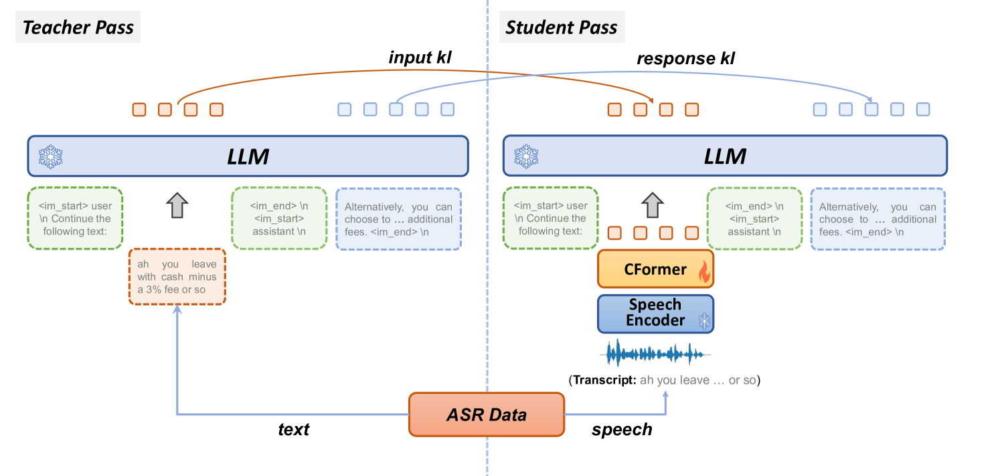
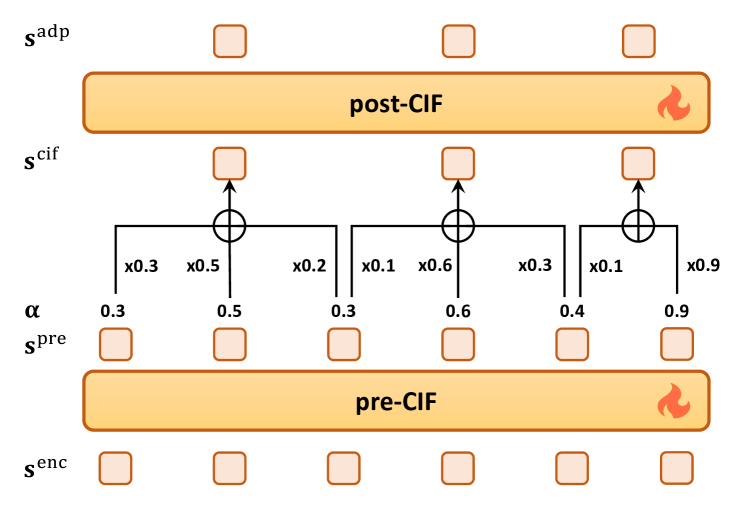
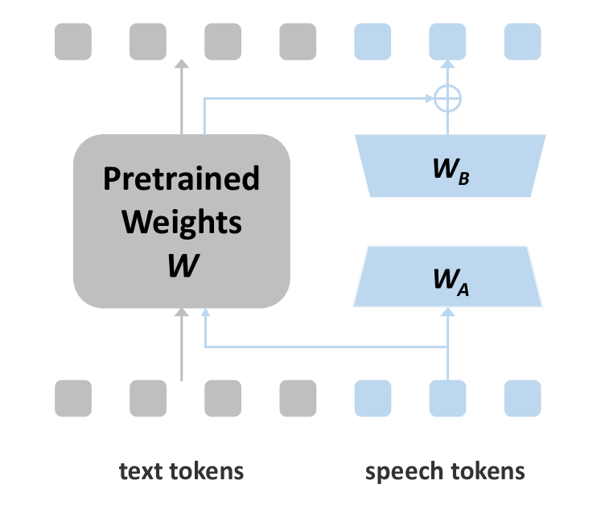

# BLSP-KD：借助知识蒸馏推动语言与语音的预训练融合

发布时间：2024年05月29日

`LLM应用

这篇论文介绍了一种名为BLSP-KD的新方法，用于优化大型语言模型（LLMs）在处理语音输入时的对齐质量。该方法通过知识蒸馏和连续整合-激发策略来实现语音与文本的精细对齐，并引入了一种新型适应技术Partial LoRA（PLoRA）来支持语音输入的微调。这些技术的应用旨在提高LLMs在口语交互领域的性能，特别是在指令遵循能力方面。因此，这篇论文属于LLM应用类别，因为它专注于改进LLMs在特定应用场景（即语音输入处理）中的实际应用和性能。` `口语交互` `语音识别`

> BLSP-KD: Bootstrapping Language-Speech Pre-training via Knowledge Distillation

# 摘要

> 近期，全端方法在将大型语言模型（LLMs）拓展至语音输入方面展现出潜力，但面临直接评估和优化对齐质量的挑战，且因语音与文本长度不匹配而难以实现精细对齐。为此，我们推出了BLSP-KD，一种通过知识蒸馏实现语言-语音预训练的创新方法，它通过两大关键技术克服了这些难题。首先，利用知识蒸馏，最小化LLM对语音及文本输入的下一个令牌预测分布差异，从而优化语音-文本对齐。其次，采用连续整合-激发策略，将语音精确分割成与文本令牌一对一对应的单位，实现精细对齐。此外，我们还开发了Partial LoRA（PLoRA），一种新型适应技术，支持在知识蒸馏框架下对语音输入的LLM微调。定量评估表明，BLSP-KD超越了以往的全端基线和级联系统，在相似参数规模下，显著提升了LLMs对语音输入的指令遵循能力。这一方法为LLMs在口语交互领域的应用开辟了新天地。

> Recent end-to-end approaches have shown promise in extending large language models (LLMs) to speech inputs, but face limitations in directly assessing and optimizing alignment quality and fail to achieve fine-grained alignment due to speech-text length mismatch. We introduce BLSP-KD, a novel approach for Bootstrapping Language-Speech Pretraining via Knowledge Distillation, which addresses these limitations through two key techniques. First, it optimizes speech-text alignment by minimizing the divergence between the LLM's next-token prediction distributions for speech and text inputs using knowledge distillation. Second, it employs a continuous-integrate-andfire strategy to segment speech into tokens that correspond one-to-one with text tokens, enabling fine-grained alignment. We also introduce Partial LoRA (PLoRA), a new adaptation method supporting LLM finetuning for speech inputs under knowledge distillation. Quantitative evaluation shows that BLSP-KD outperforms previous end-to-end baselines and cascaded systems with comparable scale of parameters, facilitating general instruction-following capabilities for LLMs with speech inputs. This approach provides new possibilities for extending LLMs to spoken language interactions.

[Arxiv](https://arxiv.org/abs/2405.19041)