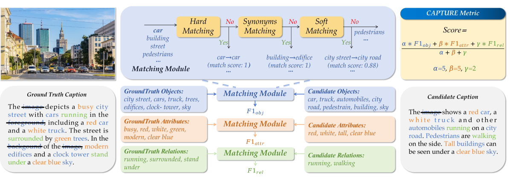

# 提升与优化细节图像描述的基准测试

发布时间：2024年05月29日

`LLM应用

这篇论文主要关注的是图像描述生成任务，特别是在评估基准和评价指标方面的改进。通过创建新的数据集和评估指标（CAPTURE），论文旨在提高大型视觉-语言模型（LVLM）的性能。这些工作直接应用于实际的模型开发和评估中，因此属于LLM应用类别。虽然这些改进可能间接影响模型的理论理解，但论文的核心贡献在于实际应用和评估方法的创新，而不是理论模型的深入分析或Agent的设计与实现。` `计算机视觉`

> Benchmarking and Improving Detail Image Caption

# 摘要

> 图像描述生成，作为视觉理解的核心任务，近年来因过时的评估基准和不可靠的评价指标而鲜受大型视觉-语言模型（LVLM）研究关注。为此，我们精心策划了由专家标注的高质量数据集，如GPT-4V和Gemini-1.5-Pro，以重新定义详细图像描述的评估标准。同时，我们创新性地提出了CAPTURE评估指标，该指标通过提取并匹配描述中的视觉元素，实现了与专家判断的高度一致性。基于这一可靠的评估体系，我们进一步开发了一个五阶段数据构建流程，旨在最大化LVLM的详细描述能力，全程无需人工或GPT-4V介入。实验结果显示，这一策略显著提升了LVLM生成的描述质量，并有望在自循环模式下持续优化。所有相关代码和数据集将在https://github.com/foundation-multimodal-models/CAPTURE公开分享。

> Image captioning has long been regarded as a fundamental task in visual understanding. Recently, however, few large vision-language model (LVLM) research discusses model's image captioning performance because of the outdated short-caption benchmarks and unreliable evaluation metrics. In this work, we propose to benchmark detail image caption task by curating high-quality evaluation datasets annotated by human experts, GPT-4V and Gemini-1.5-Pro. We also design a more reliable caption evaluation metric called CAPTURE (CAPtion evaluation by exTracting and coUpling coRE information). CAPTURE extracts visual elements, e.g., objects, attributes and relations from captions, and then matches these elements through three stages, achieving the highest consistency with expert judgements over other rule-based or model-based caption metrics. The proposed benchmark and metric provide reliable evaluation for LVLM's detailed image captioning ability. Guided by this evaluation, we further explore to unleash LVLM's detail caption capabilities by synthesizing high-quality data through a five-stage data construction pipeline. Our pipeline only uses a given LVLM itself and other open-source tools, without any human or GPT-4V annotation in the loop. Experiments show that the proposed data construction strategy significantly improves model-generated detail caption data quality for LVLMs with leading performance, and the data quality can be further improved in a self-looping paradigm. All code and dataset will be publicly available at https://github.com/foundation-multimodal-models/CAPTURE.

[Arxiv](https://arxiv.org/abs/2405.19092)