# 图学习是否能优化任务规划？

发布时间：2024年05月29日

`Agent

这篇论文主要探讨了如何使用图神经网络（GNNs）与大型语言模型（LLMs）结合来进行任务规划，这是一个涉及决策和执行的过程，特别是在处理复杂用户需求时。论文中提到的任务规划涉及将用户需求分解为可执行的子任务，并通过图的形式表示这些子任务及其依赖关系。这种方法可以被视为一种智能代理（Agent）的行为，因为它涉及到在复杂环境中做出决策和执行任务的能力。因此，这篇论文更适合归类到Agent分类中。` `任务规划` `人工智能`

> Can Graph Learning Improve Task Planning?

# 摘要

> 随着大型语言模型（LLMs）的兴起，任务规划已成为一个新兴的研究焦点。它将复杂用户需求分解为一系列可执行的子任务，以实现原始目标。这些子任务间的关系可以被视作一个图，其中节点是子任务，边则是它们之间的依赖。因此，任务规划本质上是一个在图中寻找并执行连通路径或子图的决策过程。本文中，我们探索了基于图学习的方法来进行任务规划，这与主流的提示设计研究方向形成互补。我们的研究动机源于一个理论洞见：LLMs在图上进行决策时受到注意力和自回归损失偏差的影响，而图神经网络（GNNs）能有效解决这一问题。基于此，我们将GNNs与LLMs结合，显著提升了性能。实验证明，即使未经训练，GNN方法也优于现有方案，且少量训练即可进一步提升效果。此外，我们的方法与提示工程和模型微调相辅相成，通过优化提示或微调模型，性能得以进一步提升。

> Task planning is emerging as an important research topic alongside the development of large language models (LLMs). It aims to break down complex user requests into solvable sub-tasks, thereby fulfilling the original requests. In this context, the sub-tasks can be naturally viewed as a graph, where the nodes represent the sub-tasks, and the edges denote the dependencies among them. Consequently, task planning is a decision-making problem that involves selecting a connected path or subgraph within the corresponding graph and invoking it. In this paper, we explore graph learning-based methods for task planning, a direction that is orthogonal to the prevalent focus on prompt design. Our interest in graph learning stems from a theoretical discovery: the biases of attention and auto-regressive loss impede LLMs' ability to effectively navigate decision-making on graphs, which is adeptly addressed by graph neural networks (GNNs). This theoretical insight led us to integrate GNNs with LLMs to enhance overall performance. Extensive experiments demonstrate that GNN-based methods surpass existing solutions even without training, and minimal training can further enhance their performance. Additionally, our approach complements prompt engineering and fine-tuning techniques, with performance further enhanced by improved prompts or a fine-tuned model.

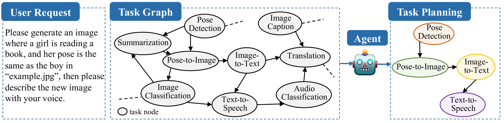

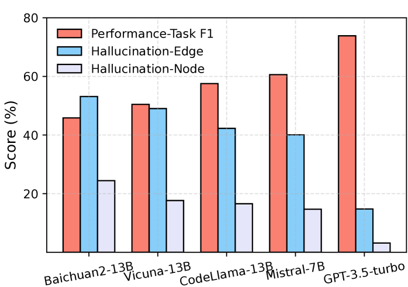

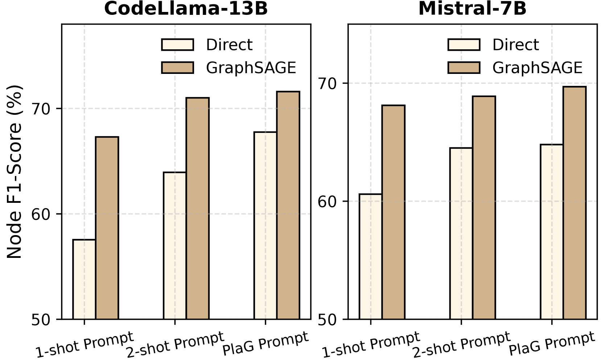

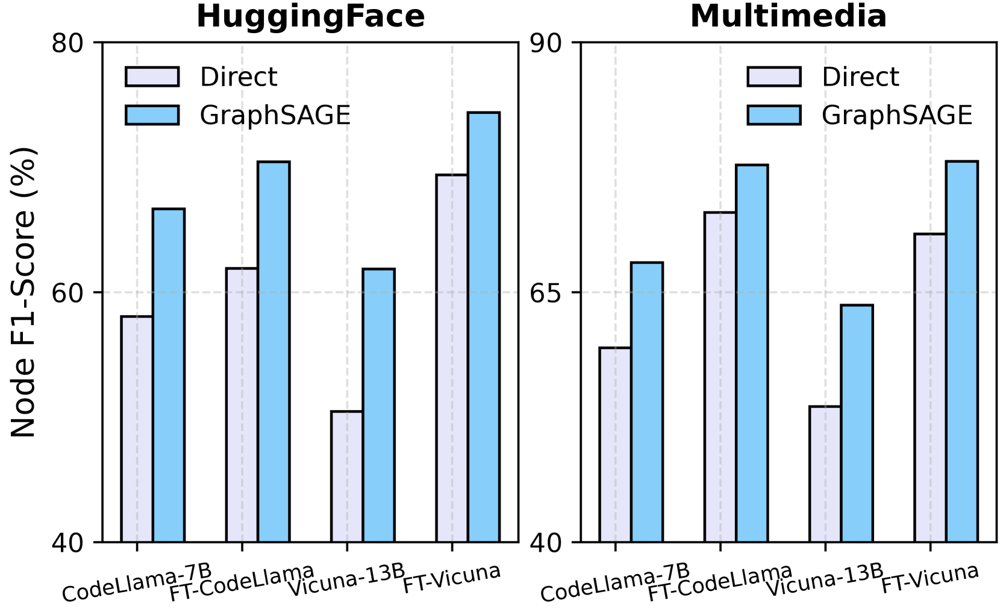

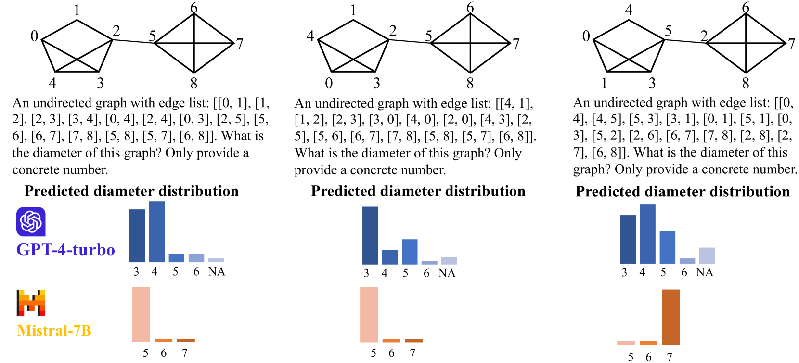

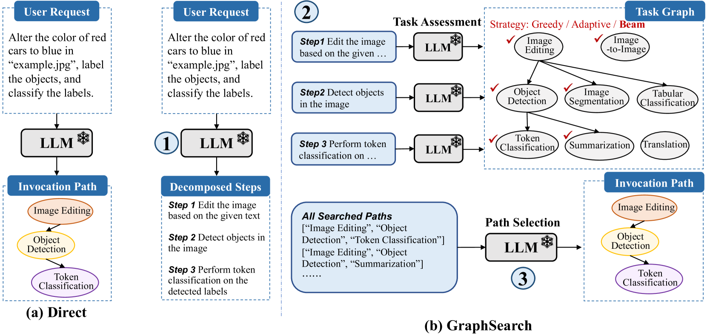

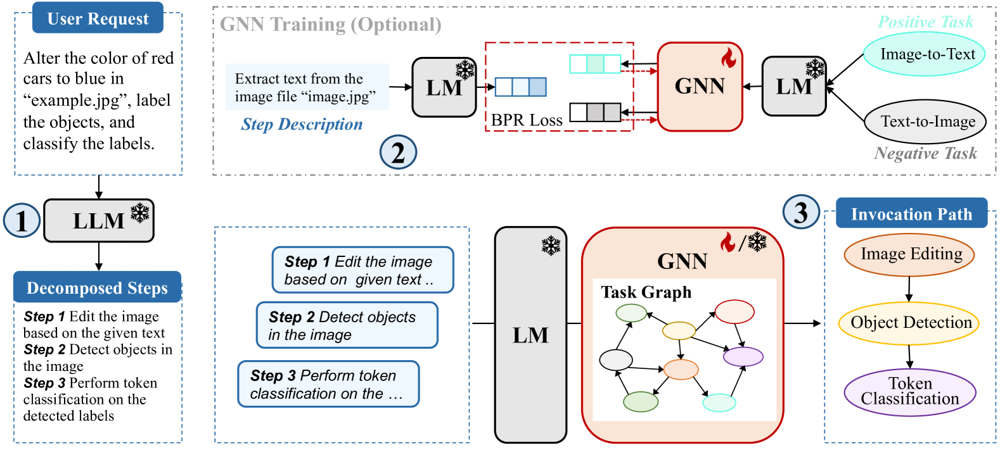

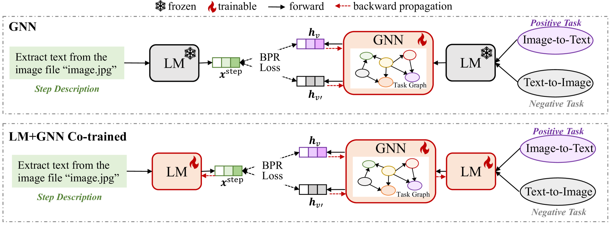

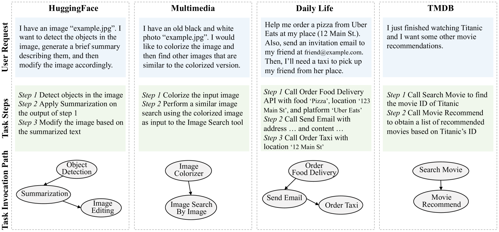

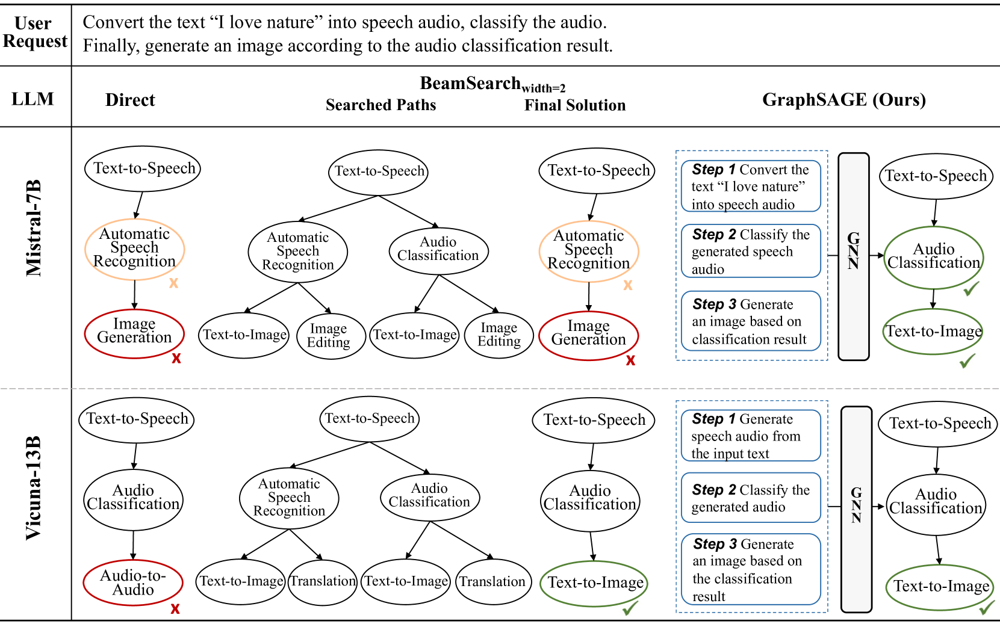

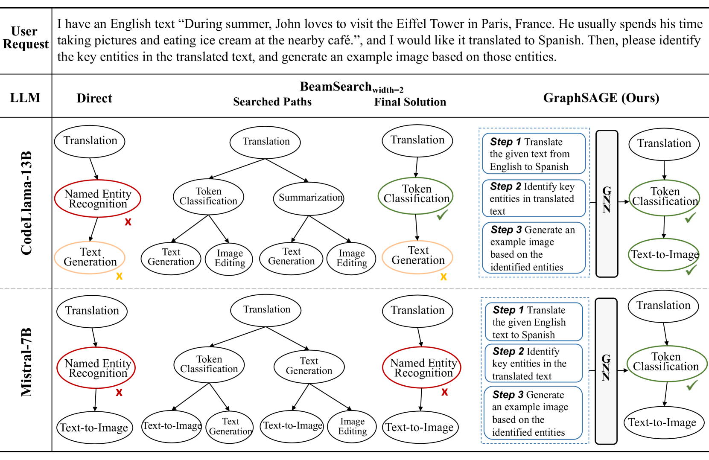

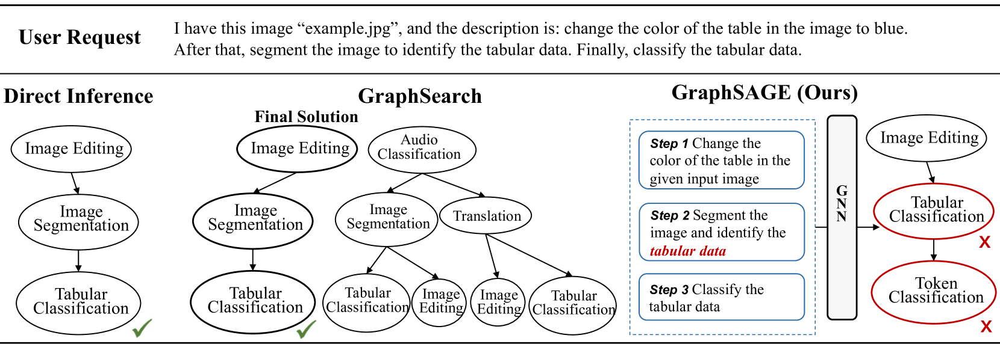

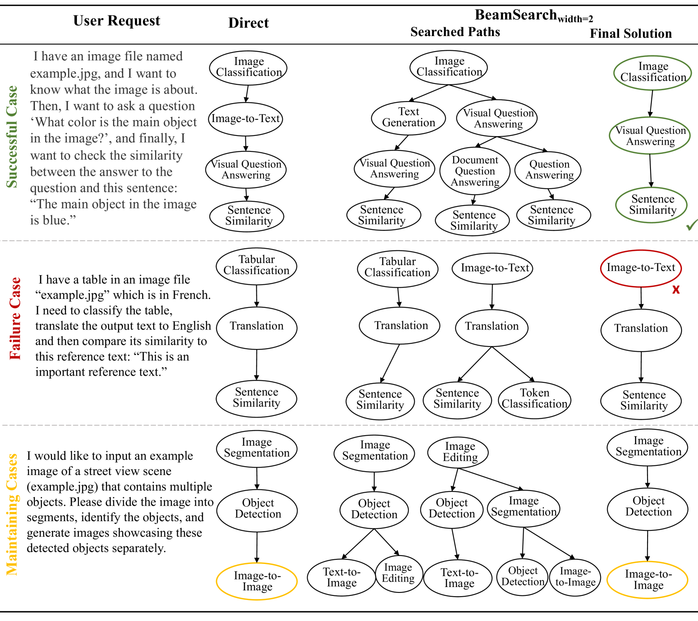

[Arxiv](https://arxiv.org/abs/2405.19119)