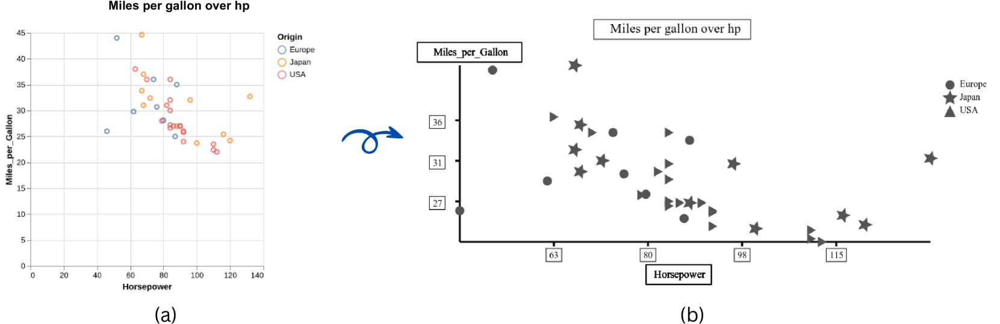
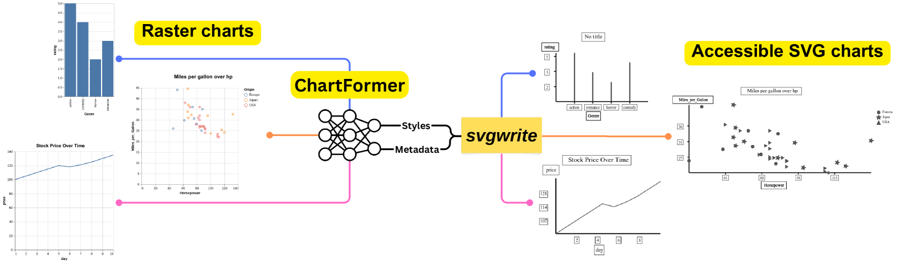
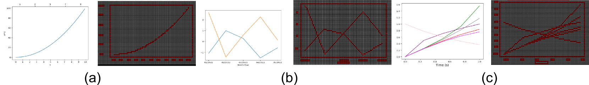

# ChartFormer：一款大型视觉语言模型，专为将图表图像转化为触感友好的SVG格式而设计。

发布时间：2024年05月29日

`LLM应用

理由：这篇论文主要关注的是利用图表分析领域的最新进展，开发了一个名为ChartFormer的模型，用于将光栅图表图像转换为触觉友好的SVGs，以满足盲人和视觉障碍者的需求。这个应用直接涉及到使用模型来解决实际问题，即图表的可访问性问题，因此属于LLM应用类别。虽然这个过程中可能涉及到一些理论性的分析，但主要贡献和应用方向是实际的模型开发和应用，而不是理论研究。` `辅助技术` `数据可视化`

> ChartFormer: A Large Vision Language Model for Converting Chart Images into Tactile Accessible SVGs

# 摘要

> 图表等可视化工具对于解读复杂数据至关重要，但它们常以光栅图像形式出现，无法满足盲人和视觉障碍者的辅助技术需求。创建可访问的矢量图形既需专业技能又耗时。本研究利用图表分析领域的最新进展，实现了触觉图表的端到端生成。我们的三大贡献包括：(1) 开发 ChartFormer 模型，将光栅图表图像转换为触觉友好的 SVGs；(2) 基于我们遵循可访问性标准创建的 Chart2Tactile 数据集训练该模型；(3) 通过与使用可刷新二维触觉显示器的用户进行初步研究，验证了我们 SVGs 的有效性。相关成果已在 https://github.com/nsothman/ChartFormer 公开。

> Visualizations, such as charts, are crucial for interpreting complex data. However, they are often provided as raster images, which are not compatible with assistive technologies for people with blindness and visual impairments, such as embossed papers or tactile displays. At the same time, creating accessible vector graphics requires a skilled sighted person and is time-intensive. In this work, we leverage advancements in the field of chart analysis to generate tactile charts in an end-to-end manner. Our three key contributions are as follows: (1) introducing the ChartFormer model trained to convert raster chart images into tactile-accessible SVGs, (2) training this model on the Chart2Tactile dataset, a synthetic chart dataset we created following accessibility standards, and (3) evaluating the effectiveness of our SVGs through a pilot user study with an refreshable two-dimensional tactile display. Our work is publicly available at https://github.com/nsothman/ChartFormer .

[Arxiv](https://arxiv.org/abs/2405.19117)