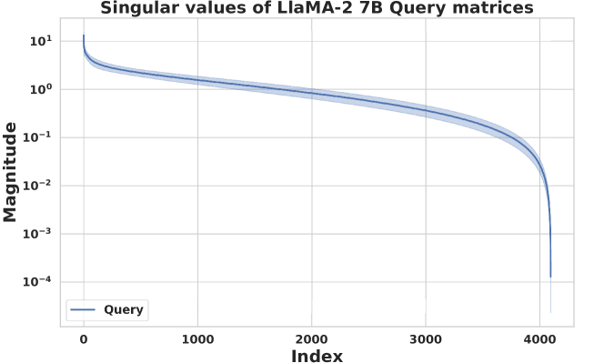
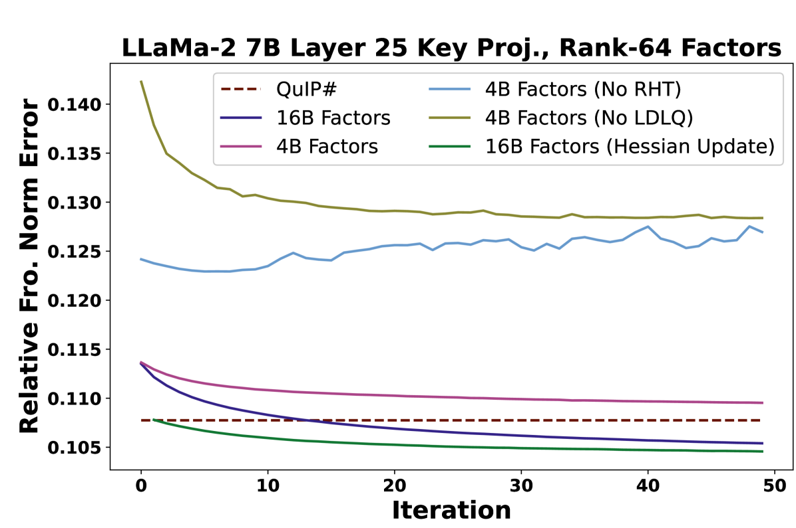
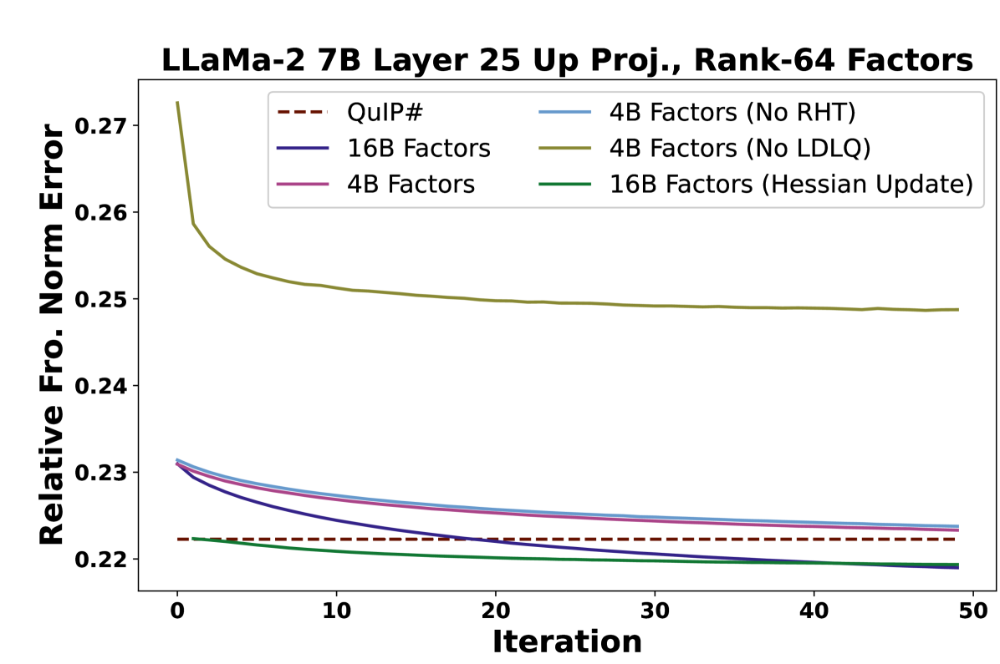
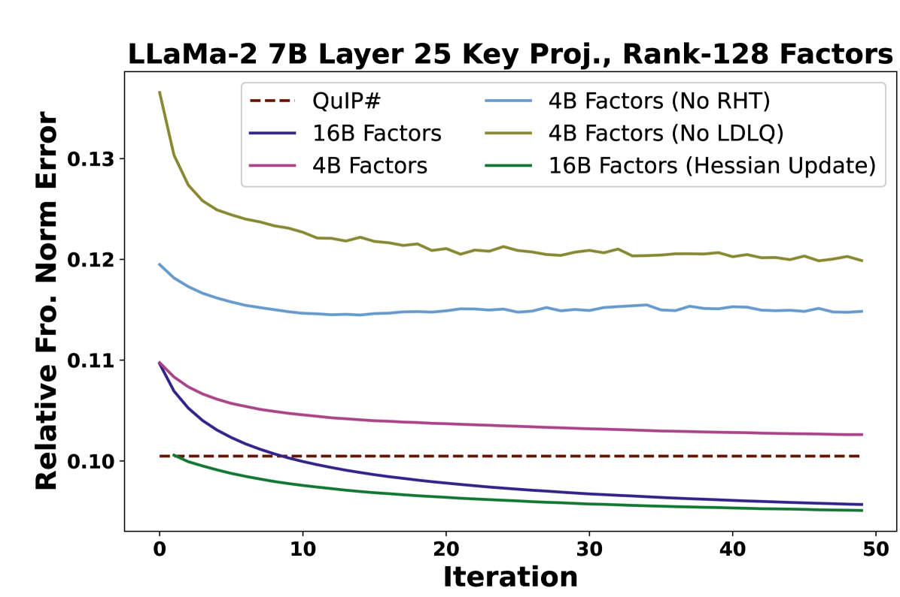
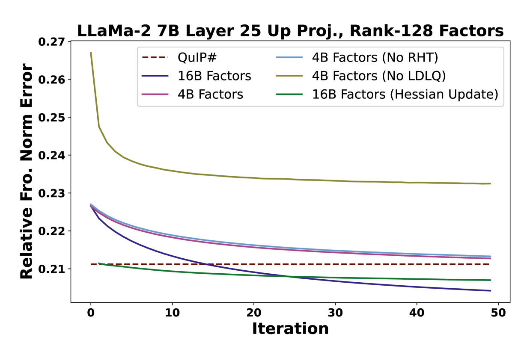
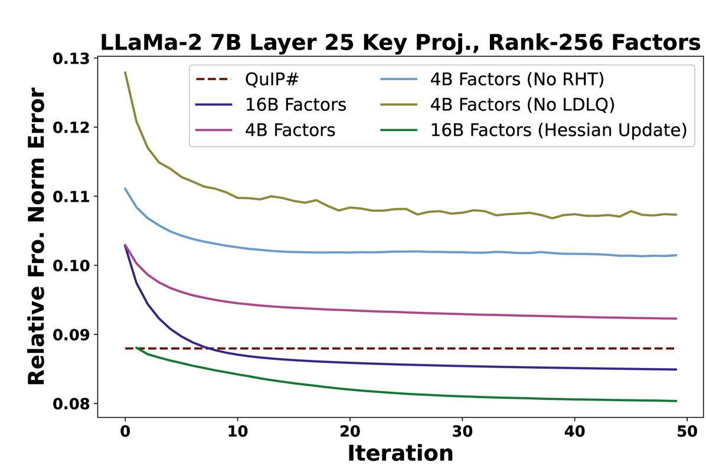
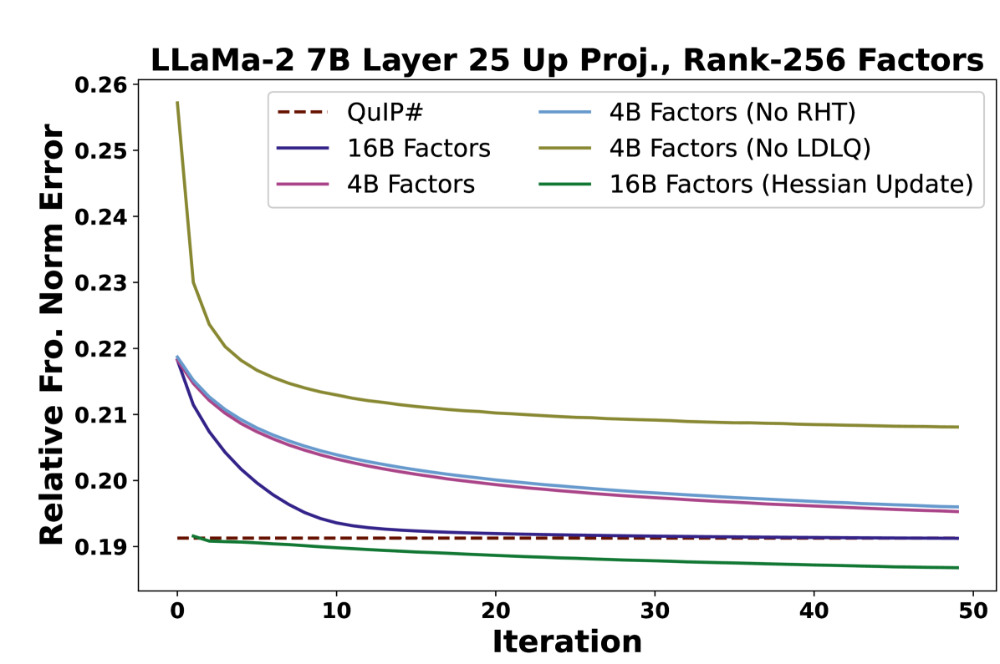
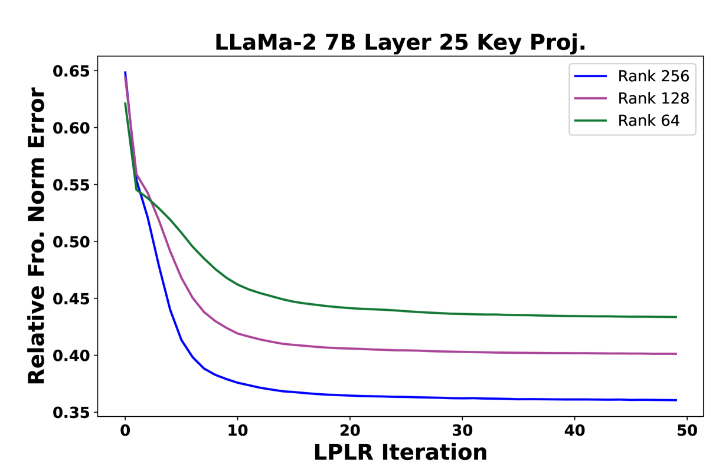
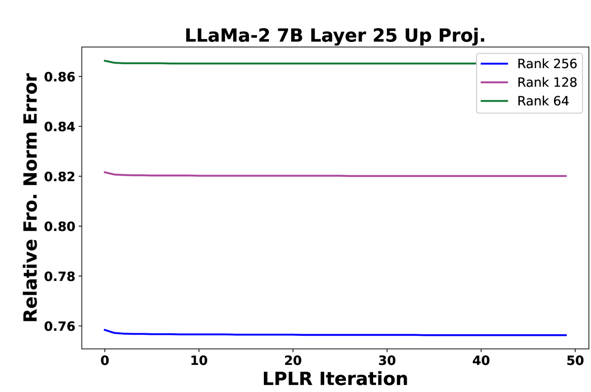

# 通过低秩与低精度分解精简大型语言模型

发布时间：2024年05月29日

`LLM理论

理由：这篇论文主要探讨了大型语言模型（LLMs）的压缩技术，特别是通过一种名为CALDERA的创新后训练压缩算法来实现。该算法利用了权重矩阵的低秩结构，并通过低秩低精度分解来近似原始模型，以实现在内存受限的边缘设备上的部署。论文中还提供了理论分析和实验结果，以证明该方法的有效性。因此，这篇论文更偏向于LLM的理论研究，而不是具体的应用、Agent或RAG相关的研究。` `边缘计算` `人工智能`

> Compressing Large Language Models using Low Rank and Low Precision Decomposition

# 摘要

> 大型语言模型（LLMs）因其庞大的体积而难以在内存受限的边缘设备上部署。本研究提出了一种名为$\rm CALDERA$的创新后训练压缩算法，该算法利用权重矩阵$\mathbf{W}$的固有低秩结构，通过低秩低精度分解$\mathbf{W} \approx \mathbf{Q} + \mathbf{L}\mathbf{R}$进行近似，其中$\mathbf{L}$和$\mathbf{R}$为低秩因子，且各元素被量化。模型通过替换每一层的$\mathbf{Q} + \mathbf{L}\mathbf{R}$分解实现压缩，并评估其零-shot性能。此外，$\mathbf{L}$和$\mathbf{R}$的低秩适应性增强了零-shot性能。$\rm CALDERA$通过优化问题$\min_{\mathbf{Q},\mathbf{L},\mathbf{R}}\lVert(\mathbf{Q} + \mathbf{L}\mathbf{R} - \mathbf{W})\mathbf{X}^\top\rVert_{\rm F}^2$获得分解，其中$\mathbf{X}$为校准数据，$\mathbf{Q}$、$\mathbf{L}$、$\mathbf{R}$需以低精度格式表示。理论分析表明，$\rm CALDERA$的近似误差有明确的上界，并通过权衡压缩比与模型性能，分析了目标秩和量化比特预算的影响。实验显示，使用$\rm CALDERA$压缩的LlaMa-$2$ $7$B/$70$B和LlaMa-$3$ $8$B模型在每参数少于$2.5$比特的情况下，性能超越了现有技术。实现代码已公开：\href{https://github.com/pilancilab/caldera}{https://github.com/pilancilab/caldera}。

> The prohibitive sizes of Large Language Models (LLMs) today make it difficult to deploy them on memory-constrained edge devices. This work introduces $\rm CALDERA$ -- a new post-training LLM compression algorithm that harnesses the inherent low-rank structure of a weight matrix $\mathbf{W}$ by approximating it via a low-rank, low-precision decomposition as $\mathbf{W} \approx \mathbf{Q} + \mathbf{L}\mathbf{R}$. Here, $\mathbf{L}$ and $\mathbf{R}$ are low rank factors, and the entries of $\mathbf{Q}$, $\mathbf{L}$ and $\mathbf{R}$ are quantized. The model is compressed by substituting each layer with its $\mathbf{Q} + \mathbf{L}\mathbf{R}$ decomposition, and the zero-shot performance of the compressed model is evaluated. Additionally, $\mathbf{L}$ and $\mathbf{R}$ are readily amenable to low-rank adaptation, consequently enhancing the zero-shot performance. $\rm CALDERA$ obtains this decomposition by formulating it as an optimization problem $\min_{\mathbf{Q},\mathbf{L},\mathbf{R}}\lVert(\mathbf{Q} + \mathbf{L}\mathbf{R} - \mathbf{W})\mathbf{X}^\top\rVert_{\rm F}^2$, where $\mathbf{X}$ is the calibration data, and $\mathbf{Q}, \mathbf{L}, \mathbf{R}$ are constrained to be representable using low-precision formats. Theoretical upper bounds on the approximation error of $\rm CALDERA$ are established using a rank-constrained regression framework, and the tradeoff between compression ratio and model performance is studied by analyzing the impact of target rank and quantization bit budget. Results illustrate that compressing LlaMa-$2$ $7$B/$70$B and LlaMa-$3$ $8$B models obtained using $\rm CALDERA$ outperforms existing post-training LLM compression techniques in the regime of less than $2.5$ bits per parameter. The implementation is available at: \href{https://github.com/pilancilab/caldera}{https://github.com/pilancilab/caldera}.

[Arxiv](https://arxiv.org/abs/2405.18886)