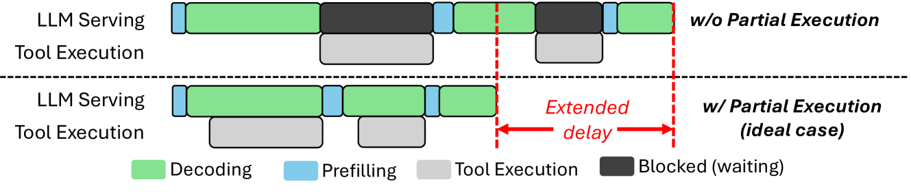
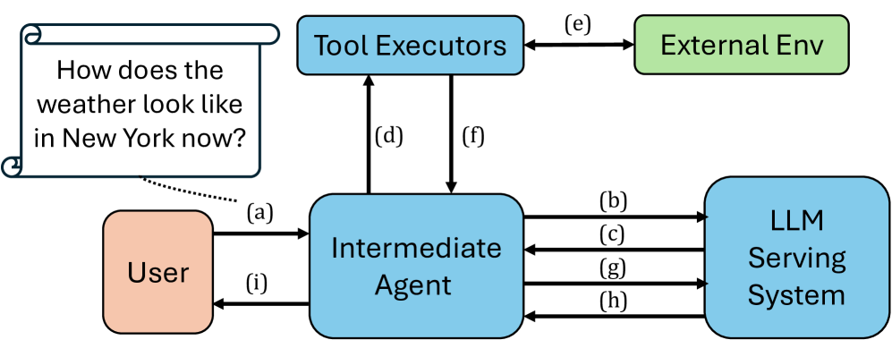
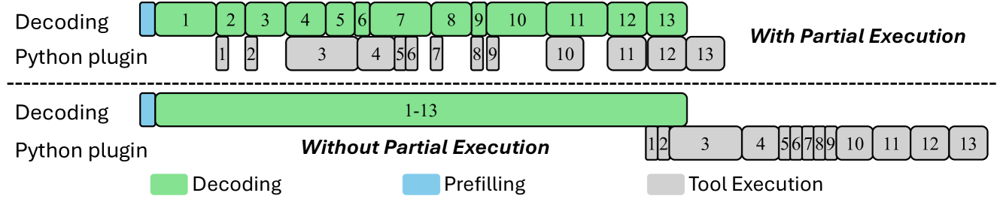
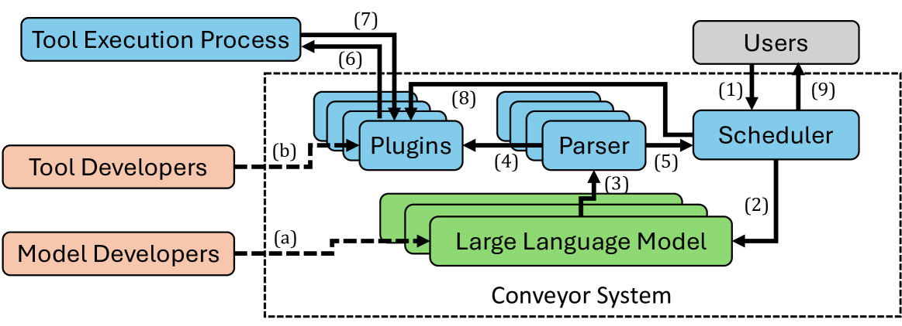
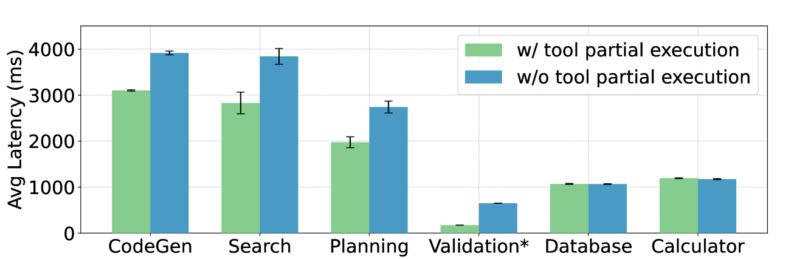
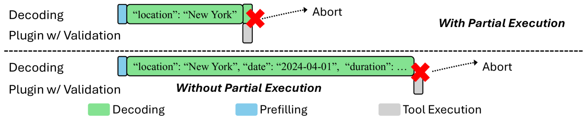
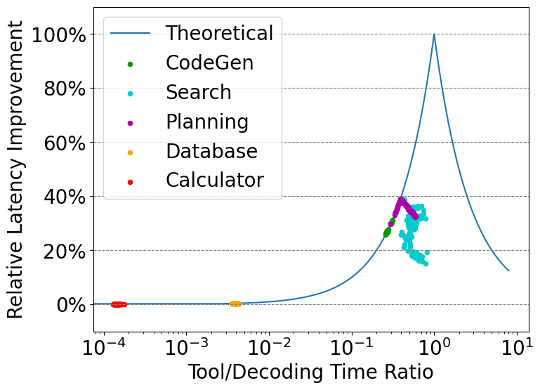

# Conveyor：采用工具部分执行的高效大型语言模型服务，实现工具感知。

发布时间：2024年05月29日

`LLM应用

这篇论文探讨了如何通过在大型语言模型（LLM）的解码过程中集成外部工具的部分执行来提高效率。具体来说，论文介绍了Conveyor系统，这是一个专门设计来优化处理涉及外部工具请求的系统。它为工具开发者提供了一个接口，允许他们展示部分执行的可能性，并配备了一个请求调度器来支持这种执行。实验结果显示，这种方法可以显著降低请求完成延迟。因此，这篇论文属于LLM应用分类，因为它关注的是LLM在实际应用中的优化和改进。` `云计算` `人工智能`

> Conveyor: Efficient Tool-aware LLM Serving with Tool Partial Execution

# 摘要

> 随着与外部工具（如ChatGPT插件）的集成，大型语言模型（LLM）的服务负载变得更加复杂。本文揭示了一个新机遇：在LLM解码过程中同步进行工具的部分执行，以提升效率。为此，我们开发了Conveyor系统，专为优化处理涉及外部工具的请求。我们创新性地为工具开发者提供了一个接口，使他们能向LLM服务系统展示部分执行的可能性，并配备了一个请求调度器，以支持工具的部分执行。实验结果表明，通过这种方式，请求完成延迟可降低高达38.8%。

> The complexity of large language model (LLM) serving workloads has substantially increased due to the integration with external tool invocations, such as ChatGPT plugins. In this paper, we identify a new opportunity for efficient LLM serving for requests that trigger tools: tool partial execution alongside LLM decoding. To this end, we design Conveyor, an efficient LLM serving system optimized for handling requests involving external tools. We introduce a novel interface for tool developers to expose partial execution opportunities to the LLM serving system and a request scheduler that facilitates partial tool execution. Our results demonstrate that tool partial execution can improve request completion latency by up to 38.8%.

[Arxiv](https://arxiv.org/abs/2406.00059)