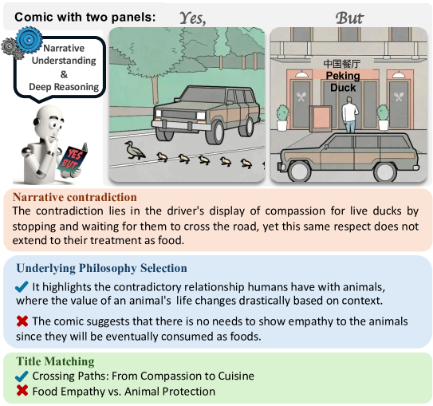
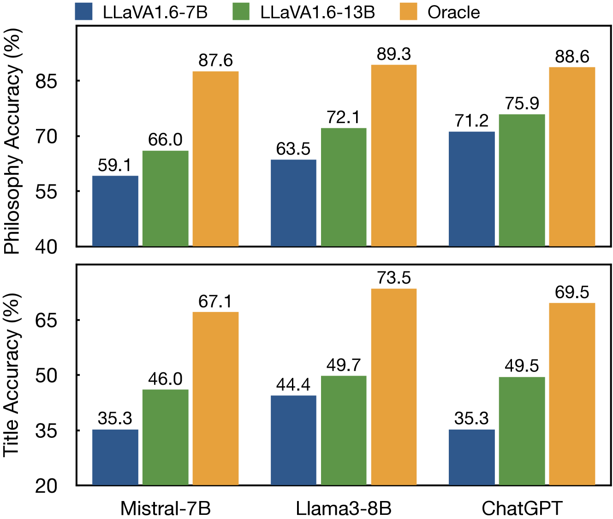
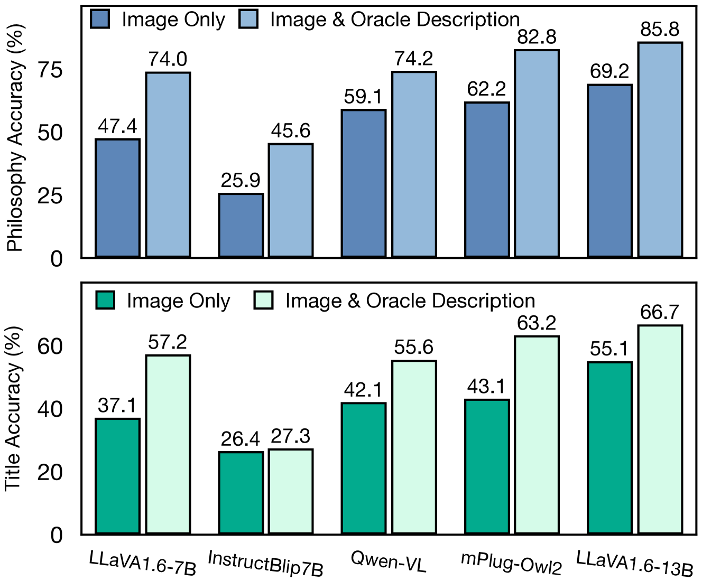

# 揭秘并置之谜：AI模型能否洞察幽默中的矛盾？

发布时间：2024年05月29日

`Agent

理由：这篇论文主要关注的是大型多模态语言模型在理解和解释人类幽默，特别是在矛盾叙事漫画中的应用。它通过YesBut基准测试了AI模型的能力，并分析了这些模型在理解复杂叙事幽默方面的局限性。虽然这项工作涉及到了大型语言模型的应用，但其核心在于评估和改进AI作为一个智能Agent在特定任务（理解幽默）上的表现，因此更适合归类为Agent。` `人工智能`

> Cracking the Code of Juxtaposition: Can AI Models Understand the Humorous Contradictions

# 摘要

> 大型多模态语言模型虽在多任务中表现出色，但在捕捉人类幽默的微妙之处，尤其是通过非线性叙事展现的幽默时，仍显不足。本文聚焦于矛盾叙事的漫画，每幅漫画包含两个引发幽默矛盾的面板。我们推出了YesBut基准，旨在通过从基础内容理解到复杂叙事推理的任务，测试AI识别和解读这些漫画的能力。经过对商业及开源大型（视觉）语言模型的深入实验与分析，我们发现即便是最尖端的模型，在理解漫画中的叙事幽默复杂性方面，仍不及人类。这些发现揭示了AI在理解人类创意表达上的局限，并指出了改进的方向。

> Recent advancements in large multimodal language models have demonstrated remarkable proficiency across a wide range of tasks. Yet, these models still struggle with understanding the nuances of human humor through juxtaposition, particularly when it involves nonlinear narratives that underpin many jokes and humor cues. This paper investigates this challenge by focusing on comics with contradictory narratives, where each comic consists of two panels that create a humorous contradiction. We introduce the YesBut benchmark, which comprises tasks of varying difficulty aimed at assessing AI's capabilities in recognizing and interpreting these comics, ranging from literal content comprehension to deep narrative reasoning. Through extensive experimentation and analysis of recent commercial or open-sourced large (vision) language models, we assess their capability to comprehend the complex interplay of the narrative humor inherent in these comics. Our results show that even state-of-the-art models still lag behind human performance on this task. Our findings offer insights into the current limitations and potential improvements for AI in understanding human creative expressions.

[Arxiv](https://arxiv.org/abs/2405.19088)