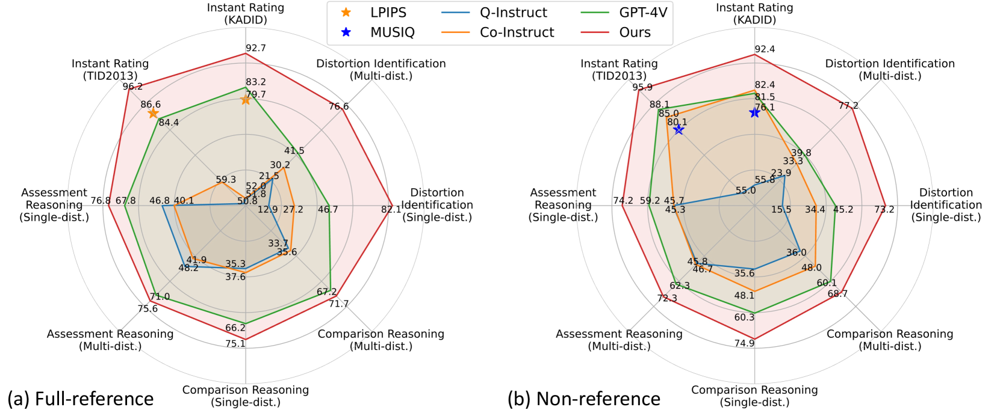
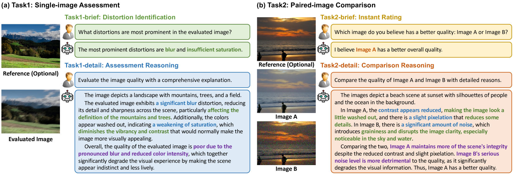
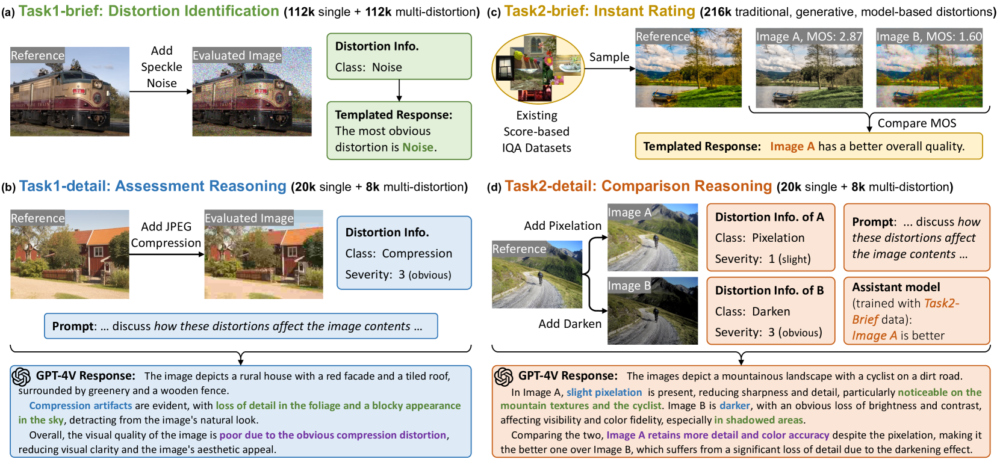
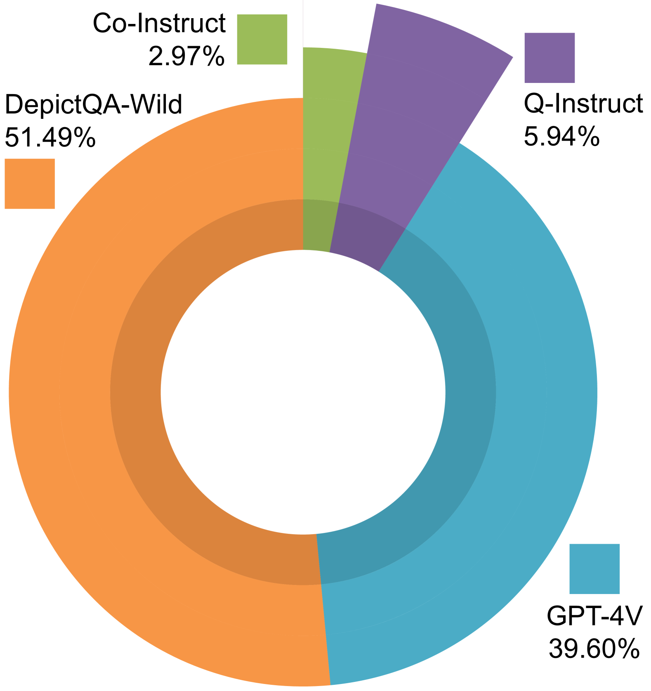
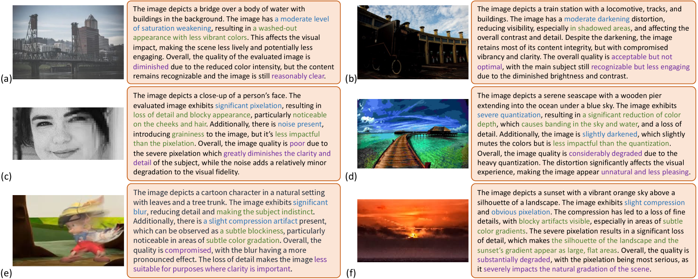
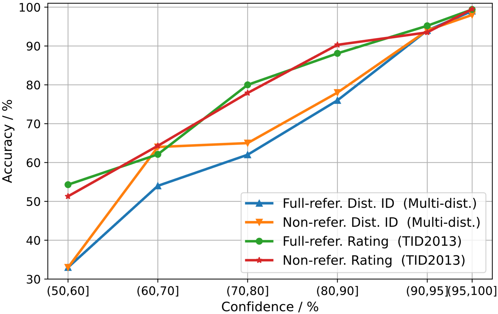
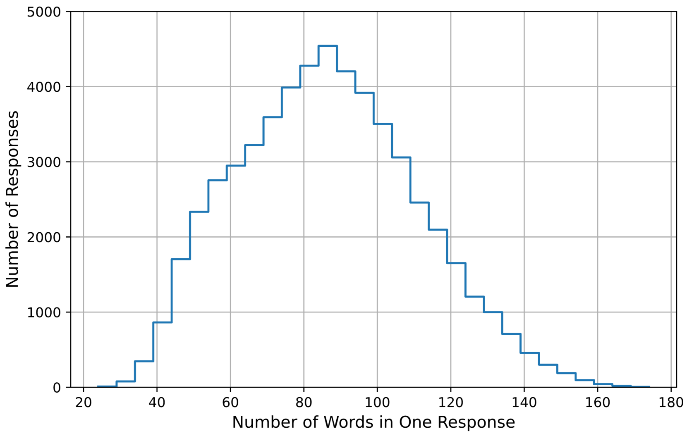
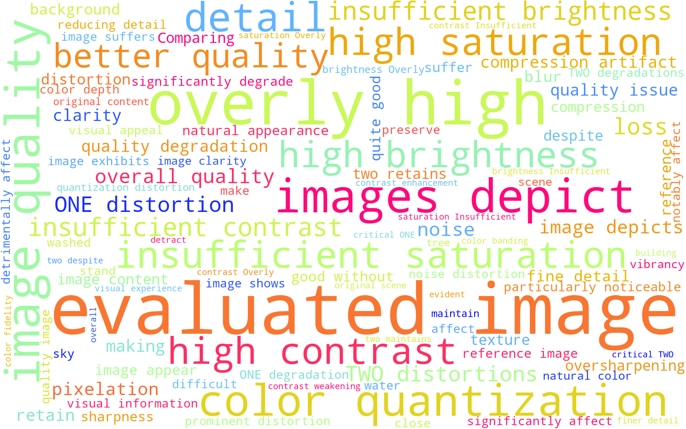
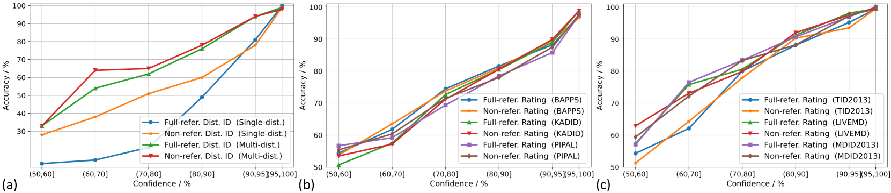
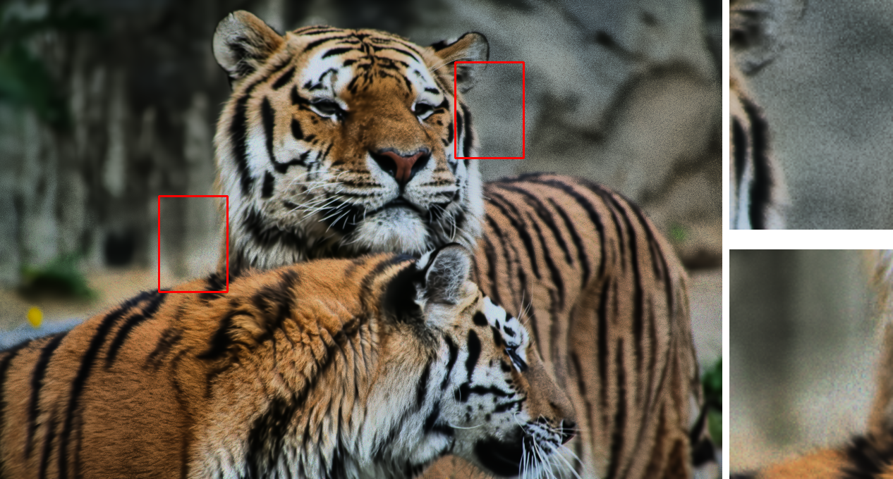

# 自然环境下的图像质量描述性评估

发布时间：2024年05月29日

`LLM应用

理由：这篇论文主要讨论了基于视觉语言模型（VLMs）的图像质量评估（IQA）技术，并介绍了一种新的IQA任务范式DepictQA-Wild。该研究专注于改进和优化图像质量评估的方法，以更好地适应实际应用的需求。这表明论文的内容是关于大型语言模型（LLM）在特定应用领域的实际应用，即图像质量评估，因此属于LLM应用分类。` `图像质量评估` `视觉语言模型`

> Descriptive Image Quality Assessment in the Wild

# 摘要

> 随着视觉语言模型（VLMs）技术的飞速进步，基于VLM的图像质量评估（IQA）正致力于用语言精准描述图像质量，以匹配人类的表达方式并深入理解IQA任务的复杂性。尽管如此，当前的方法仍未能满足实际应用的需求。一方面，过往研究多局限于特定的子任务或场景，难以适应现实世界中多样化的需求。另一方面，由于数据集的覆盖面、规模和质量受限，这些方法的性能并未达到最优。为此，我们推出了DepictQA-Wild，一种全新的多功能IQA任务范式，它不仅包括评估和比较任务，还涵盖了简短与详细的响应模式，以及全参考与无参考的评估场景。我们采用了一种基于真实数据的数据集构建策略，大幅提升了数据质量，并通过简短-详细联合框架将数据集规模扩展至495K，命名为DQ-495K。在训练过程中，我们保持了图像的原始分辨率，有效应对了分辨率相关的质量问题，并引入了一个置信度分数，帮助筛选出低质量的评估结果。实验证明，DepictQA-Wild在失真识别、即时评分和推理任务上均显著超越了传统评分方法、先前的VLM-based IQA模型以及专有的GPT-4V。我们的方法在评估网络下载图像和模型处理图像等实际应用中展现出了显著优势。数据集和代码将在https://depictqa.github.io/depictqa-wild/公开发布。

> With the rapid advancement of Vision Language Models (VLMs), VLM-based Image Quality Assessment (IQA) seeks to describe image quality linguistically to align with human expression and capture the multifaceted nature of IQA tasks. However, current methods are still far from practical usage. First, prior works focus narrowly on specific sub-tasks or settings, which do not align with diverse real-world applications. Second, their performance is sub-optimal due to limitations in dataset coverage, scale, and quality. To overcome these challenges, we introduce Depicted image Quality Assessment in the Wild (DepictQA-Wild). Our method includes a multi-functional IQA task paradigm that encompasses both assessment and comparison tasks, brief and detailed responses, full-reference and non-reference scenarios. We introduce a ground-truth-informed dataset construction approach to enhance data quality, and scale up the dataset to 495K under the brief-detail joint framework. Consequently, we construct a comprehensive, large-scale, and high-quality dataset, named DQ-495K. We also retain image resolution during training to better handle resolution-related quality issues, and estimate a confidence score that is helpful to filter out low-quality responses. Experimental results demonstrate that DepictQA-Wild significantly outperforms traditional score-based methods, prior VLM-based IQA models, and proprietary GPT-4V in distortion identification, instant rating, and reasoning tasks. Our advantages are further confirmed by real-world applications including assessing the web-downloaded images and ranking model-processed images. Datasets and codes will be released in https://depictqa.github.io/depictqa-wild/.

[Arxiv](https://arxiv.org/abs/2405.18842)