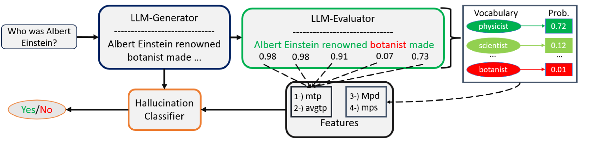

# 检测大规模语言模型生成中的幻觉：基于词元概率的新途径

发布时间：2024年05月29日

`LLM应用

这篇论文关注的是大型语言模型（LLMs）产生不准确输出（幻觉）的问题，并提出了一种新颖的监督学习方法来检测这些幻觉。这种方法不依赖于产生幻觉的同一LLM，而是使用来自其他LLM评估者的四个数值特征。论文的研究重点在于提高依赖LLM内容的应用的可靠性，这是一个应用层面的研究，因此将其归类为LLM应用。` `机器学习`

> Detecting Hallucinations in Large Language Model Generation: A Token Probability Approach

# 摘要

> 大型语言模型（LLMs）产生不准确输出（幻觉）的问题日益引起关注。为了确保依赖LLM内容的应用的可靠性，检测这些幻觉至关重要。现有方法往往资源密集，依赖于复杂的分析，且多依赖于产生幻觉的同一LLM。本文提出了一种新颖的监督学习方法，使用两个简单分类器，仅基于四个数值特征，这些特征来自其他LLM评估者，不限于同一模型。该方法在多个任务和三个基准上取得了超越现有技术的成果。我们还深入分析了方法的优劣，强调了特征选择和LLM评估者的重要性，并已在GitHub上公开了我们的代码。

> Concerns regarding the propensity of Large Language Models (LLMs) to produce inaccurate outputs, also known as hallucinations, have escalated. Detecting them is vital for ensuring the reliability of applications relying on LLM-generated content. Current methods often demand substantial resources and rely on extensive LLMs or employ supervised learning with multidimensional features or intricate linguistic and semantic analyses difficult to reproduce and largely depend on using the same LLM that hallucinated. This paper introduces a supervised learning approach employing two simple classifiers utilizing only four numerical features derived from tokens and vocabulary probabilities obtained from other LLM evaluators, which are not necessarily the same. The method yields promising results, surpassing state-of-the-art outcomes in multiple tasks across three different benchmarks. Additionally, we provide a comprehensive examination of the strengths and weaknesses of our approach, highlighting the significance of the features utilized and the LLM employed as an evaluator. We have released our code publicly at https://github.com/Baylor-AI/HalluDetect.

[Arxiv](https://arxiv.org/abs/2405.19648)