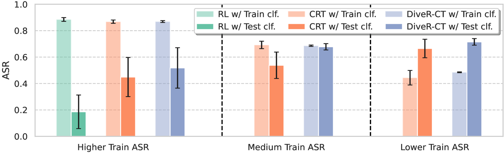
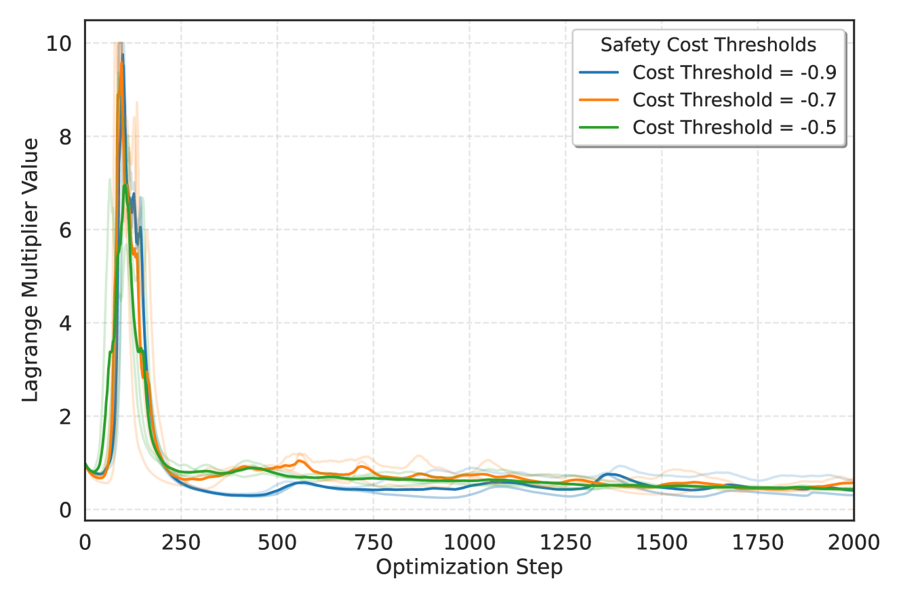

# DiveR-CT：解放约束，提升多样性，红队演练新境界

发布时间：2024年05月29日

`Agent

理由：这篇论文介绍了一种新的自动红队演练工具DiveR-CT，它通过放宽目标和语义奖励的限制来增强策略的多样性，从而提高安全评估的效率和效果。这种工具可以被视为一个智能Agent，因为它能够自主地执行任务（如安全评估和漏洞探测），并根据环境和目标调整其行为。这与Agent分类中的定义相符，即Agent是指能够感知环境并采取行动以达到目标的实体。此外，论文中提到的动态调整目标权重和安全调优等功能，进一步强调了该工具作为智能Agent的特性。` `网络安全` `人工智能安全`

> DiveR-CT: Diversity-enhanced Red Teaming with Relaxing Constraints

# 摘要

> 大型语言模型（LLMs）的进步已经不可或缺，但其安全管理引发了广泛关注。自动红队演练作为一种高效且可扩展的安全评估手段，正逐渐取代传统的手动漏洞探测。然而，现有方法往往为了追求高攻击成功率而牺牲了多样性，且随着历史数据的积累，创新也趋于停滞。为此，我们推出了DiveR-CT，它通过放宽目标和语义奖励的限制，为策略提供了更多自由，以增强多样性。实验结果显示，DiveR-CT在多个方面超越了基线：1) 在不同攻击成功率下，生成的数据在多样性指标上表现更佳；2) 通过安全调优，有效提升了蓝队模型的韧性；3) 允许动态调整目标权重，确保攻击成功率的可靠与可控；4) 减少了奖励过度优化的风险。更多项目信息及代码，请访问https://andrewzh1112.github.io/#diverct。

> Recent advances in large language models (LLMs) have made them indispensable, raising significant concerns over managing their safety. Automated red teaming offers a promising alternative to the labor-intensive and error-prone manual probing for vulnerabilities, providing more consistent and scalable safety evaluations. However, existing approaches often compromise diversity by focusing on maximizing attack success rate. Additionally, methods that decrease the cosine similarity from historical embeddings with semantic diversity rewards lead to novelty stagnation as history grows. To address these issues, we introduce DiveR-CT, which relaxes conventional constraints on the objective and semantic reward, granting greater freedom for the policy to enhance diversity. Our experiments demonstrate DiveR-CT's marked superiority over baselines by 1) generating data that perform better in various diversity metrics across different attack success rate levels, 2) better-enhancing resiliency in blue team models through safety tuning based on collected data, 3) allowing dynamic control of objective weights for reliable and controllable attack success rates, and 4) reducing susceptibility to reward overoptimization. Project details and code can be found at https://andrewzh112.github.io/#diverct.

[Arxiv](https://arxiv.org/abs/2405.19026)