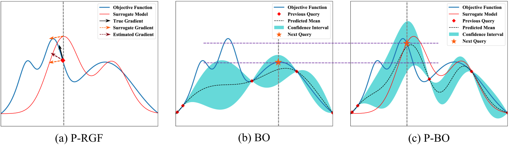

# 利用贝叶斯优化与函数先验指导，实现高效的黑盒对抗攻击策略

发布时间：2024年05月29日

`Agent

理由：这篇论文主要探讨了黑盒对抗攻击的问题，并提出了一种先验引导的贝叶斯优化（P-BO）算法来解决这一问题。这种方法涉及到生成对抗样本，这是Agent领域的一个重要研究方向，因为它涉及到如何通过模型的输出反馈来影响或攻击模型。此外，论文中提到的代理模型和贝叶斯优化技术，都是Agent研究中常用的工具和方法。因此，这篇论文更适合归类于Agent。` `网络安全` `机器学习`

> Efficient Black-box Adversarial Attacks via Bayesian Optimization Guided by a Function Prior

# 摘要

> 本文探讨了一种黑盒对抗攻击的难题，即如何仅凭模型的输出反馈来生成对抗样本。尽管已有方法通过引入代理白盒模型的梯度来提升查询效率，但局部梯度信息不足，导致这些方法仍需大量查询。为此，我们提出了一种先验引导的贝叶斯优化（P-BO）算法，它将代理模型作为全局函数先验，用于黑盒对抗攻击。鉴于代理模型蕴含了目标黑盒模型的丰富信息，P-BO采用高斯过程来模拟攻击目标，其均值函数基于代理模型的损失进行初始化。理论分析显示，不良先验可能影响P-BO的性能，因此我们设计了一种自适应集成策略，通过优化后悔界来自动调整先验系数。实验结果表明，与现有黑盒攻击技术相比，我们的算法在减少查询次数和提升攻击成功率方面表现出色。相关代码已公开发布于 https://github.com/yibo-miao/PBO-Attack。

> This paper studies the challenging black-box adversarial attack that aims to generate adversarial examples against a black-box model by only using output feedback of the model to input queries. Some previous methods improve the query efficiency by incorporating the gradient of a surrogate white-box model into query-based attacks due to the adversarial transferability. However, the localized gradient is not informative enough, making these methods still query-intensive. In this paper, we propose a Prior-guided Bayesian Optimization (P-BO) algorithm that leverages the surrogate model as a global function prior in black-box adversarial attacks. As the surrogate model contains rich prior information of the black-box one, P-BO models the attack objective with a Gaussian process whose mean function is initialized as the surrogate model's loss. Our theoretical analysis on the regret bound indicates that the performance of P-BO may be affected by a bad prior. Therefore, we further propose an adaptive integration strategy to automatically adjust a coefficient on the function prior by minimizing the regret bound. Extensive experiments on image classifiers and large vision-language models demonstrate the superiority of the proposed algorithm in reducing queries and improving attack success rates compared with the state-of-the-art black-box attacks. Code is available at https://github.com/yibo-miao/PBO-Attack.

[Arxiv](https://arxiv.org/abs/2405.19098)