# 借助LLM知识转移提升零-shot面部表情识别能力

发布时间：2024年05月29日

`LLM应用

这篇论文介绍了一种名为Exp-CLIP的方法，该方法通过从大型语言模型（LLM）转移知识来增强零样本面部表情识别。这种方法利用了预训练的视觉-语言编码器，并通过引入一个投影头来优化处理面部表情的细微变化。Exp-CLIP通过将视觉表示与LLM编码器提取的任务特定语义对齐，并采用文本指令定制LLM知识，从而在多个野外面部表情识别数据集上实现了卓越的零样本性能。这种方法的应用性质和对LLM的利用使其适合归类为LLM应用。` `面部表情识别` `零样本学习`

> Enhancing Zero-Shot Facial Expression Recognition by LLM Knowledge Transfer

# 摘要

> 目前的面部表情识别模型多依赖于监督学习，受限于缺乏大量高质量标注的面部表情图像，导致在未见过的图像上泛化能力差。基于视觉-语言的零样本模型虽有潜力，但因缺乏针对面部表情识别的特定知识，未能优化处理细微表情。为此，我们提出了Exp-CLIP方法，通过从大型语言模型转移知识，增强零样本面部表情识别。该方法利用预训练的视觉-语言编码器，并引入一个投影头，将视觉-语言空间映射至捕捉面部动作特征的空间。通过将视觉表示与LLM编码器提取的任务特定语义对齐，并采用文本指令定制LLM知识，Exp-CLIP在七个野外FER数据集上超越了CLIP及其他大型视觉-语言模型，实现了卓越的零样本性能。相关代码和模型已公开于\url{https://github.com/zengqunzhao/Exp-CLIP}。

> Current facial expression recognition (FER) models are often designed in a supervised learning manner thus are constrained by the lack of large-scale facial expression images with high-quality annotations. Consequently, these models often fail to generalize well, performing poorly on unseen images in training. Vision-language-based zero-shot models demonstrate a promising potential for addressing such challenges. However, these models lack task-specific knowledge therefore are not optimized for the nuances of recognizing facial expressions. To bridge this gap, this work proposes a novel method, Exp-CLIP, to enhance zero-shot FER by transferring the task knowledge from large language models (LLMs). Specifically, based on the pre-trained vision-language encoders, we incorporate a projection head designed to map the initial joint vision-language space into a space that captures representations of facial actions. To train this projection head for subsequent zero-shot predictions, we propose to align the projected visual representations with task-specific semantic meanings derived from the LLM encoder, and the text instruction-based strategy is employed to customize the LLM knowledge. Given unlabelled facial data and efficient training of the projection head, Exp-CLIP achieves superior zero-shot results to the CLIP models and several other large vision-language models (LVLMs) on seven in-the-wild FER datasets. The code and pre-trained models are available at \url{https://github.com/zengqunzhao/Exp-CLIP}.

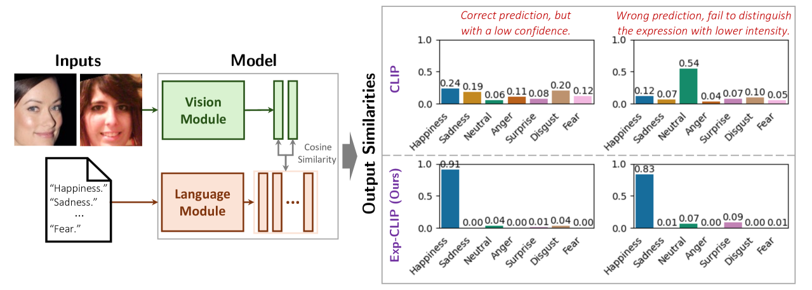

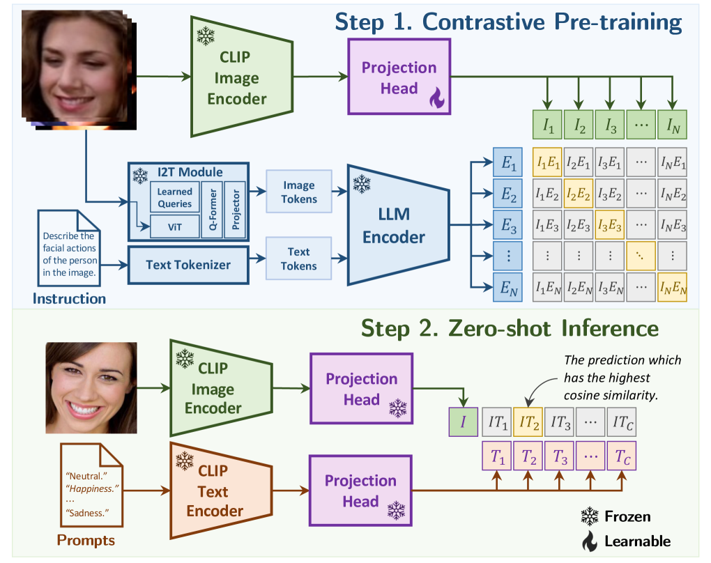

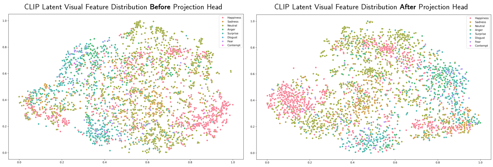

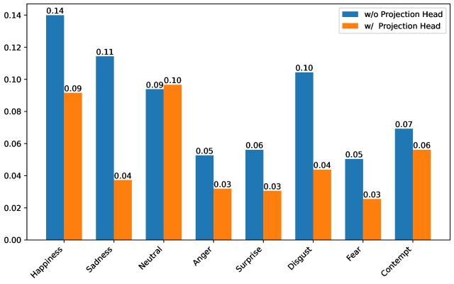

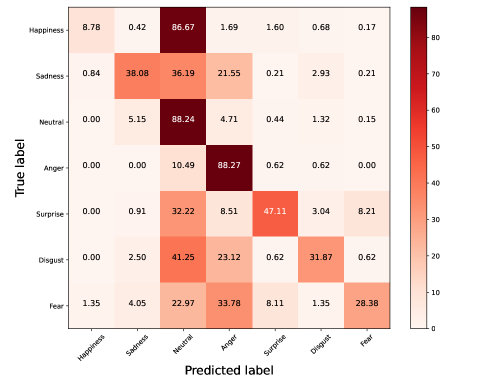

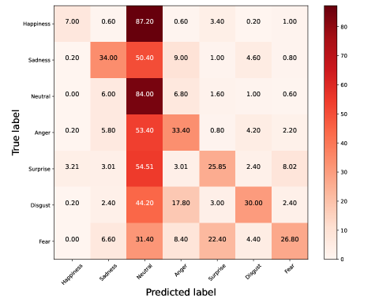

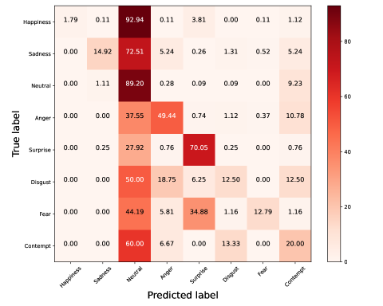

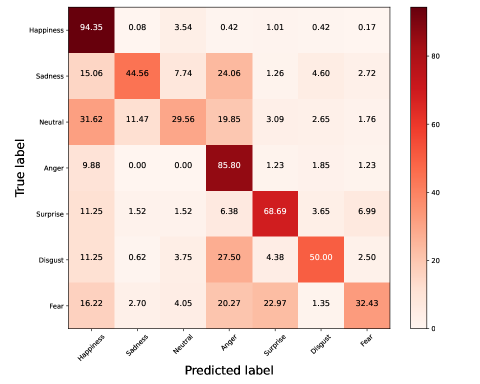

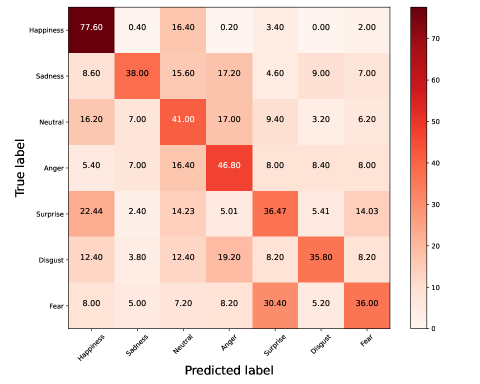

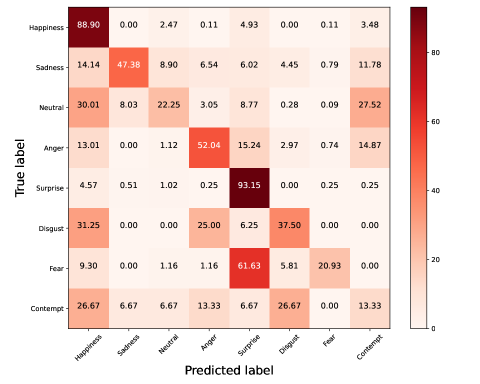

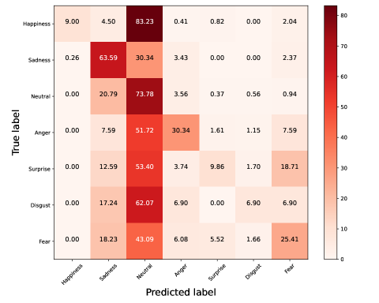

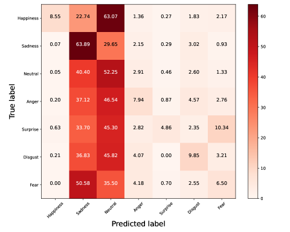

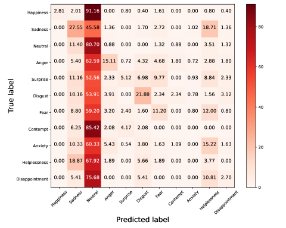

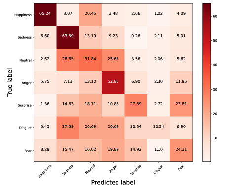

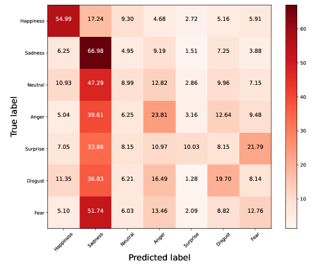

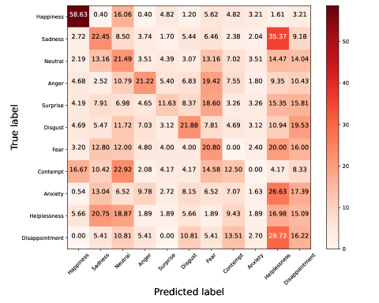

[Arxiv](https://arxiv.org/abs/2405.19100)