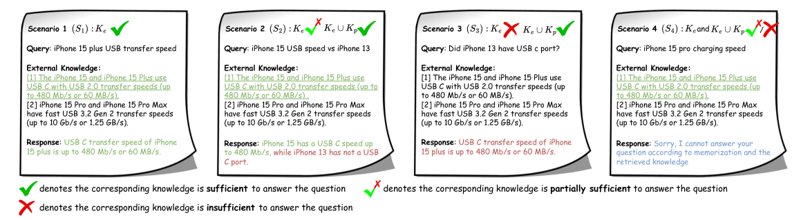
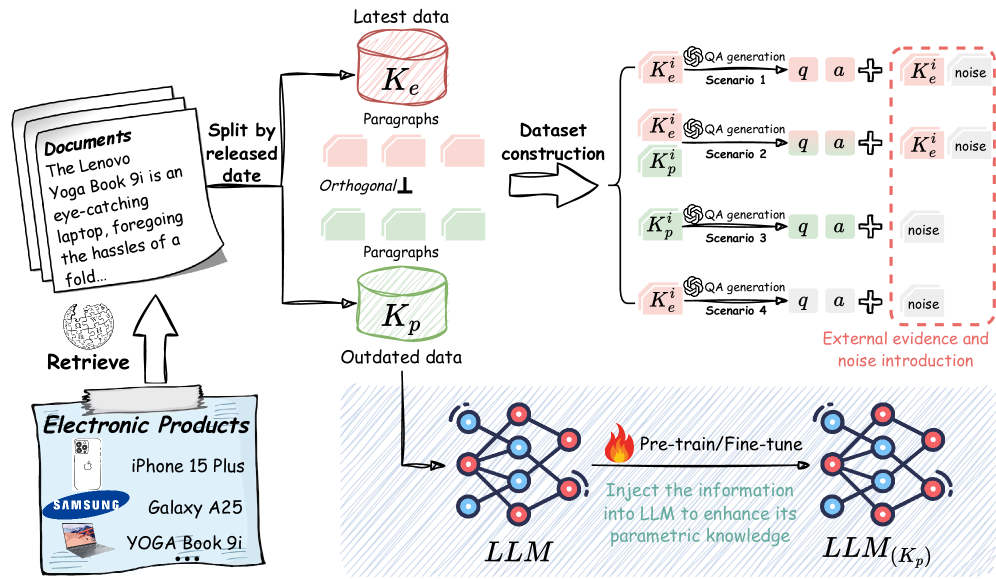

# 探究大型语言模型中外部知识与参数知识的融合效应

发布时间：2024年05月29日

`RAG

这篇论文主要探讨了如何将外部知识融入大型语言模型（LLMs）中，以克服其参数记忆的限制，并分析了在不同知识融合情景下LLMs的行为。这与RAG（Retrieval-Augmented Generation）模型的概念相符，RAG模型是一种结合了检索（retrieval）和生成（generation）的方法，旨在通过外部知识源增强语言模型的性能。因此，这篇论文应归类于RAG。` `知识管理`

> Evaluating the External and Parametric Knowledge Fusion of Large Language Models

# 摘要

> 将外部知识融入大型语言模型（LLMs）是克服其陈旧参数记忆限制的一种有前景的方法。然而，以往研究往往过度依赖外部知识，忽视了LLMs自身参数知识的价值。特别是在外部知识不完整时，LLMs如何融合外部与内部知识的问题尚未充分探讨。我们首次系统地分析了四种知识融合情景下LLMs的行为，并设计了一套数据构建与知识注入流程来模拟这些情景，进行了一系列实验。研究发现，强化LLMs的参数知识能显著提高其知识整合能力，但记忆和提取参数知识以及界定其边界仍是挑战。我们的研究为未来在LLMs中平衡外部与内部知识提供了方向。

> Integrating external knowledge into large language models (LLMs) presents a promising solution to overcome the limitations imposed by their antiquated and static parametric memory. Prior studies, however, have tended to over-reliance on external knowledge, underestimating the valuable contributions of an LLMs' intrinsic parametric knowledge. The efficacy of LLMs in blending external and parametric knowledge remains largely unexplored, especially in cases where external knowledge is incomplete and necessitates supplementation by their parametric knowledge. We propose to deconstruct knowledge fusion into four distinct scenarios, offering the first thorough investigation of LLM behavior across each. We develop a systematic pipeline for data construction and knowledge infusion to simulate these fusion scenarios, facilitating a series of controlled experiments. Our investigation reveals that enhancing parametric knowledge within LLMs can significantly bolster their capability for knowledge integration. Nonetheless, we identify persistent challenges in memorizing and eliciting parametric knowledge, and determining parametric knowledge boundaries. Our findings aim to steer future explorations on harmonizing external and parametric knowledge within LLMs.

[Arxiv](https://arxiv.org/abs/2405.19010)