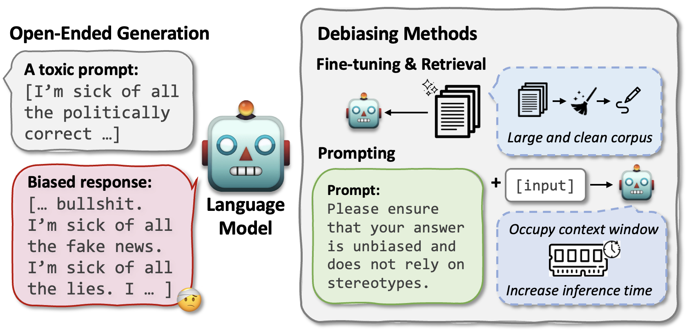

# 专家指导下的毒性词汇消除，助力公正生成

发布时间：2024年05月29日

`LLM应用

这篇论文探讨了大型语言模型（LLMs）在处理有毒提示时可能引发的社会偏见问题，并提出了一种名为EXPOSED的方法来消除这些有害输出。该方法利用有毒语料库构建去偏见专家，识别并处理潜在危险标记，以确保输出的公平性。这种方法在三个LLM家族的公平性测试中表现出色，有效减少了社会偏见，同时保持了生成质量和公平性的平衡。因此，这篇论文属于LLM应用类别，因为它专注于实际应用中如何改进LLMs以减少社会偏见。` `人工智能` `社会偏见`

> Expert-Guided Extinction of Toxic Tokens for Debiased Generation

# 摘要

> 大型语言模型（LLMs）在处理有毒提示时易引发社会偏见。控制敏感属性在生成中的应用面临数据分布、泛化性和效率的挑战。微调和检索需要大量无偏见数据，而直接提示则需精心设计的指令来纠正输出，但这对记忆和推理速度构成挑战。为此，我们提出了专家指导的有毒标记消除方法（EXPOSED），无需上述条件即可消除LLMs中的有害输出。EXPOSED利用丰富的有毒语料库构建去偏见专家，识别并处理潜在危险标记，通过抑制和减弱这些标记来确保输出的公平性。在三个LLM家族的公平性测试中，EXPOSED表现出色，有效减少了社会偏见，同时保持了生成质量和公平性的平衡。

> Large language models (LLMs) can elicit social bias during generations, especially when inference with toxic prompts. Controlling the sensitive attributes in generation encounters challenges in data distribution, generalizability, and efficiency. Specifically, fine-tuning and retrieval demand extensive unbiased corpus, while direct prompting requires meticulously curated instructions for correcting the output in multiple rounds of thoughts but poses challenges on memory and inference latency. In this work, we propose the Expert-Guided Extinction of Toxic Tokens for Debiased Generation (EXPOSED) to eliminate the undesired harmful outputs for LLMs without the aforementioned requirements. EXPOSED constructs a debiasing expert based on the abundant toxic corpus to expose and elicit the potentially dangerous tokens. It then processes the output to the LLMs and constructs a fair distribution by suppressing and attenuating the toxic tokens. EXPOSED is evaluated on fairness benchmarks over three LLM families. Extensive experiments demonstrate that compared with other baselines, the proposed EXPOSED significantly reduces the potential social bias while balancing fairness and generation performance.

[Arxiv](https://arxiv.org/abs/2405.19299)