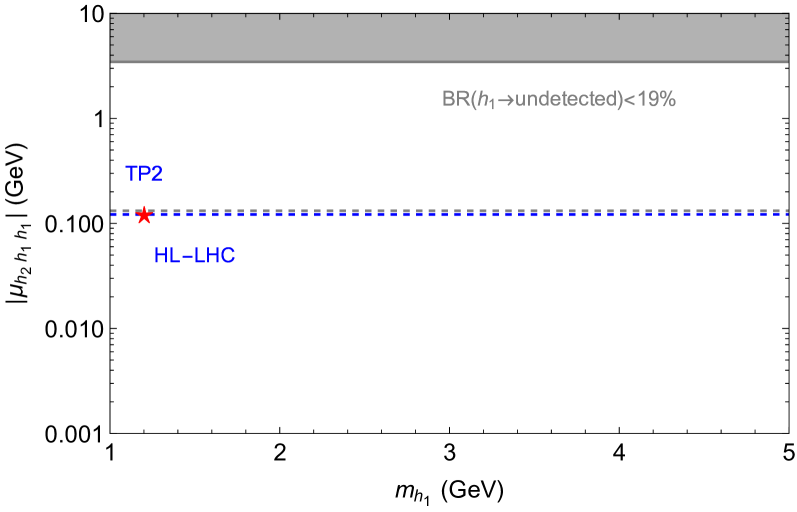

# 利用多模态学习方法，在大型强子对撞机（LHC）上探寻希格斯玻色子至多光子的奇异衰变路径

发布时间：2024年05月29日

`LLM应用

理由：这篇论文主要探讨了在LHC（大型强子对撞机）上通过希格斯玻色子的异常衰变来探测暗物质的方法，并采用了先进的机器学习技术，特别是多模态网络结构中的变压器编码器，以区分新型信号与标准模型背景。这涉及到大型语言模型（LLM）的应用，特别是在物理学研究中的应用，因此归类为LLM应用。` `粒子物理` `暗物质研究`

> Exploring Exotic Decays of the Higgs Boson to Multi-Photons at the LHC via Multimodal Learning Approaches

# 摘要

> 标准模型中的希格斯玻色子，作为最新发现的基本粒子，可能仍是连接标准模型与暗物质相关新物理领域的桥梁。尽管大型强子对撞机尚未完全揭示希格斯玻色子的奥秘，但这一发现仍为探索新物理留下了空间。在暗物质可能的质量范围内，亚GeV级别尤为引人注目，它对依赖核反冲的暗物质直接探测实验构成了巨大挑战。目前，科学家们正探索多种创新方法以揭开这一亚GeV暗物质领域的面纱。一旦解决了识别暗物质信号的难题，作为希格斯工厂的LHC将能深入探索这一领域。由于暗物质粒子的质量远低于希格斯玻色子，它们在希格斯衰变后会获得极高的能量。然而，在LHC上检测和识别这些高能粒子仍是一大挑战，即便它们最终会衰变为标准模型中的粒子。我们采用一个基于leptophobic $Z^{\prime}_B$模型的理论框架，分析希格斯玻色子异常衰变产生的多光子特征，这些特征表现为未能满足隔离标准的光子簇，形成类似喷射的结构。传统的分析方法，仅依赖电磁量热计中的能量沉积，将无法识别这些特征，因为它们会被量子色动力学的背景事件所掩盖。为了有效区分这些新型信号与标准模型背景，我们采用了先进的机器学习技术，特别是多模态网络结构中的变压器编码器。

> The Standard Model (SM) Higgs boson, the most recently discovered elementary particle, may still serve as a mediator between the SM sector and a new physics sector related to dark matter (DM). The Large Hadron Collider (LHC) has not yet fully constrained the physics associated with the Higgs boson, leaving room for such possibilities. Among the various potential mass scales of the dark sector, the sub-GeV mass range is particularly intriguing. This parameter space presents significant challenges for DM direct detection experiments that rely on nuclear recoils. Various innovative experimental methods are currently under investigation to explore this sub-GeV dark sector. The LHC, functioning as a Higgs factory, could explore this sector once the challenge of identifying DM signals is resolved. Due to the significantly lower mass of particles in the dark sector compared to the Higgs boson, these particles are expected to be highly boosted following the Higgs boson's decay. However, detecting and identifying these highly boosted particles remains a considerable challenge at the LHC, despite their eventual decay into SM particles. We employ a well-motivated leptophobic $Z^{\prime}_B$ model as a prototype to analyze the distinctive signatures from Higgs boson exotic decays into multi-photons. These signatures consist of collimated photons that fail to meet the photon isolation criteria, forming jet-like objects. Conventional analyses relying solely on the purity of energy deposits in the electromagnetic calorimeter would fail to detect these signatures, as they would be overwhelmed by background events from Quantum Chromodynamics. To effectively distinguish between such novel signal signatures and SM background events, we leverage advanced machine learning techniques, specifically the transformer encoder in a multimodal network structure.

[Arxiv](https://arxiv.org/abs/2405.18834)