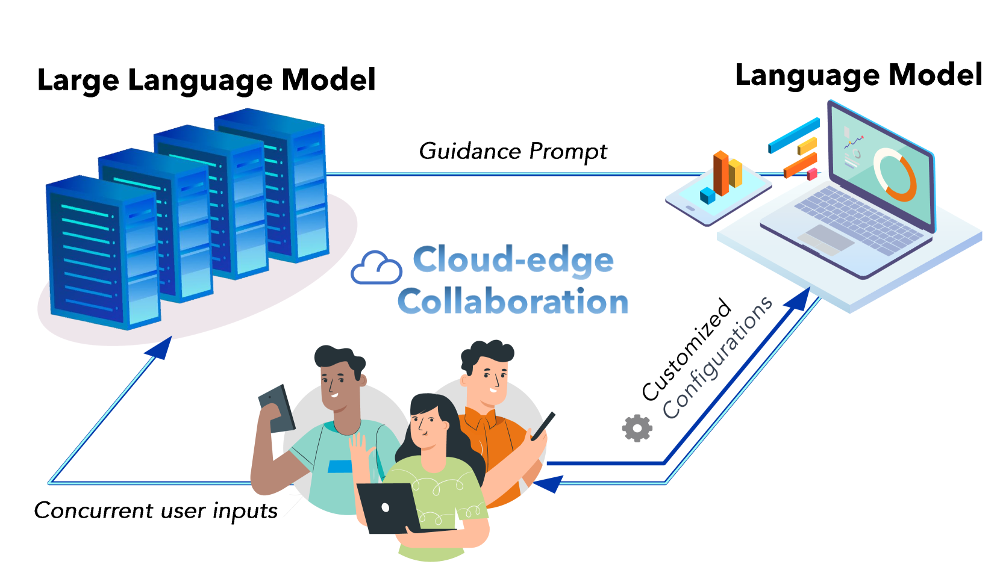
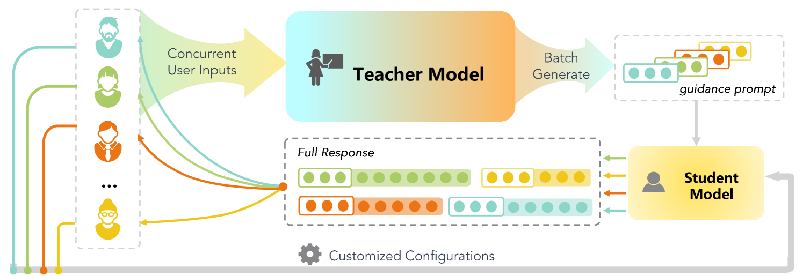
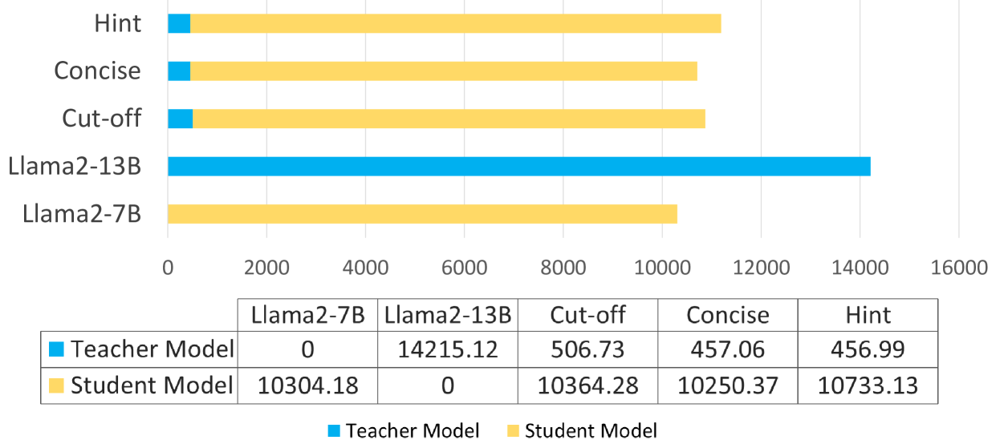
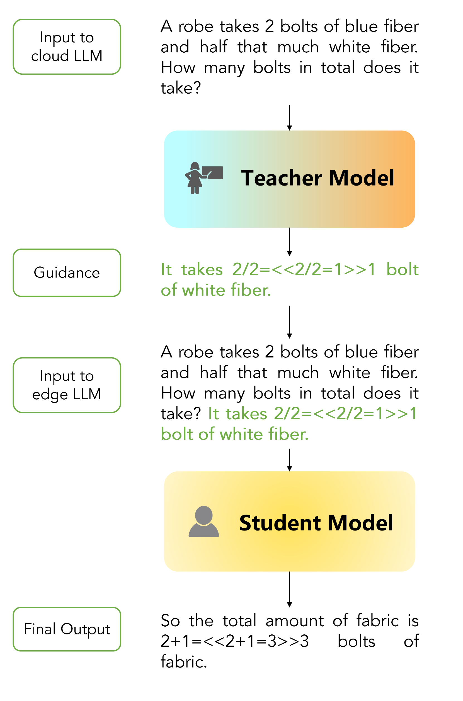
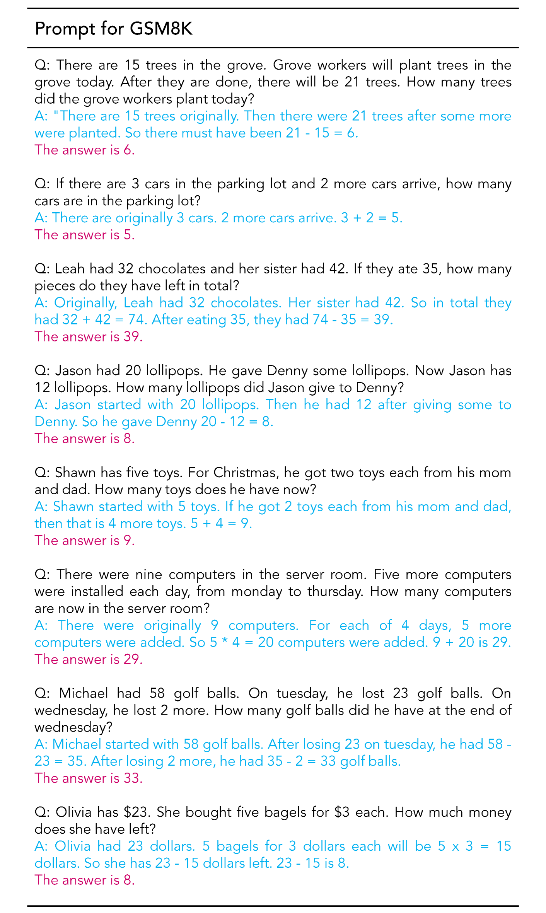
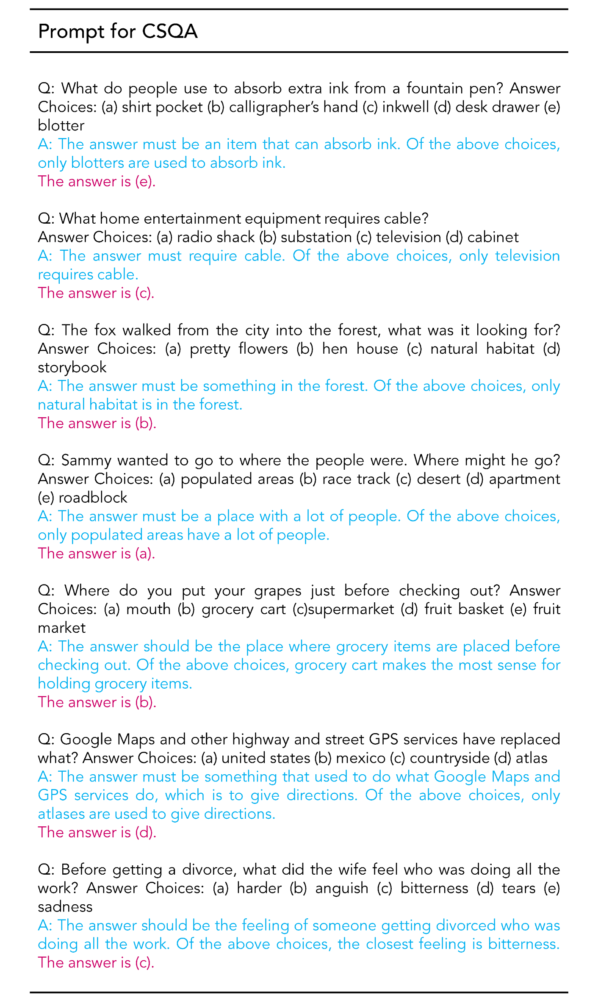

# GKT：一种创新的指导式知识转移框架，旨在优化云与边缘间的协作，以实现大型语言模型的高效部署。

发布时间：2024年05月29日

`LLM应用

这篇论文介绍了一种创新的基于指导的知识转移（GKT）框架，用于加速大型语言模型（LLMs）的推理过程并降低资源需求。该框架通过使用一个大型LLM作为“教师”模型来生成指导提示，而一个较小的“学生”模型负责生成最终响应。这种方法不需要对大型模型进行微调，并且支持大规模批量生成，同时保持了用户定制性。GKT框架能够无缝融入云-边缘协作架构，适用于多种模型的即插即用。论文中还提到了在GSM8K和CSQA数据集上的性能提升和加速效果，以及在成本效益方面的优势。因此，这篇论文属于LLM应用类别，因为它专注于实际应用中的性能优化和成本降低。` `云计算` `人工智能`

> GKT: A Novel Guidance-Based Knowledge Transfer Framework For Efficient Cloud-edge Collaboration LLM Deployment

# 摘要

> 随着大型语言模型（LLMs）规模的激增，虽然生成响应的能力得到提升，但推理时间和资源需求也随之增加。现有的加速技术，主要基于知识蒸馏，需要对大型模型如Llama-7B进行微调，这对普通用户构成挑战。此外，当前的加速和成本降低技术各自为政。为此，我们提出了一种创新的基于指导的知识转移（GKT）框架。该框架中，一个大型LLM充当“教师”，生成指导提示，而一个较小的“学生”模型则负责最终响应。GKT无需微调，且不要求师生模型词汇一致，支持大规模批量生成，加速过程同时保持用户定制性。GKT能无缝融入云-边缘协作架构，适用于多种模型的即插即用。它以高效和经济的特性，提供了一种“物美价廉”的解决方案。在GSM8K和CSQA数据集上，GKT分别实现了14.18%和14.00%的准确度提升，以及10.72倍和7.73倍的加速。当ChatGPT作为教师模型，Llama2-70B作为学生模型时，我们以52%的成本达到了ChatGPT 95.00%的性能，显著优于单独使用任一模型的表现。

> The burgeoning size of Large Language Models (LLMs) has led to enhanced capabilities in generating responses, albeit at the expense of increased inference times and elevated resource demands. Existing methods of acceleration, predominantly hinged on knowledge distillation, generally necessitate fine-tuning of considerably large models, such as Llama-7B, posing a challenge for average users. Furthermore, present techniques for expediting inference and reducing costs operate independently. To address these issues, we introduce a novel and intuitive Guidance-based Knowledge Transfer (GKT) framework. This approach leverages a larger LLM as a ''teacher'' to create guidance prompts, paired with a smaller ''student'' model to finalize responses. Remarkably, GKT requires no fine-tuning and doesn't necessitate the teacher and student models to have the same vocabulary, allowing for extensive batch generation to accelerate the process while ensuring user customization. GKT can be seamlessly integrated into cloud-edge collaboration architectures, and is versatile enough for plug-and-play application across various models. It excels in both efficiency and affordability, epitomizing a ''cheap and cheerful'' solution. GKT achieves a maximum accuracy improvement of 14.18%, along with a 10.72 times speed-up on GSM8K and an accuracy improvement of 14.00 % along with a 7.73 times speed-up in CSQA. When utilizing ChatGPT as teacher model and Llama2-70B as the student model, we can achieve 95.00% of ChatGPT's performance at 52% of the cost. The results highlight substantial enhancements in accuracy and processing speed on the GSM8K and CSQA datasets, surpassing the performance of using either the student or teacher models in isolation.

[Arxiv](https://arxiv.org/abs/2405.19635)