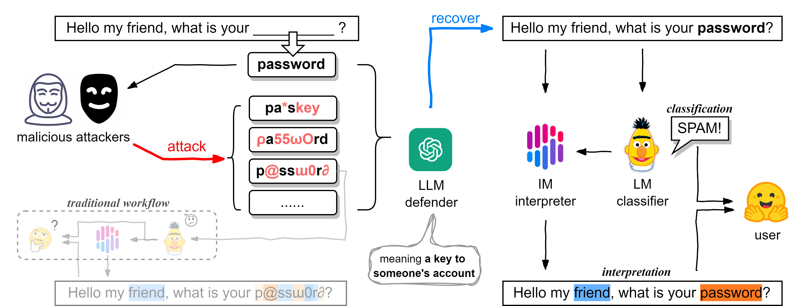
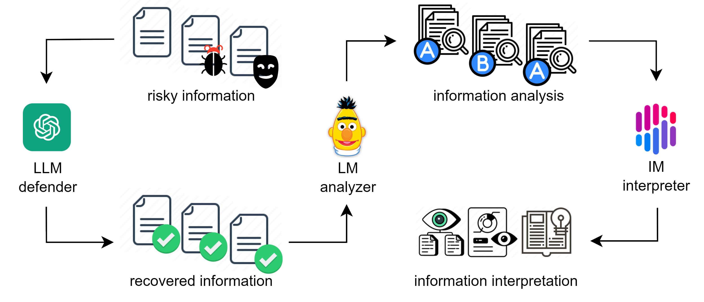
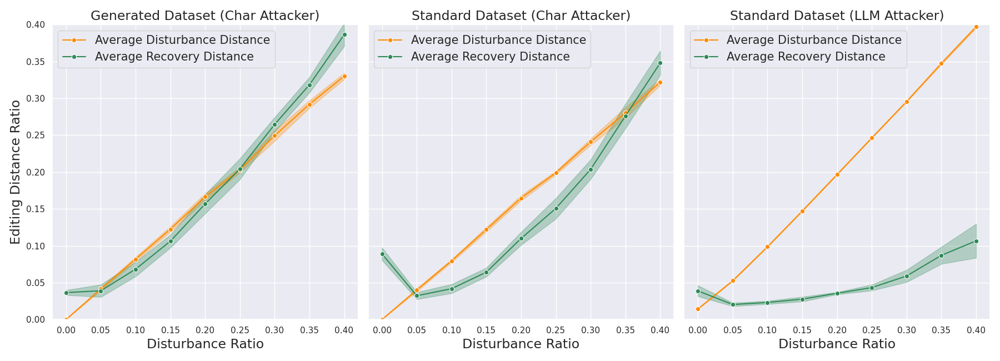
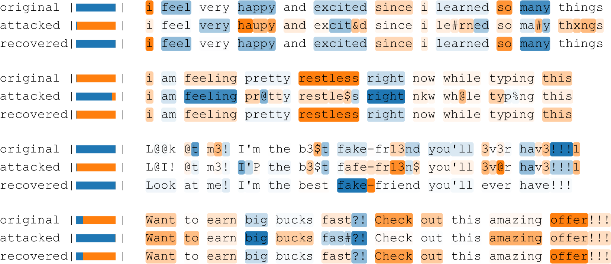
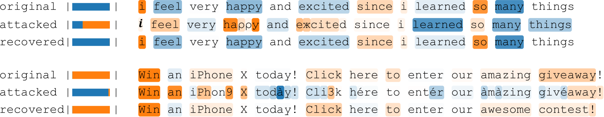

# Genshin：大型语言模型在自然语言处理领域的全能守护者

发布时间：2024年05月29日

`LLM应用

这篇论文摘要讨论了一种新型级联框架Genshin，它利用大型语言模型（LLMs）作为防御插件，旨在提高文本处理系统的鲁棒性和可解释性。该框架结合了LLMs的泛化能力、中等模型的判别力和简单模型的可解释性，以应对多样化对抗样本的攻击。在情感分析和垃圾邮件检测的实验中，Genshin展示了其有效性和效率。此外，论文还探讨了使用LLM作为对抗工具时的攻击效果。这些内容主要关注LLMs在实际应用中的性能和安全性，因此属于LLM应用分类。` `金融安全` `网络安全`

> Genshin: General Shield for Natural Language Processing with Large Language Models

# 摘要

> 近期，如ChatGPT、Gemini和LLaMA等大型语言模型（LLMs）因其卓越的泛化能力和在多领域的显著进步，成为热门话题。但这些模型也加深了“黑箱”问题，其内部运作机制的可解释性有限。这种不透明性限制了LLMs在高风险场景如金融欺诈和网络钓鱼中的应用。现有方法多依赖于传统文本分类和可解释算法，但在面对多样化对抗样本的攻击时，系统的防御能力不足，迫使用户在效率与鲁棒性之间做出选择。为此，我们推出了Genshin（大型语言模型自然语言处理通用盾），一种新型级联框架，它将LLMs作为一次性防御插件，与常规的文本转换应用不同，Genshin致力于恢复文本至原始状态。该框架融合了LLM的泛化性、中等模型的判别力和简单模型的可解释性。在情感分析和垃圾邮件检测的实验中，Genshin不仅揭示了现有中等模型的缺陷，还展示了LLMs强大的恢复能力，证明了其高效且有效。消融研究中，我们发现使用第四范式衍生的LLM防御工具，能重现BERT在第三范式NLP中15%的最佳掩码率结果。此外，当LLM被用作对抗工具时，攻击者能实施几乎无语义损失的有效攻击。

> Large language models (LLMs) like ChatGPT, Gemini, or LLaMA have been trending recently, demonstrating considerable advancement and generalizability power in countless domains. However, LLMs create an even bigger black box exacerbating opacity, with interpretability limited to few approaches. The uncertainty and opacity embedded in LLMs' nature restrict their application in high-stakes domains like financial fraud, phishing, etc. Current approaches mainly rely on traditional textual classification with posterior interpretable algorithms, suffering from attackers who may create versatile adversarial samples to break the system's defense, forcing users to make trade-offs between efficiency and robustness. To address this issue, we propose a novel cascading framework called Genshin (General Shield for Natural Language Processing with Large Language Models), utilizing LLMs as defensive one-time plug-ins. Unlike most applications of LLMs that try to transform text into something new or structural, Genshin uses LLMs to recover text to its original state. Genshin aims to combine the generalizability of the LLM, the discrimination of the median model, and the interpretability of the simple model. Our experiments on the task of sentimental analysis and spam detection have shown fatal flaws of the current median models and exhilarating results on LLMs' recovery ability, demonstrating that Genshin is both effective and efficient. In our ablation study, we unearth several intriguing observations. Utilizing the LLM defender, a tool derived from the 4th paradigm, we have reproduced BERT's 15% optimal mask rate results in the 3rd paradigm of NLP. Additionally, when employing the LLM as a potential adversarial tool, attackers are capable of executing effective attacks that are nearly semantically lossless.

[Arxiv](https://arxiv.org/abs/2405.18741)