# 大型语言模型与多模态生成及编辑的交汇：综述

发布时间：2024年05月29日

`Agent

这篇论文摘要主要讨论了大型语言模型（LLMs）与多模态学习的结合，特别是在跨图像、视频、3D和音频等多个领域的多模态生成技术。它不仅分析了相关方法和数据集，还探讨了如何利用这些技术来增强人机交互的工具，即多模态代理。此外，论文还涉及了AI安全领域的进展和未来发展方向。因此，这篇论文更符合Agent分类，因为它关注的是如何通过多模态技术来增强代理的能力，而不是仅仅讨论LLM的理论或应用。` `人工智能` `多模态学习`

> LLMs Meet Multimodal Generation and Editing: A Survey

# 摘要

> 随着大型语言模型（LLMs）技术的飞速发展，结合LLMs与多模态学习的研究日益受到关注。以往的调查多聚焦于理解层面，而本调查则深入探讨了跨图像、视频、3D和音频等多个领域的多模态生成技术，并强调了这些领域中的关键进展和里程碑式工作。我们详细分析了支撑这些研究的方法和多模态数据集的核心技术要素，并探讨了利用现有生成模型进行人机交互的工具增强型多模态代理。此外，我们还全面审视了AI安全领域的进步，并展望了新兴应用及未来发展方向。本调查为多模态生成领域提供了一个全面而深入的视角，有望推动生成内容的人工智能（AIGC）和世界模型的进一步发展。所有相关论文的精选列表可在https://github.com/YingqingHe/Awesome-LLMs-meet-Multimodal-Generation查阅。

> With the recent advancement in large language models (LLMs), there is a growing interest in combining LLMs with multimodal learning. Previous surveys of multimodal large language models (MLLMs) mainly focus on understanding. This survey elaborates on multimodal generation across different domains, including image, video, 3D, and audio, where we highlight the notable advancements with milestone works in these fields. Specifically, we exhaustively investigate the key technical components behind methods and multimodal datasets utilized in these studies. Moreover, we dig into tool-augmented multimodal agents that can use existing generative models for human-computer interaction. Lastly, we also comprehensively discuss the advancement in AI safety and investigate emerging applications as well as future prospects. Our work provides a systematic and insightful overview of multimodal generation, which is expected to advance the development of Artificial Intelligence for Generative Content (AIGC) and world models. A curated list of all related papers can be found at https://github.com/YingqingHe/Awesome-LLMs-meet-Multimodal-Generation

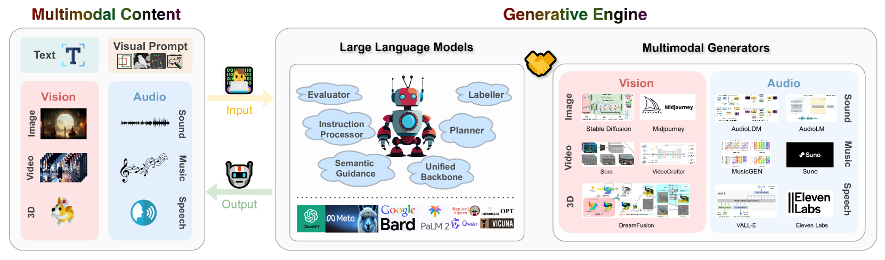

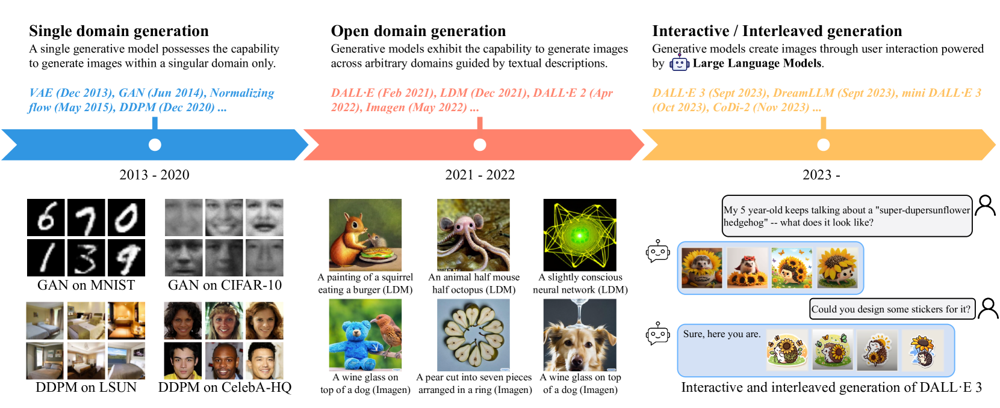

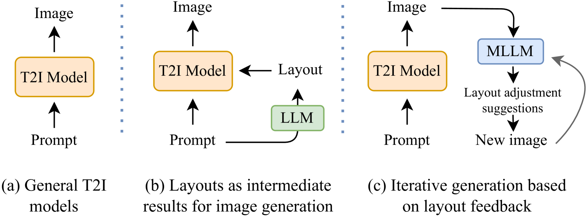

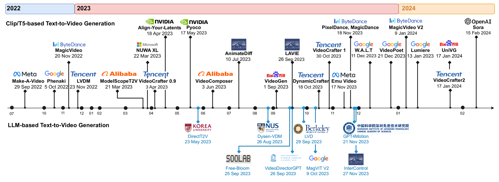

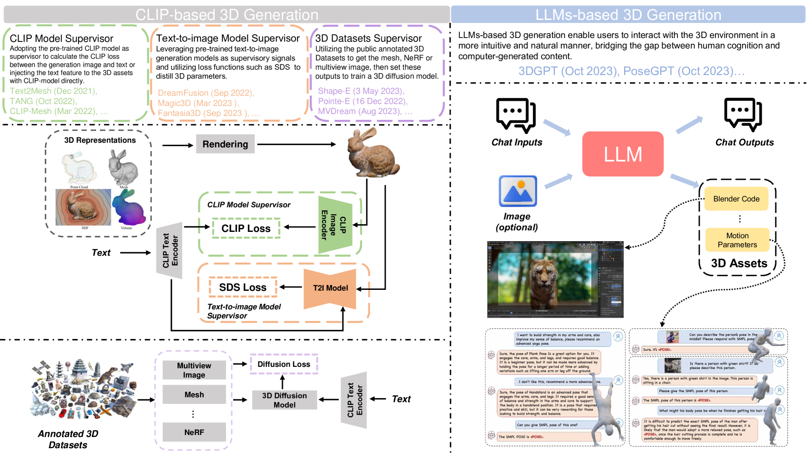

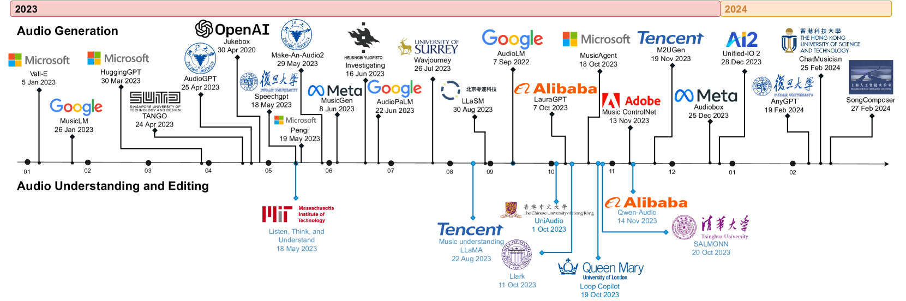

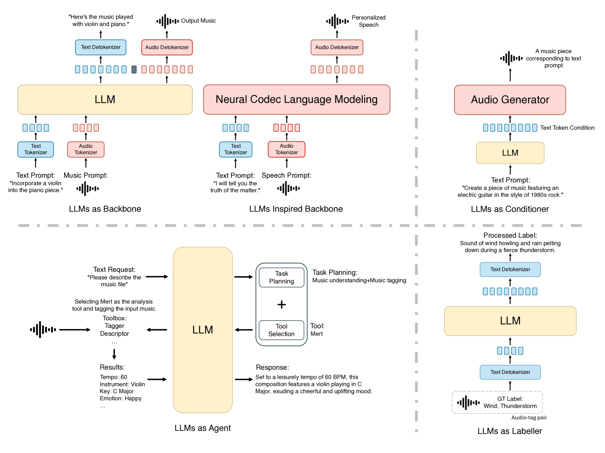

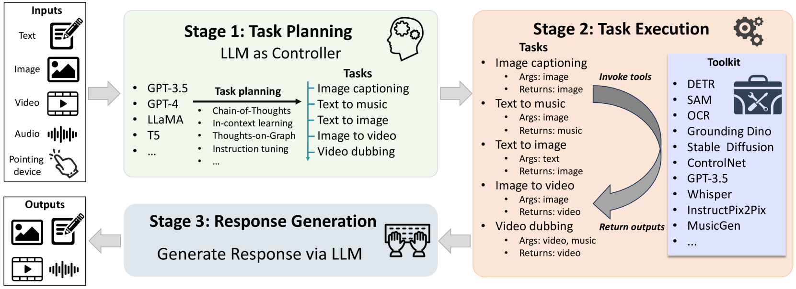

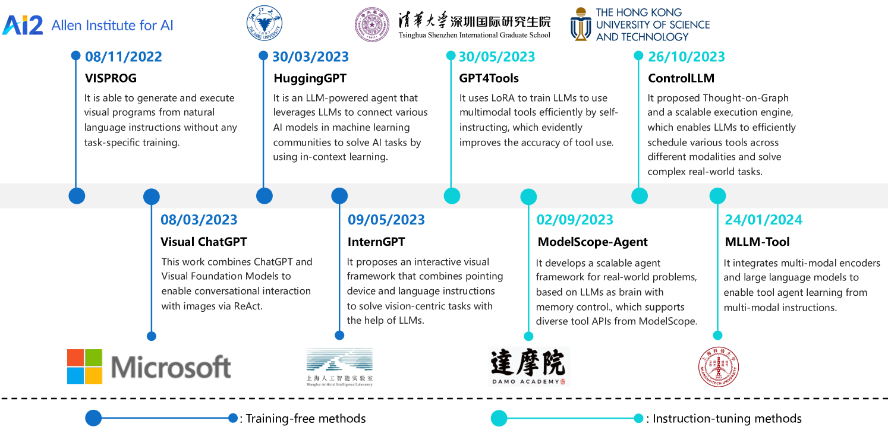

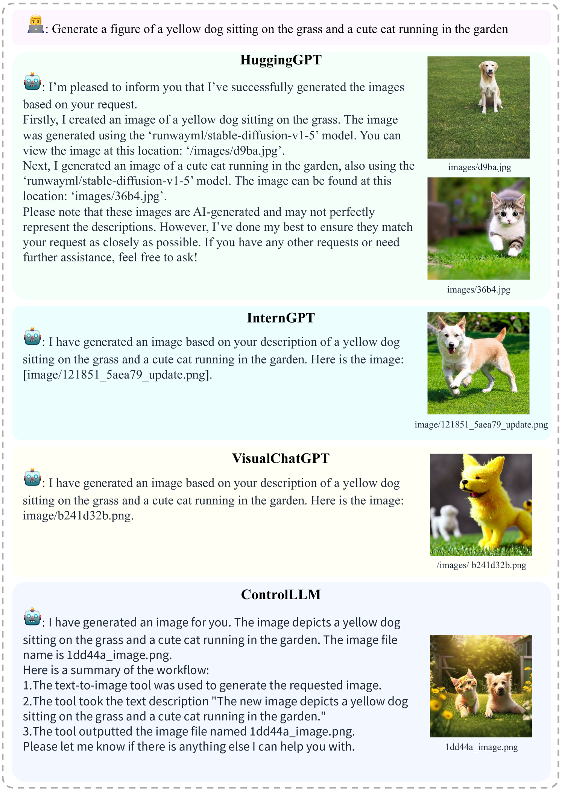

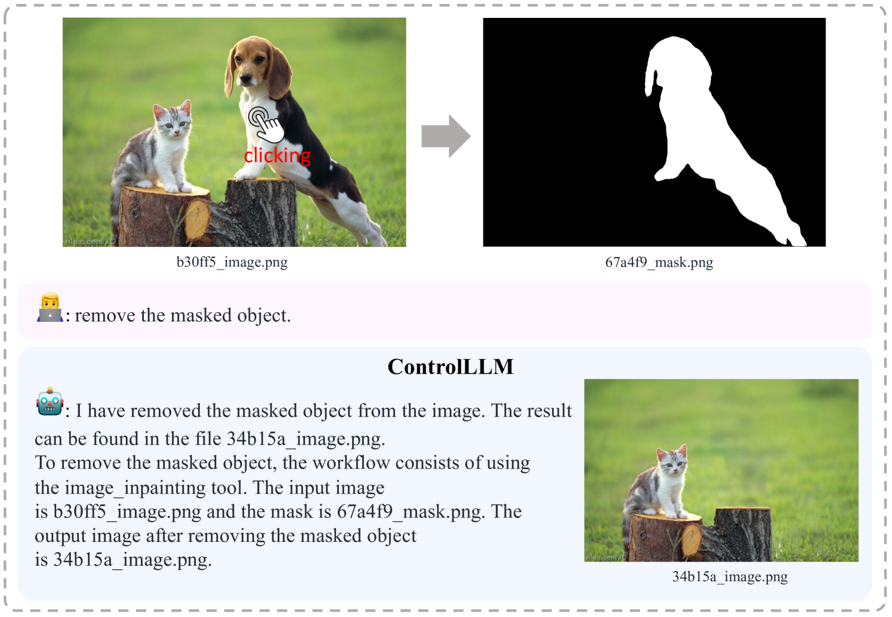

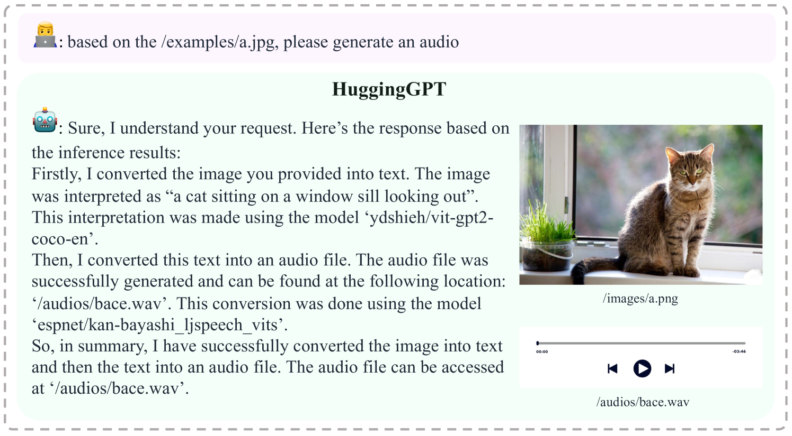

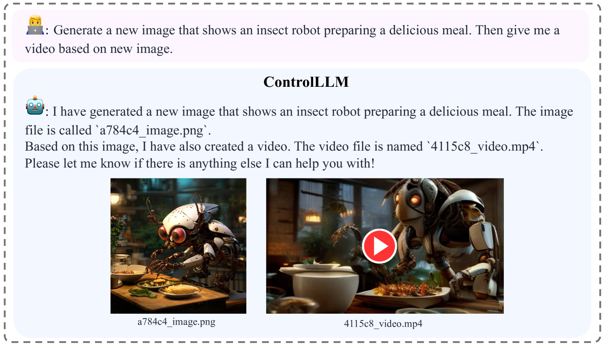

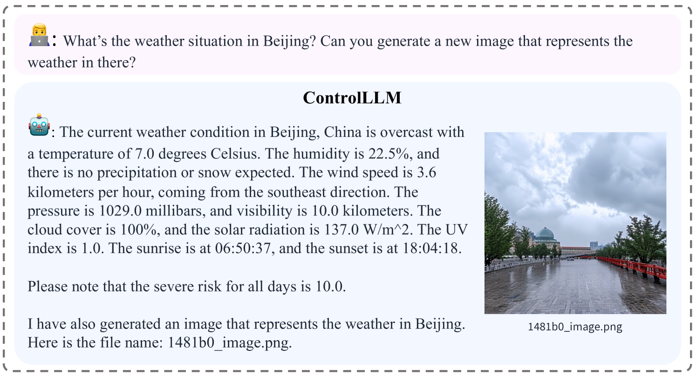

[Arxiv](https://arxiv.org/abs/2405.19334)