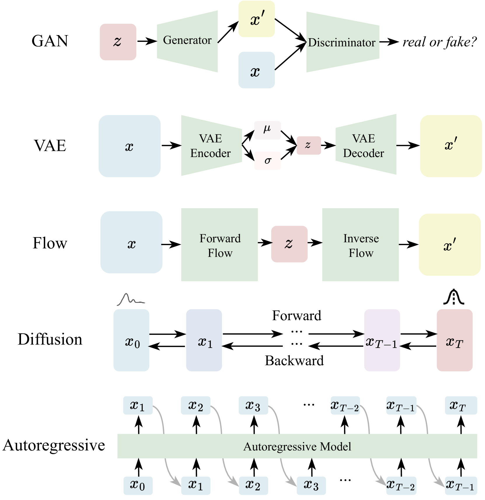
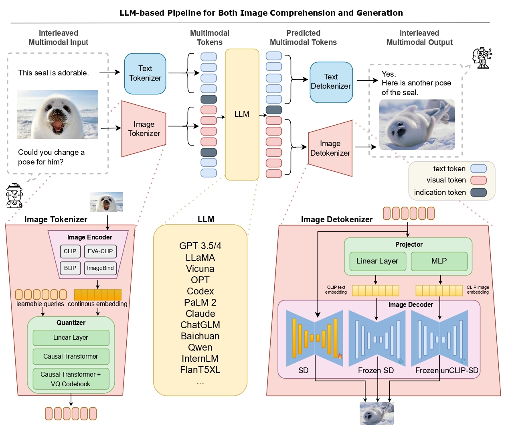

# 大型语言模型与多模态生成及编辑的交汇：综述

发布时间：2024年05月29日

`Agent

理由：该论文摘要主要讨论了结合大型语言模型（LLMs）与多模态学习的研究，特别是在多模态生成技术方面的进展，并探讨了利用这些技术增强人机交互的多模态代理工具。这表明论文内容涉及到了Agent的概念，即如何利用LLMs和多模态技术来创建能够与人类进行交互的智能代理。因此，将其归类为Agent是合适的。虽然论文也涉及到了LLM的应用和理论，但核心在于探讨如何构建和应用多模态代理，这是其主要贡献和焦点。` `人工智能` `多模态学习`

> LLMs Meet Multimodal Generation and Editing: A Survey

# 摘要

> 随着大型语言模型（LLMs）技术的飞速发展，结合LLMs与多模态学习的研究日益受到关注。以往的调查多聚焦于理解层面，而本调查则深入探讨了跨图像、视频、3D和音频等多个领域的多模态生成技术，并强调了这些领域中的关键进展和里程碑式工作。我们细致分析了这些研究背后的核心技术及所采用的多模态数据集。同时，我们还探讨了利用现有生成模型增强人机交互的多模态代理工具。此外，我们对AI安全领域的进步进行了全面讨论，并展望了新兴应用及未来发展。本研究为多模态生成领域提供了一个系统且深入的视角，有望推动生成内容人工智能（AIGC）及世界模型的进步，相关论文精选列表可访问https://github.com/YingqingHe/Awesome-LLMs-meet-Multimodal-Generation获取。

> With the recent advancement in large language models (LLMs), there is a growing interest in combining LLMs with multimodal learning. Previous surveys of multimodal large language models (MLLMs) mainly focus on understanding. This survey elaborates on multimodal generation across different domains, including image, video, 3D, and audio, where we highlight the notable advancements with milestone works in these fields. Specifically, we exhaustively investigate the key technical components behind methods and multimodal datasets utilized in these studies. Moreover, we dig into tool-augmented multimodal agents that can use existing generative models for human-computer interaction. Lastly, we also comprehensively discuss the advancement in AI safety and investigate emerging applications as well as future prospects. Our work provides a systematic and insightful overview of multimodal generation, which is expected to advance the development of Artificial Intelligence for Generative Content (AIGC) and world models. A curated list of all related papers can be found at https://github.com/YingqingHe/Awesome-LLMs-meet-Multimodal-Generation

[Arxiv](https://arxiv.org/abs/2405.19334)