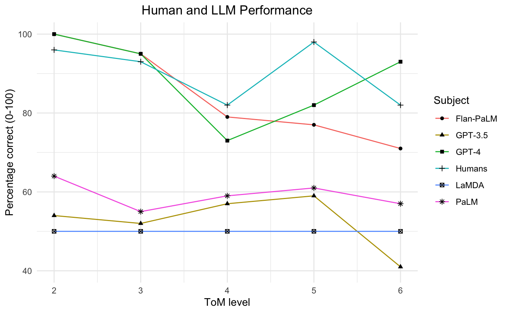

# 大型语言模型在高级心智理论任务中展现出与成人相媲美的能力。

发布时间：2024年05月29日

`LLM理论

理由：这篇论文探讨了大型语言模型（LLMs）在高级心智理论（ToM）能力上的发展，并通过一套特定的测试来评估这些模型的表现。研究关注的是模型的心理推理能力，这是一个理论性质的问题，涉及到模型的内部机制和能力评估，而不是具体的应用场景或模型作为代理的行为。因此，这篇论文更适合归类于LLM理论。` `人工智能` `心理学`

> LLMs achieve adult human performance on higher-order theory of mind tasks

# 摘要

> 本文深入探讨了大型语言模型（LLMs）在高级心智理论（ToM）能力上的发展程度，特别是人类那种能够递归推理多重心理和情感状态的能力。通过引入一套手写测试——多阶心智理论问答（Multi-Order Theory of Mind Q&A），并将其用于比较五个LLMs与新收集的成人基准的表现，研究发现GPT-4和Flan-PaLM在ToM任务上的表现已达到或接近成人水平，其中GPT-4在第六阶推理中甚至超越了成人表现。这表明，模型大小与微调策略共同作用于ToM能力的实现，而顶尖LLMs已展现出一种普遍的ToM推理能力。考虑到高级ToM在众多人类合作与竞争行为中的核心作用，这些发现对未来面向用户的LLM应用具有深远影响。

> This paper examines the extent to which large language models (LLMs) have developed higher-order theory of mind (ToM); the human ability to reason about multiple mental and emotional states in a recursive manner (e.g. I think that you believe that she knows). This paper builds on prior work by introducing a handwritten test suite -- Multi-Order Theory of Mind Q&A -- and using it to compare the performance of five LLMs to a newly gathered adult human benchmark. We find that GPT-4 and Flan-PaLM reach adult-level and near adult-level performance on ToM tasks overall, and that GPT-4 exceeds adult performance on 6th order inferences. Our results suggest that there is an interplay between model size and finetuning for the realisation of ToM abilities, and that the best-performing LLMs have developed a generalised capacity for ToM. Given the role that higher-order ToM plays in a wide range of cooperative and competitive human behaviours, these findings have significant implications for user-facing LLM applications.

[Arxiv](https://arxiv.org/abs/2405.18870)