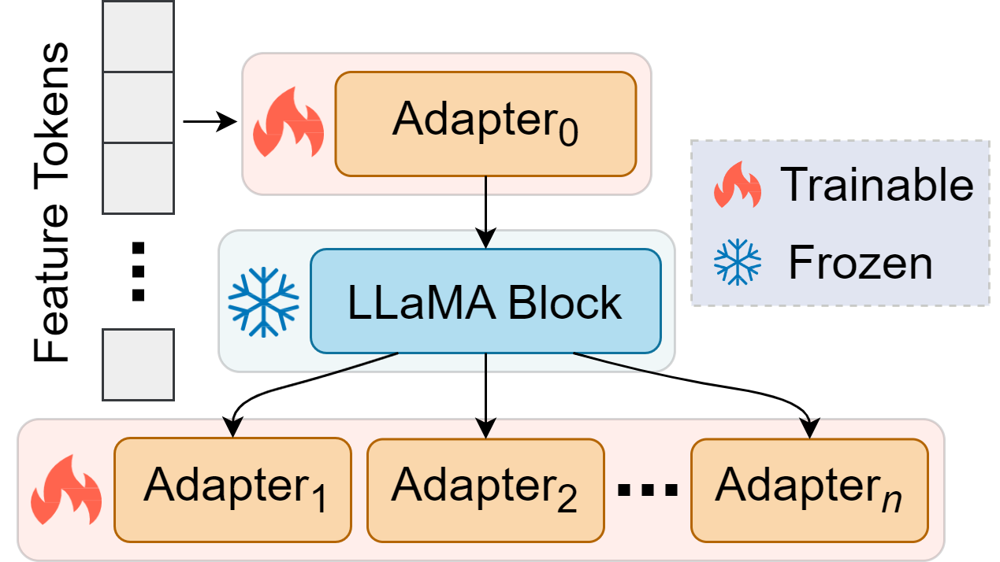
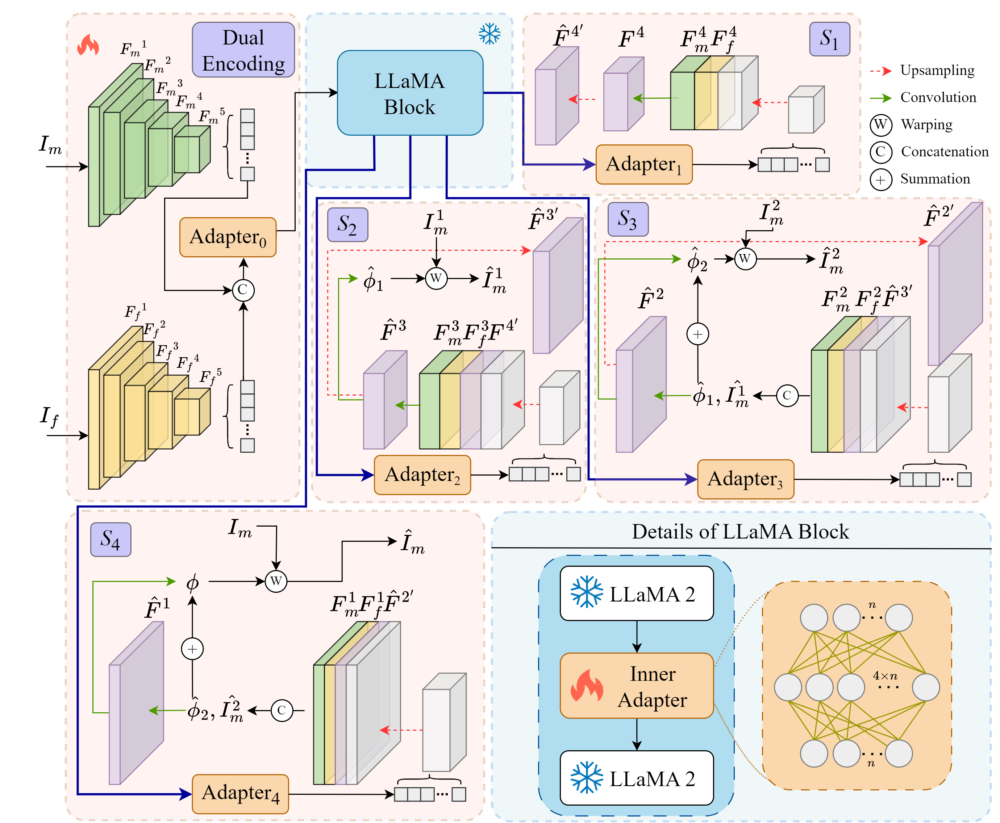
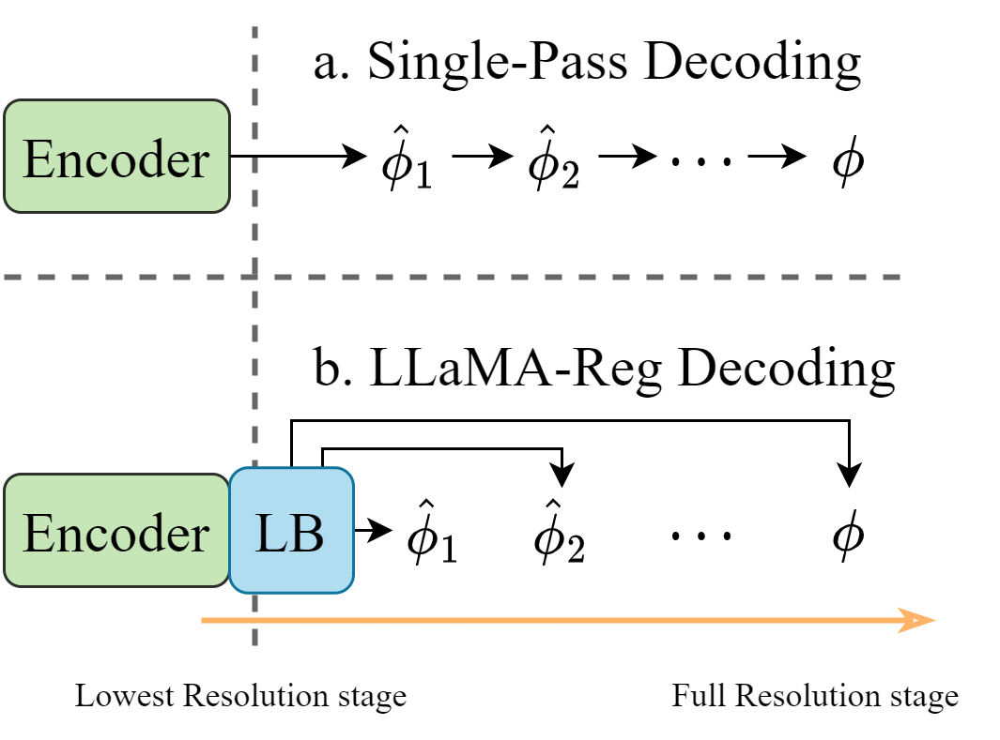
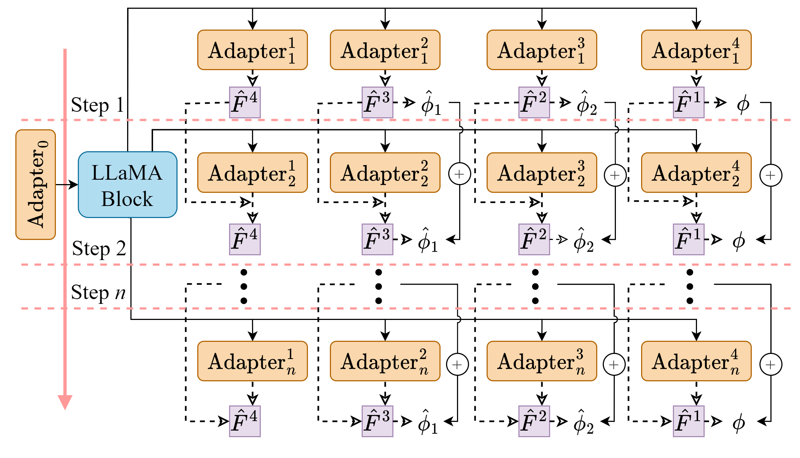
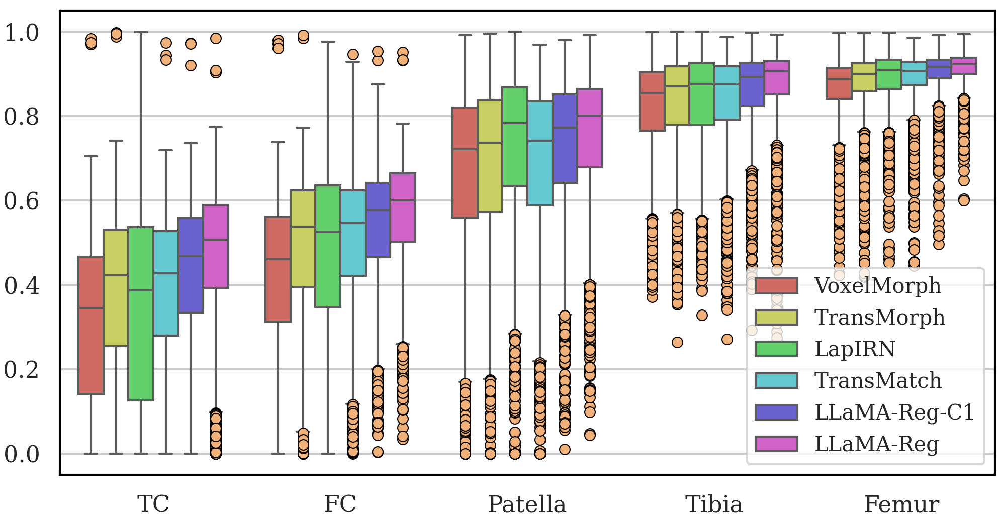
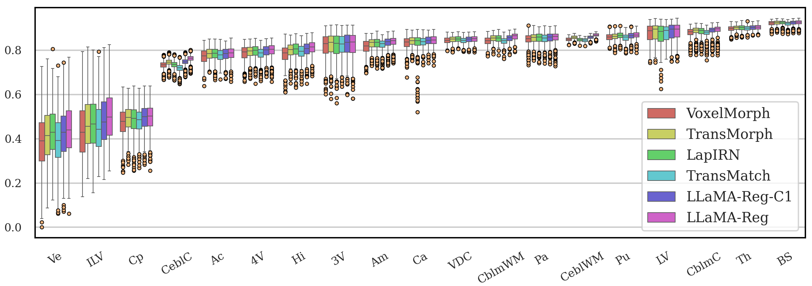

# LLaMA-Reg：借助 LLaMA 2 实现无监督医学图像配准

发布时间：2024年05月29日

`LLM应用

理由：这篇论文介绍了一种利用预训练的大型语言模型（LLM）来提升医学图像配准精度的方法。这种方法通过嵌入LLM来提取深层图像特征，从而提高了配准的准确性。论文的重点在于将LLM应用于特定的实际问题——医学图像配准，而不是探讨LLM的理论基础或Agent的设计，也不是关于检索增强生成（RAG）的研究。因此，它属于LLM应用类别。` `图像处理`

> LLaMA-Reg: Using LLaMA 2 for Unsupervised Medical Image Registration

# 摘要

> 医学图像配准在医学图像分析领域至关重要。本文介绍了一种新颖的方法，利用预训练的大型语言模型来提升医学图像配准的精度。通过在配准模型中嵌入大型语言模型以提取深层图像特征，我们显著提高了配准的准确性，展现了大型语言模型在这一领域的巨大潜能。我们采用双编码器提取图像对的深层特征，并将其输入至预训练的大型语言模型。为了使模型更好地服务于配准任务，我们冻结了大型语言模型的权重，并通过适配器进行微调，以便（a）将视觉信息转换为语言模型可处理的形式，（b）再将语言模型的输出转换回视觉空间。我们的方法融合了微调后的大型语言模型与各编码器层的特征输出，逐步生成解码器中的形变场，以完成图像配准。实验结果显示，在膝关节和脑部MRI配准任务中，我们的方法达到了业界领先水平。

> Medical image registration is an essential topic in medical image analysis. In this paper, we propose a method for medical image registration using a pretrained large language model. We find that using the pretrained large language model to encode deep features of the medical images in the registration model can effectively improve image registration accuracy, indicating the great potential of the large language model in medical image registration tasks. We use dual encoders to perform deep feature extraction on image pairs and then input the features into the pretrained large language model. To adapt the large language model to our registration task, the weights of the large language model are frozen in the registration model, and an adapter is utilized to fine-tune the large language model, which aims at (a) mapping the visual tokens to the language space before the large language model computing, (b) project the modeled language tokens output from the large language model to the visual space. Our method combines output features from the fine-tuned large language model with the features output from each encoder layer to gradually generate the deformation fields required for registration in the decoder. To demonstrate the effectiveness of the large prediction model in registration tasks, we conducted experiments on knee and brain MRI and achieved state-of-the-art results.

[Arxiv](https://arxiv.org/abs/2405.18774)