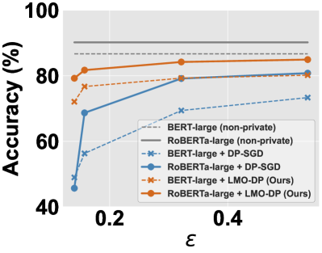
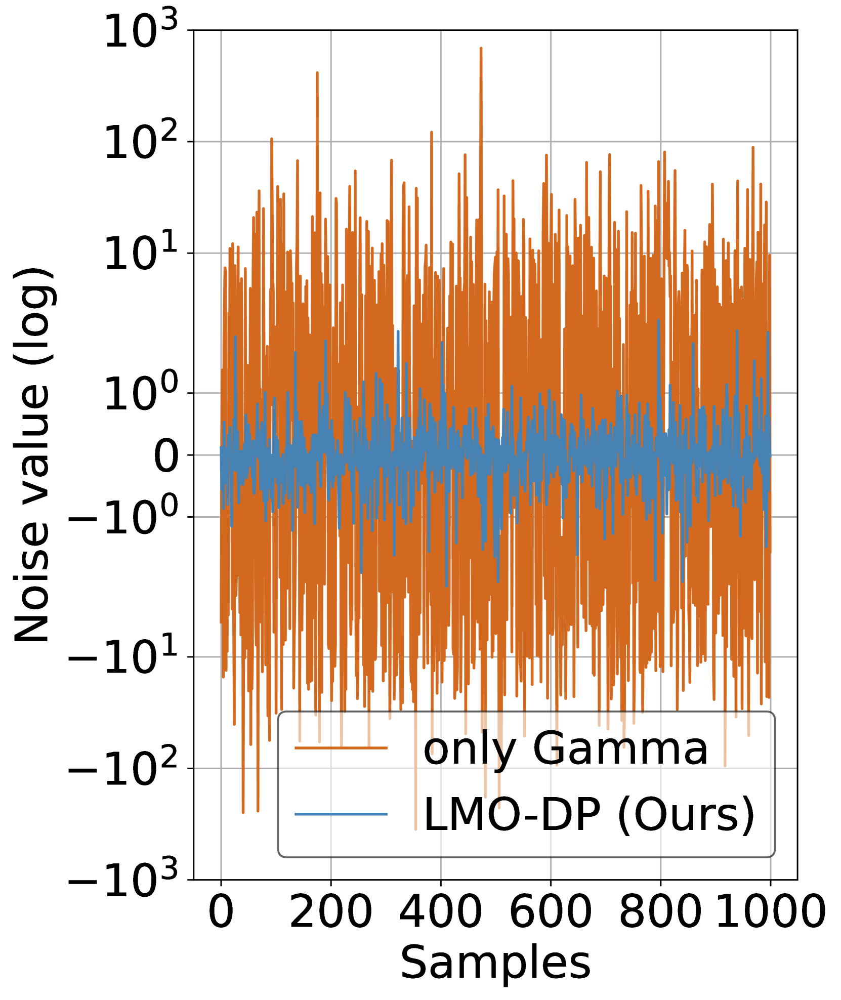
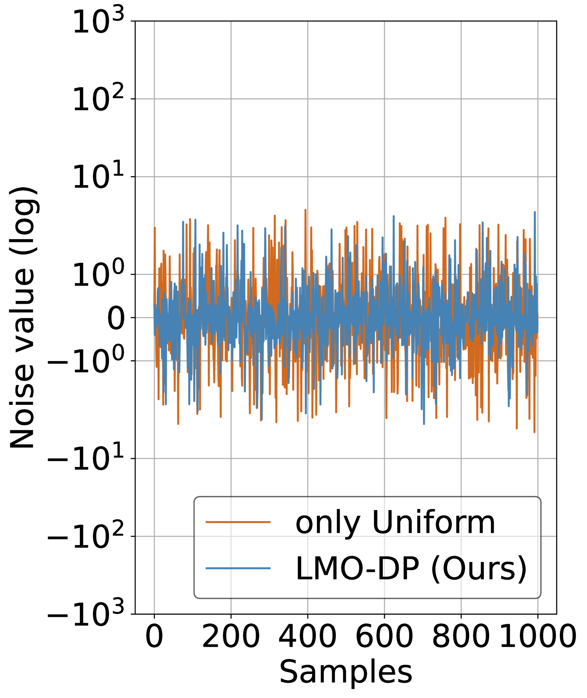

# LMO-DP：为大型语言模型的差分隐私微调优化随机化机制

发布时间：2024年05月29日

`LLM理论

理由：这篇论文主要探讨了在微调大型语言模型时如何保证隐私安全的问题，并提出了基于语言模型的最优差分隐私（LMO-DP）机制。这一机制的创新之处在于能够在严格的隐私保护环境下精确微调大型语言模型，这属于对大型语言模型理论层面的深入研究，特别是在差分隐私和模型微调的结合上。因此，它更适合归类于LLM理论。` `隐私保护`

> LMO-DP: Optimizing the Randomization Mechanism for Differentially Private Fine-Tuning (Large) Language Models

# 摘要

> 为了确保大规模预训练语言模型微调时的隐私安全，研究者们提出了差分私有随机梯度下降（DP-SGD）及其变体，但这些方法依赖于高斯机制，可能在强隐私保护要求下（如隐私预算 $ε< 3$）导致模型准确性下降。为此，我们创新性地提出了基于语言模型的最优差分隐私（LMO-DP）机制，首次实现了即使在严格的隐私保护环境下（如 $0.1\leq ε<3$），也能精确微调大型语言模型。我们还开发了一种离线最优噪声搜索技术，大幅减少了所需的噪声量。例如，使用LMO-DP机制在SST-2数据集上微调RoBERTa-large模型，其准确率可达92.20%，远超传统高斯机制。此外，GPT-2在文本生成任务上也展现了类似的优势。值得一提的是，LMO-DP还是首个能够准确微调Llama-2并提供强差分隐私保障的方法。相关代码即将发布，欢迎索取。

> Differentially Private Stochastic Gradient Descent (DP-SGD) and its variants have been proposed to ensure rigorous privacy for fine-tuning large-scale pre-trained language models. However, they rely heavily on the Gaussian mechanism, which may overly perturb the gradients and degrade the accuracy, especially in stronger privacy regimes (e.g., the privacy budget $ε< 3$). To address such limitations, we propose a novel Language Model-based Optimal Differential Privacy (LMO-DP) mechanism, which takes the first step to enable the tight composition of accurately fine-tuning (large) language models with a sub-optimal DP mechanism, even in strong privacy regimes (e.g., $0.1\leq ε<3$). Furthermore, we propose a novel offline optimal noise search method to efficiently derive the sub-optimal DP that significantly reduces the noise magnitude. For instance, fine-tuning RoBERTa-large (with 300M parameters) on the SST-2 dataset can achieve an accuracy of 92.20% (given $ε=0.3$, $δ=10^{-10}$) by drastically outperforming the Gaussian mechanism (e.g., $\sim 50\%$ for small $ε$ and $δ$). We also draw similar findings on the text generation tasks on GPT-2. Finally, to our best knowledge, LMO-DP is also the first solution to accurately fine-tune Llama-2 with strong differential privacy guarantees. The code will be released soon and available upon request.

[Arxiv](https://arxiv.org/abs/2405.18776)