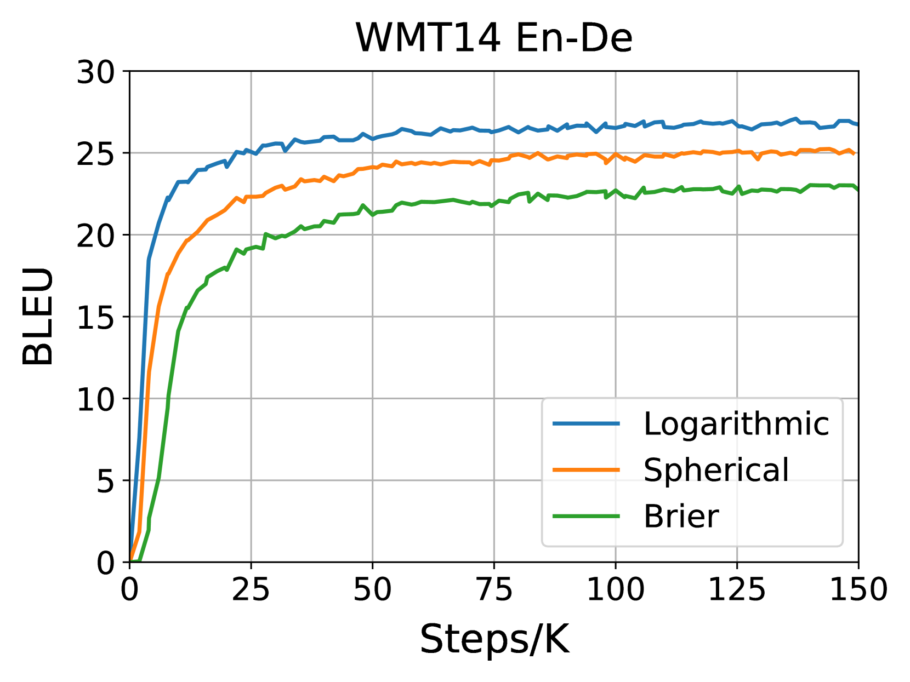
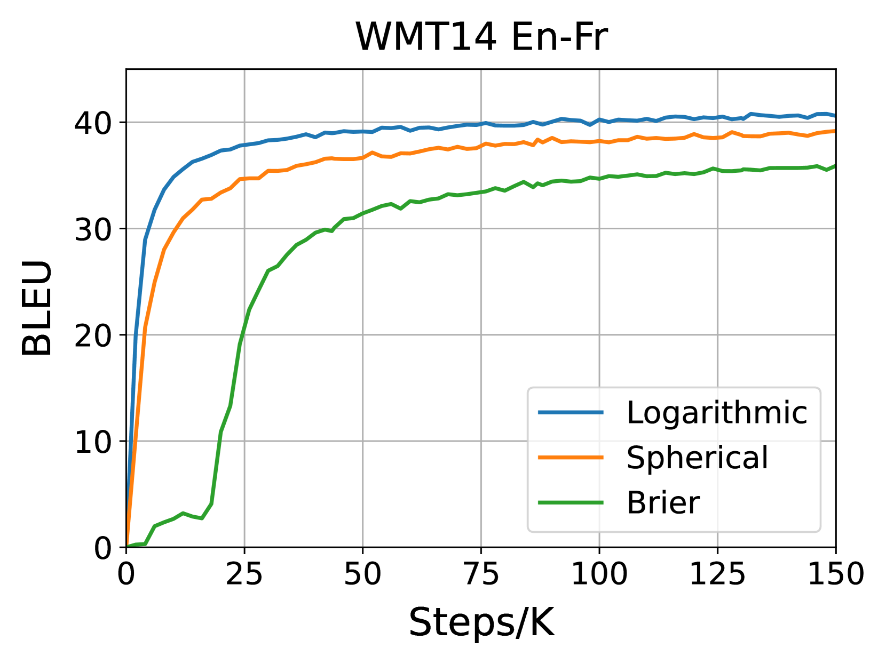
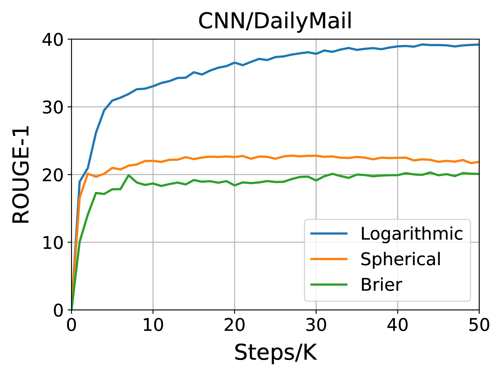
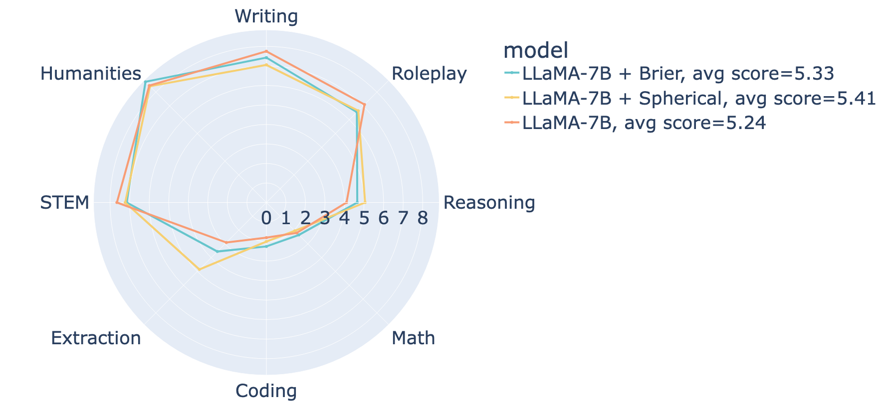
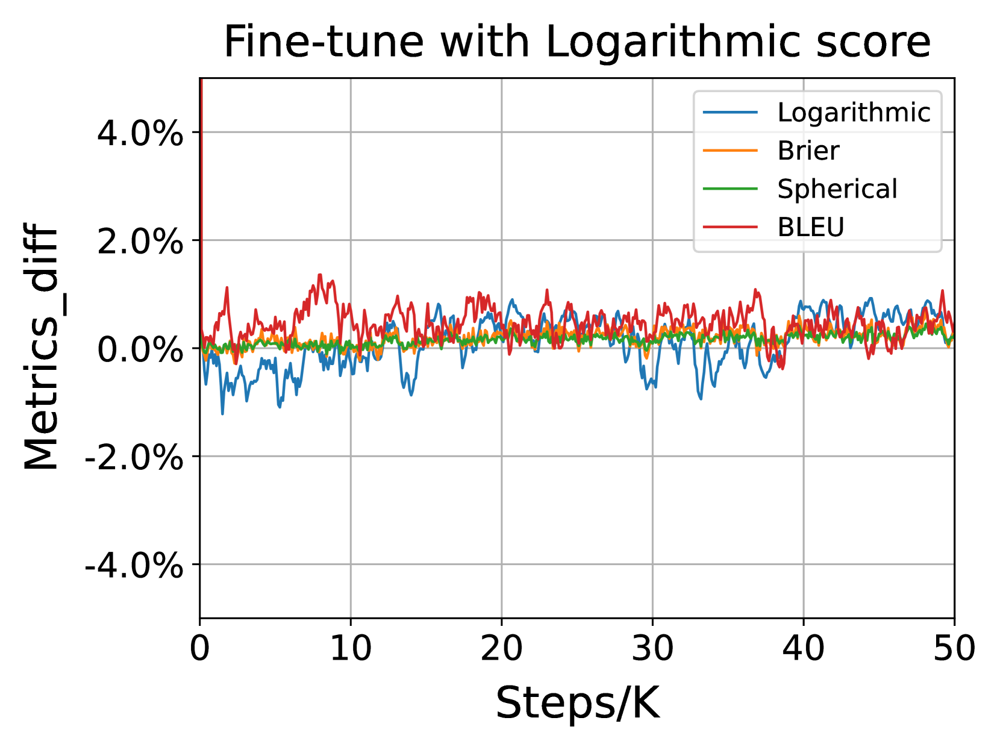
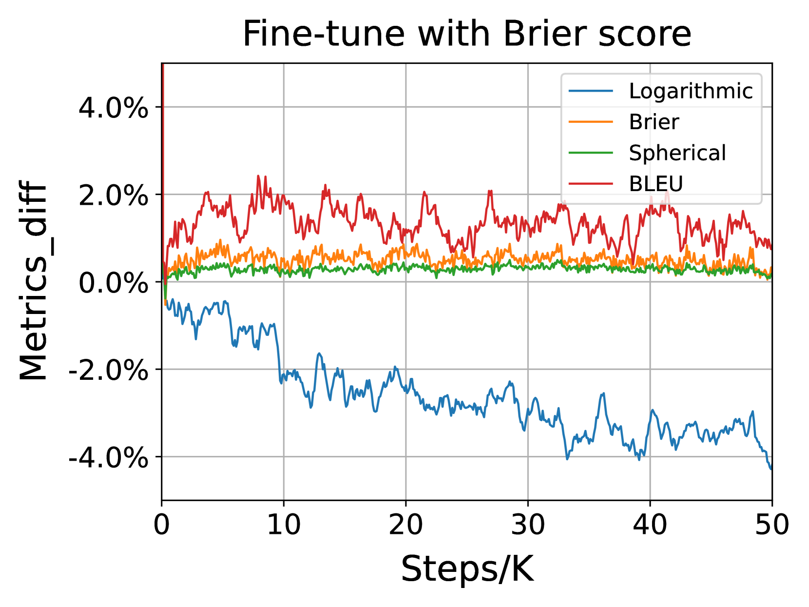
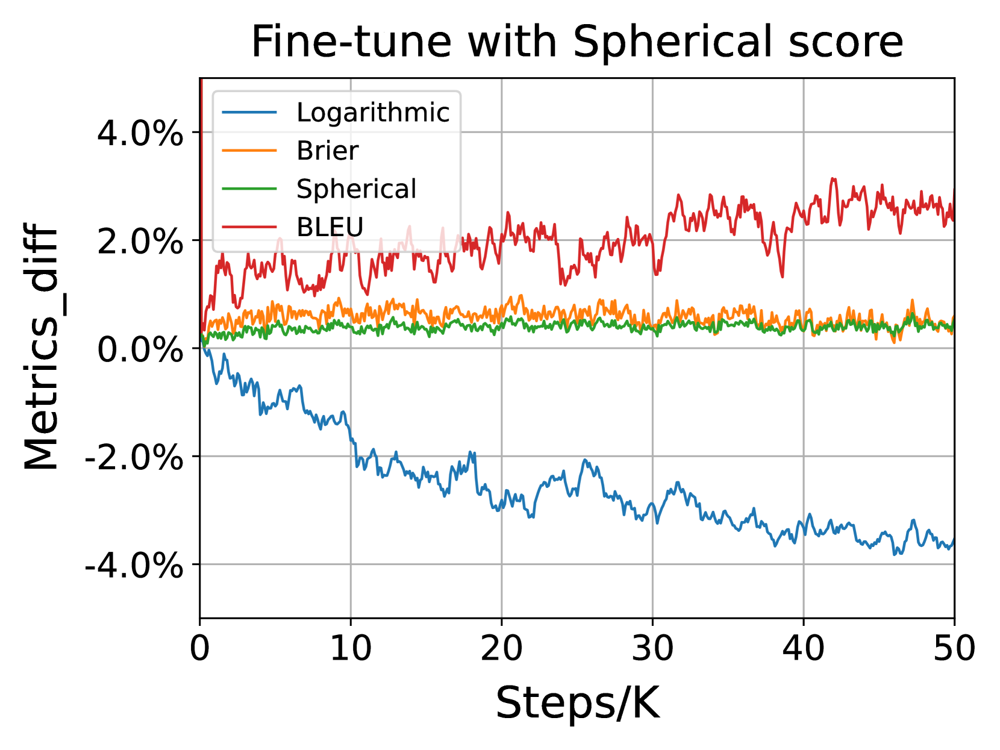

# 严格适当评分规则下的语言生成探索

发布时间：2024年05月29日

`LLM理论

理由：这篇论文主要探讨了语言生成模型中损失函数的改进，特别是通过引入非局部评分规则（如布莱尔得分和球面得分）来替代传统的对数似然损失。这种研究属于对大型语言模型（LLM）理论层面的探讨，因为它涉及到模型训练的核心机制——损失函数的优化，这是理论研究的一部分，而非具体的应用或Agent的设计。此外，虽然它提到了特定模型（如LLaMA-7B和LLaMA-13B），但重点在于理论方法的改进，而不是这些模型的具体应用。因此，将其归类为LLM理论是合适的。` `机器学习`

> Language Generation with Strictly Proper Scoring Rules

# 摘要

> 基于最大似然估计（MLE）的语言生成方法已成为文本生成的基石。这种方法通过最小化对数似然损失（统计决策理论中的对数得分）来实现，该得分鼓励模型诚实地预测，只有在模型准确报告概率时，预期得分才能达到最高。尽管有多种严格适当的评分规则，但对数得分因其仅依赖观测样本的概率，能有效应对自然文本的庞大样本空间，而独树一帜。本研究提出了一种简便方法，将非局部评分规则应用于语言生成，从而使用布莱尔得分和球面得分等替代传统对数得分来训练模型。实验证明，仅更换损失函数而不调整其他参数，即可大幅提升模型的生成质量，且这些改进同样适用于如LLaMA-7B和LLaMA-13B等大型语言模型。源代码已公开：\url{https://github.com/shaochenze/ScoringRulesLM}。

> Language generation based on maximum likelihood estimation (MLE) has become the fundamental approach for text generation. Maximum likelihood estimation is typically performed by minimizing the log-likelihood loss, also known as the logarithmic score in statistical decision theory. The logarithmic score is strictly proper in the sense that it encourages honest forecasts, where the expected score is maximized only when the model reports true probabilities. Although many strictly proper scoring rules exist, the logarithmic score is the only local scoring rule among them that depends exclusively on the probability of the observed sample, making it capable of handling the exponentially large sample space of natural text. In this work, we propose a straightforward strategy for adapting scoring rules to language generation, allowing for language modeling with any non-local scoring rules. Leveraging this strategy, we train language generation models using two classic strictly proper scoring rules, the Brier score and the Spherical score, as alternatives to the logarithmic score. Experimental results indicate that simply substituting the loss function, without adjusting other hyperparameters, can yield substantial improvements in model's generation capabilities. Moreover, these improvements can scale up to large language models (LLMs) such as LLaMA-7B and LLaMA-13B. Source code: \url{https://github.com/shaochenze/ScoringRulesLM}.

[Arxiv](https://arxiv.org/abs/2405.18906)