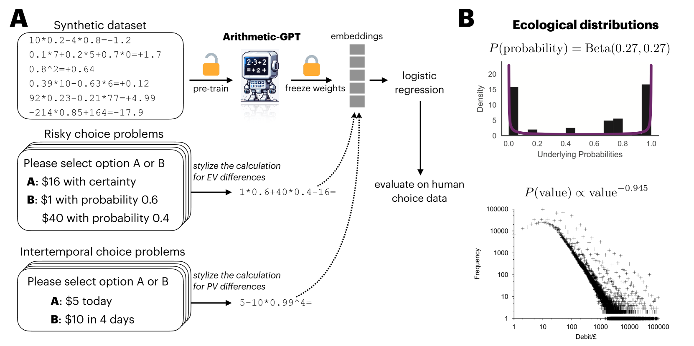
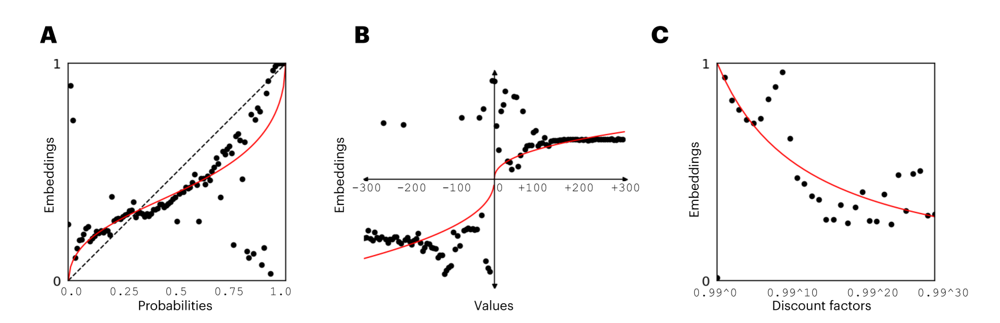

# 语言模型经算术训练后，能预测人类的风险决策与时间偏好选择

发布时间：2024年05月29日

`LLM理论

理由：这篇论文探讨了大型语言模型（LLMs）作为人类认知模型的可能性，并提出了一种创新策略来提升LLMs在这方面的效用。它涉及对LLMs的训练数据和任务分布的深入分析，以及如何通过特定的预训练来提高LLMs在预测人类行为方面的准确性。这些内容更多地关注LLMs的理论发展和内部机制，而不是它们的实际应用或与其他系统的交互，因此更适合归类为LLM理论。` `认知科学` `决策分析`

> Language Models Trained to do Arithmetic Predict Human Risky and Intertemporal Choice

# 摘要

> 人类与大型语言模型（LLMs）行为上的相似性激发了研究者探索LLMs作为人类认知模型的可能性。但在此之前，我们必须克服几个关键挑战：LLMs训练的数据量远超人类日常接触，且可能在特定认知任务中直接使用人类数据或与人类偏好对齐，这使得行为相似性的根源尚不明朗。本文提出了一种创新策略，旨在提升LLMs作为认知模型的效用。该策略涉及两个方面：一是利用LLM和理性代理都需要掌握的计算等价任务来解决认知问题；二是探究使LLM展现人类行为所需的具体任务分布。我们特别关注了决策领域中的风险选择和跨期选择，其中预期价值计算的算术是关键的计算等价任务。我们发现，一个名为Arithmetic-GPT的LLM，在生态有效的算术数据集上预训练后，能更准确地预测人类行为，优于众多传统认知模型。这表明，在生态有效的算术数据集上预训练的LLMs能与人类决策产生强烈共鸣。此外，我们的研究还强调，作为认知模型的LLMs应通过对其预训练数据的深入消融研究进行细致考察。

> The observed similarities in the behavior of humans and Large Language Models (LLMs) have prompted researchers to consider the potential of using LLMs as models of human cognition. However, several significant challenges must be addressed before LLMs can be legitimately regarded as cognitive models. For instance, LLMs are trained on far more data than humans typically encounter, and may have been directly trained on human data in specific cognitive tasks or aligned with human preferences. Consequently, the origins of these behavioral similarities are not well understood. In this paper, we propose a novel way to enhance the utility of LLMs as cognitive models. This approach involves (i) leveraging computationally equivalent tasks that both an LLM and a rational agent need to master for solving a cognitive problem and (ii) examining the specific task distributions required for an LLM to exhibit human-like behaviors. We apply this approach to decision-making -- specifically risky and intertemporal choice -- where the key computationally equivalent task is the arithmetic of expected value calculations. We show that an LLM pretrained on an ecologically valid arithmetic dataset, which we call Arithmetic-GPT, predicts human behavior better than many traditional cognitive models. Pretraining LLMs on ecologically valid arithmetic datasets is sufficient to produce a strong correspondence between these models and human decision-making. Our results also suggest that LLMs used as cognitive models should be carefully investigated via ablation studies of the pretraining data.

[Arxiv](https://arxiv.org/abs/2405.19313)