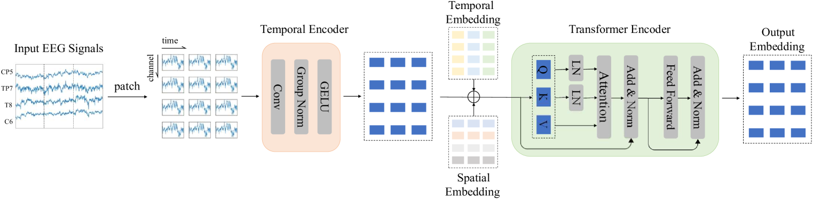
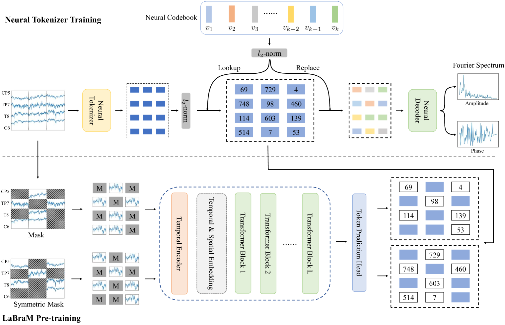
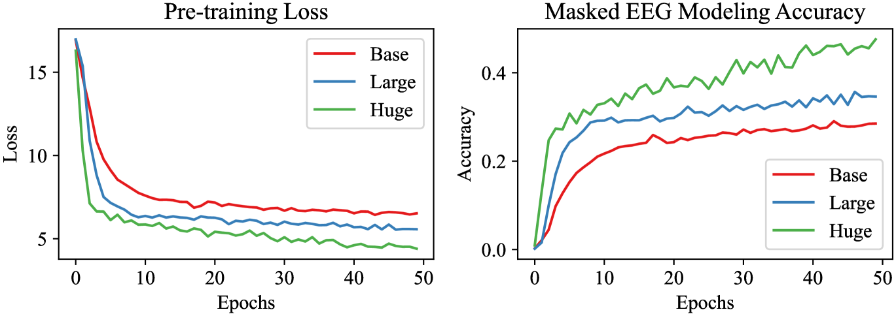
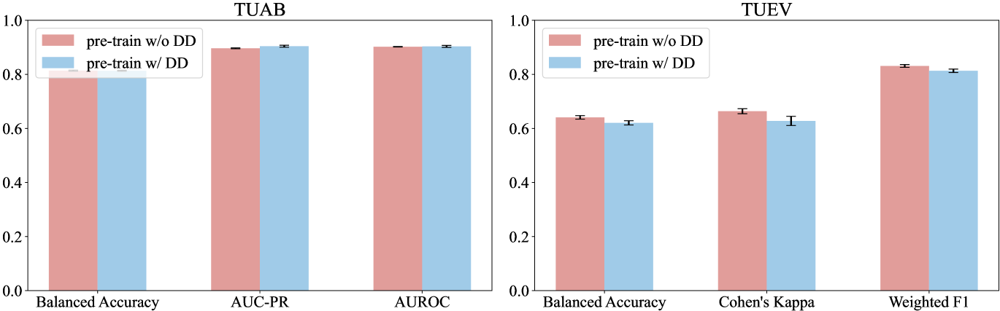
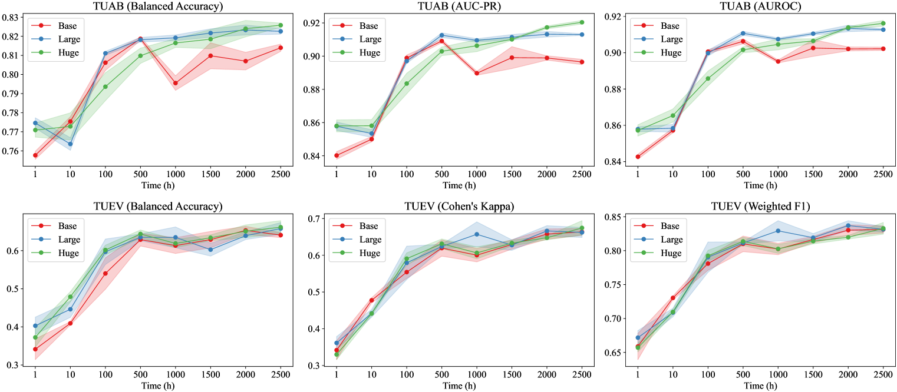
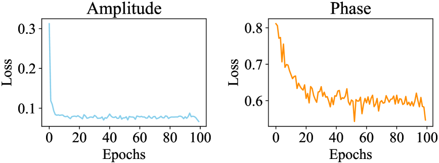
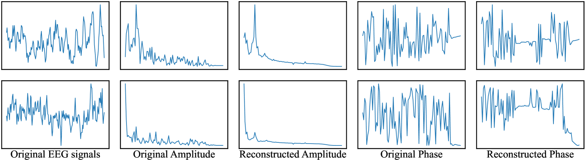
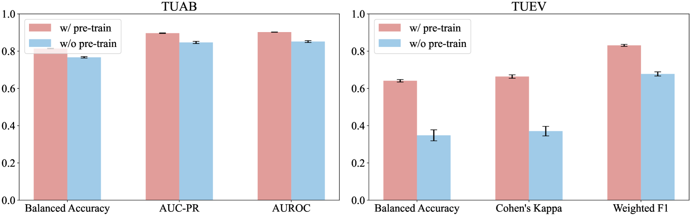

# 在脑机接口（BCI）领域，大型脑模型正利用庞大的EEG数据集来学习通用表示，展现出其强大的学习能力。

发布时间：2024年05月29日

`LLM应用

理由：这篇论文探讨了大型EEG模型（LEMs）的应用，特别是在EEG信号处理领域的应用。它提出了一个名为Large Brain Model（LaBraM）的统一EEG基础模型，旨在通过无监督预训练和微调来提高模型对EEG信号的通用感知力和泛化能力。这与大型语言模型（LLMs）在文本处理上的应用类似，因此属于LLM应用类别。论文中提到的模型设计和实验验证都是在实际的EEG数据集上进行的，强调了其在多个下游任务上的应用效果，这进一步支持了其分类为LLM应用。` `脑机接口` `神经科学`

> Large Brain Model for Learning Generic Representations with Tremendous EEG Data in BCI

# 摘要

> 当前的EEG深度学习模型多针对特定BCI数据集设计，限制了其感知与泛化能力。借鉴LLMs在文本处理上的成功，我们探索了大型EEG模型（LEMs），旨在通过无监督预训练赋予模型对EEG信号的通用感知力，并针对各类下游任务进行微调。但EEG数据集规模小、格式多变，如电极数不一、样本长度不等、任务设计多样、信噪比低。为此，我们提出了统一EEG基础模型——Large Brain Model（LaBraM），通过将EEG信号分割成通道补丁实现跨数据集学习，并利用向量量化神经频谱预测训练出能将连续EEG通道补丁编码为紧凑神经代码的神经标记器。LaBraM在约2,500小时的多样EEG信号上预训练，并在多个下游任务上验证，结果显示其在异常检测、事件分类、情绪识别及步态预测等领域均超越了现有最佳方法。代码地址：https://github.com/935963004/LaBraM。

> The current electroencephalogram (EEG) based deep learning models are typically designed for specific datasets and applications in brain-computer interaction (BCI), limiting the scale of the models and thus diminishing their perceptual capabilities and generalizability. Recently, Large Language Models (LLMs) have achieved unprecedented success in text processing, prompting us to explore the capabilities of Large EEG Models (LEMs). We hope that LEMs can break through the limitations of different task types of EEG datasets, and obtain universal perceptual capabilities of EEG signals through unsupervised pre-training. Then the models can be fine-tuned for different downstream tasks. However, compared to text data, the volume of EEG datasets is generally small and the format varies widely. For example, there can be mismatched numbers of electrodes, unequal length data samples, varied task designs, and low signal-to-noise ratio. To overcome these challenges, we propose a unified foundation model for EEG called Large Brain Model (LaBraM). LaBraM enables cross-dataset learning by segmenting the EEG signals into EEG channel patches. Vector-quantized neural spectrum prediction is used to train a semantically rich neural tokenizer that encodes continuous raw EEG channel patches into compact neural codes. We then pre-train neural Transformers by predicting the original neural codes for the masked EEG channel patches. The LaBraMs were pre-trained on about 2,500 hours of various types of EEG signals from around 20 datasets and validated on multiple different types of downstream tasks. Experiments on abnormal detection, event type classification, emotion recognition, and gait prediction show that our LaBraM outperforms all compared SOTA methods in their respective fields. Our code is available at https://github.com/935963004/LaBraM.

[Arxiv](https://arxiv.org/abs/2405.18765)