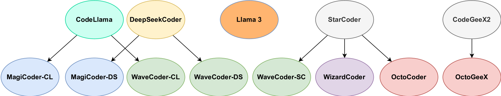

# 大型语言模型在代码摘要领域的应用

发布时间：2024年05月29日

`LLM应用

解析：这篇论文摘要主要讨论了大型语言模型（LLM）在软件工程领域的应用，特别是在代码生成和总结任务上的表现。这表明论文关注的是LLM在实际应用中的效能和能力，而不是LLM的理论研究或Agent的设计与应用。因此，最合适的分类是LLM应用。` `软件工程` `代码生成`

> Large Language Models for Code Summarization

# 摘要

> 近期，深度学习在软件工程领域的应用日益增多，尤其在代码生成与总结任务上，最新的编码大型语言模型展现出了优异的性能。本技术报告将审视这些模型在代码解释与总结任务上的表现，并深入探讨其基于自然语言描述的代码生成能力。

> Recently, there has been increasing activity in using deep learning for software engineering, including tasks like code generation and summarization. In particular, the most recent coding Large Language Models seem to perform well on these problems. In this technical report, we aim to review how these models perform in code explanation/summarization, while also investigating their code generation capabilities (based on natural language descriptions).

[Arxiv](https://arxiv.org/abs/2405.19032)