# 借助多对多关系抵御视觉-语言对抗攻击

发布时间：2024年05月29日

`Agent

理由：这篇论文主要探讨了视觉-语言模型（VL模型）在图像-文本检索任务（ITR）中对抗性攻击的防御策略。它特别关注了如何通过ITR的多对多特性来提升模型的抗干扰能力，并提出了一种新的防御策略。虽然这项工作涉及到了模型的应用和改进，但其核心在于模型的自我防御和增强，这与Agent的自主性和适应性特征相符。因此，将其归类为Agent更为合适。` `图像-文本检索` `对抗防御`

> Leveraging Many-To-Many Relationships for Defending Against Visual-Language Adversarial Attacks

# 摘要

> 最新研究表明，视觉-语言模型在图像-文本检索任务中易受对抗性攻击。然而，当前的防御措施多集中于零-shot图像分类，忽视了图像与文本的同步操纵以及ITR的多对多特性——一幅图像可有多种描述，反之亦然。本文首次探讨了针对此类攻击的防御策略，特别关注如何通过ITR的多对多关系提升模型的抗干扰能力。研究发现，尽管对抗训练易针对特定的一对一图像-文本对过度拟合，但采用多样化增强技术生成一对多或多对一的图像-文本对能显著增强模型的鲁棒性。同时，增强后的图像-文本对的匹配度对防御效果至关重要，不当的增强甚至会损害模型性能。基于此，我们提出了一种新策略，利用ITR的多对多关系，通过基本和生成模型增强技术，有效生成多样且高度匹配的N:N对。此研究为VL任务中的对抗防御提供了新思路，并为未来研究指明了新方向。

> Recent studies have revealed that vision-language (VL) models are vulnerable to adversarial attacks for image-text retrieval (ITR). However, existing defense strategies for VL models primarily focus on zero-shot image classification, which do not consider the simultaneous manipulation of image and text, as well as the inherent many-to-many (N:N) nature of ITR, where a single image can be described in numerous ways, and vice versa. To this end, this paper studies defense strategies against adversarial attacks on VL models for ITR for the first time. Particularly, we focus on how to leverage the N:N relationship in ITR to enhance adversarial robustness. We found that, although adversarial training easily overfits to specific one-to-one (1:1) image-text pairs in the train data, diverse augmentation techniques to create one-to-many (1:N) / many-to-one (N:1) image-text pairs can significantly improve adversarial robustness in VL models. Additionally, we show that the alignment of the augmented image-text pairs is crucial for the effectiveness of the defense strategy, and that inappropriate augmentations can even degrade the model's performance. Based on these findings, we propose a novel defense strategy that leverages the N:N relationship in ITR, which effectively generates diverse yet highly-aligned N:N pairs using basic augmentations and generative model-based augmentations. This work provides a novel perspective on defending against adversarial attacks in VL tasks and opens up new research directions for future work.

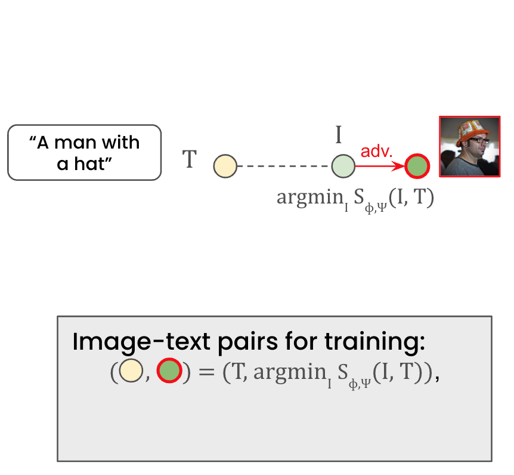

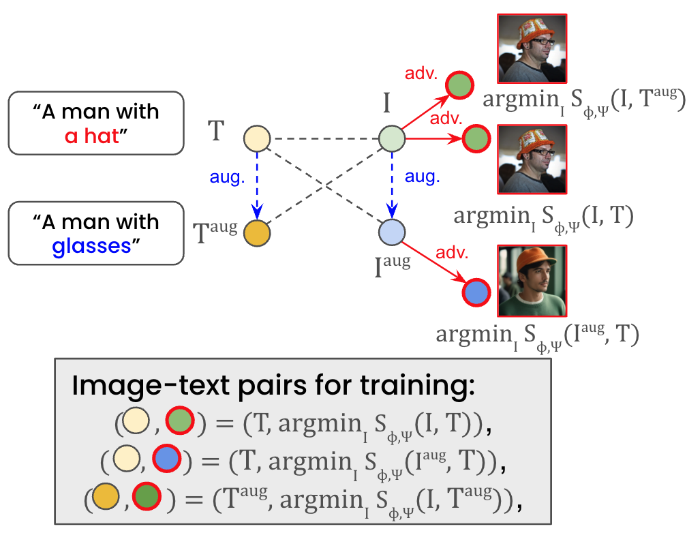

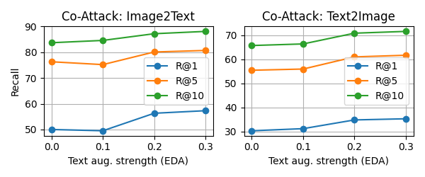

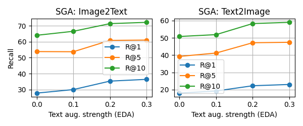

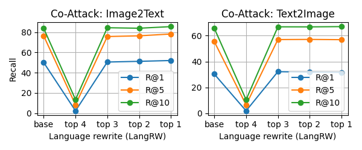

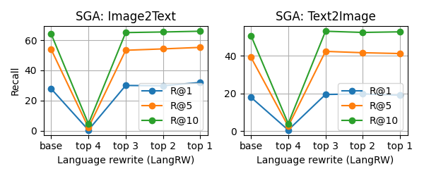

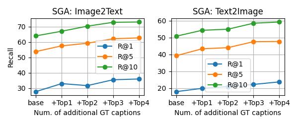

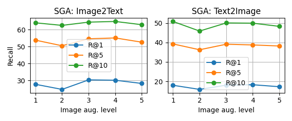

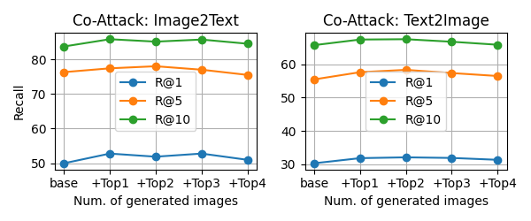

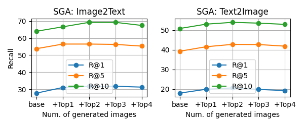

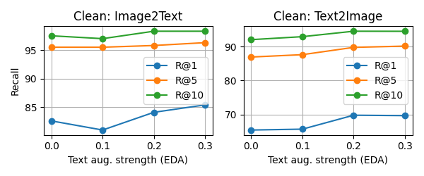

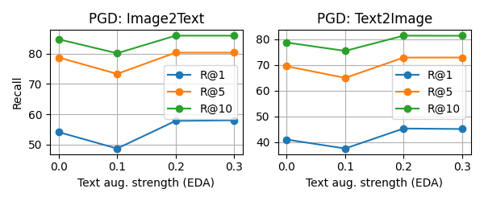

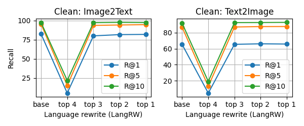

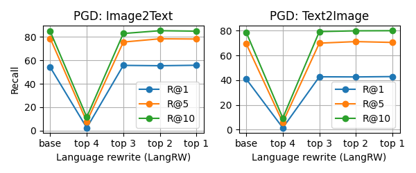

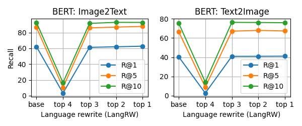

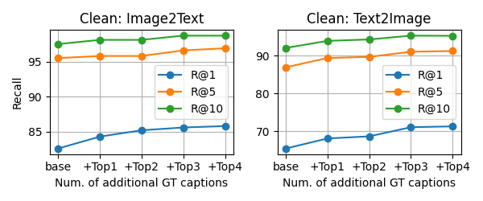

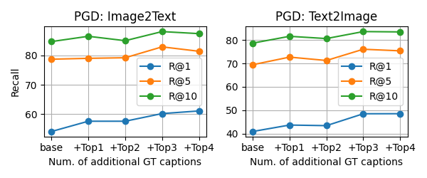

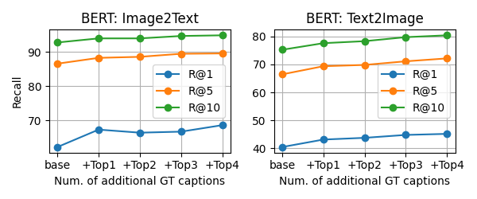

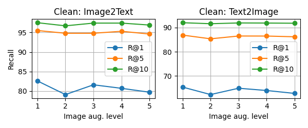

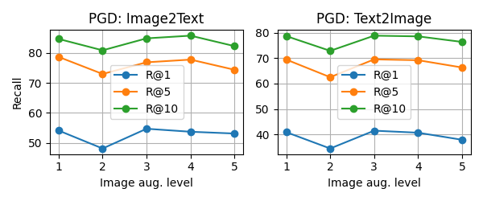

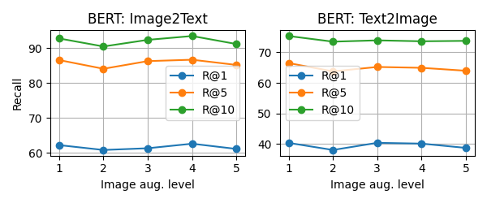

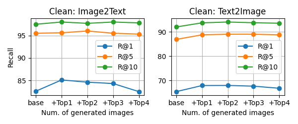

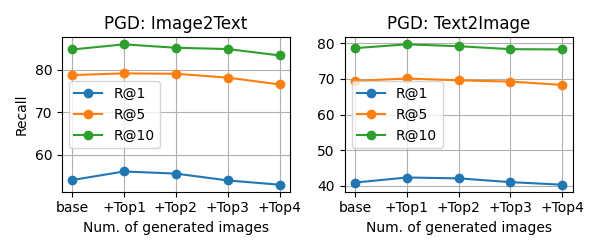

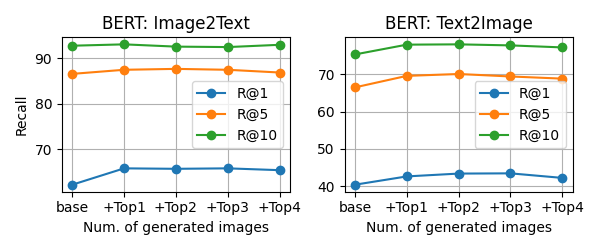

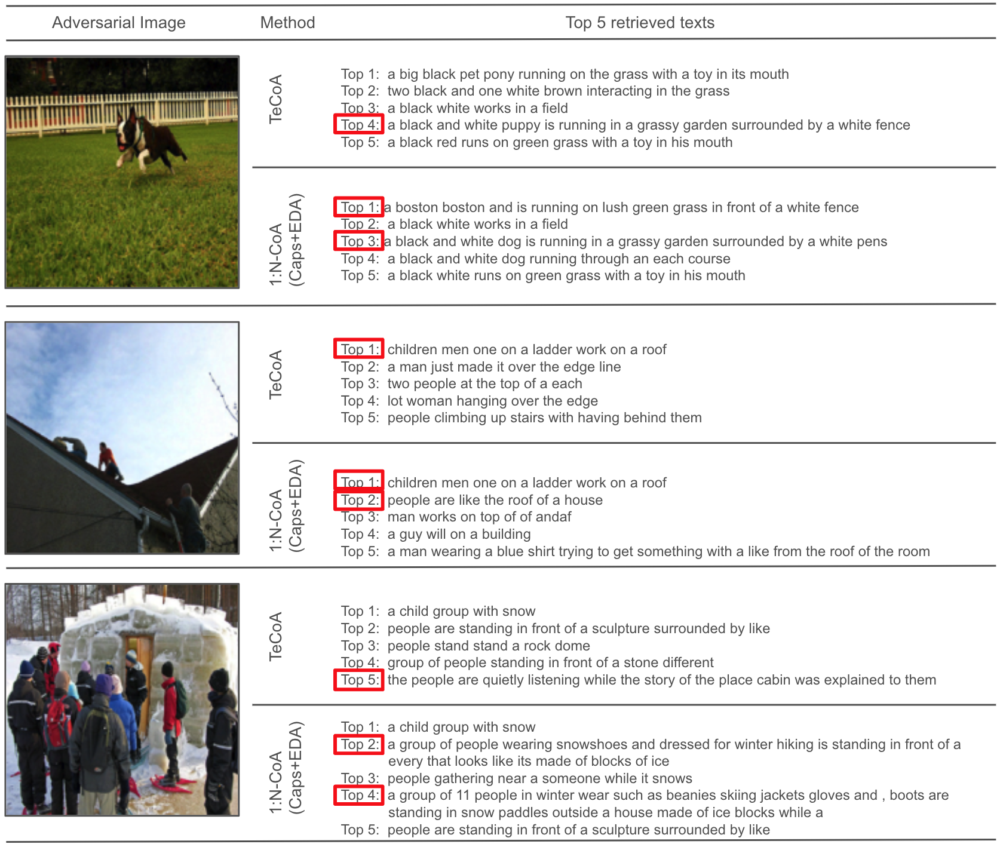

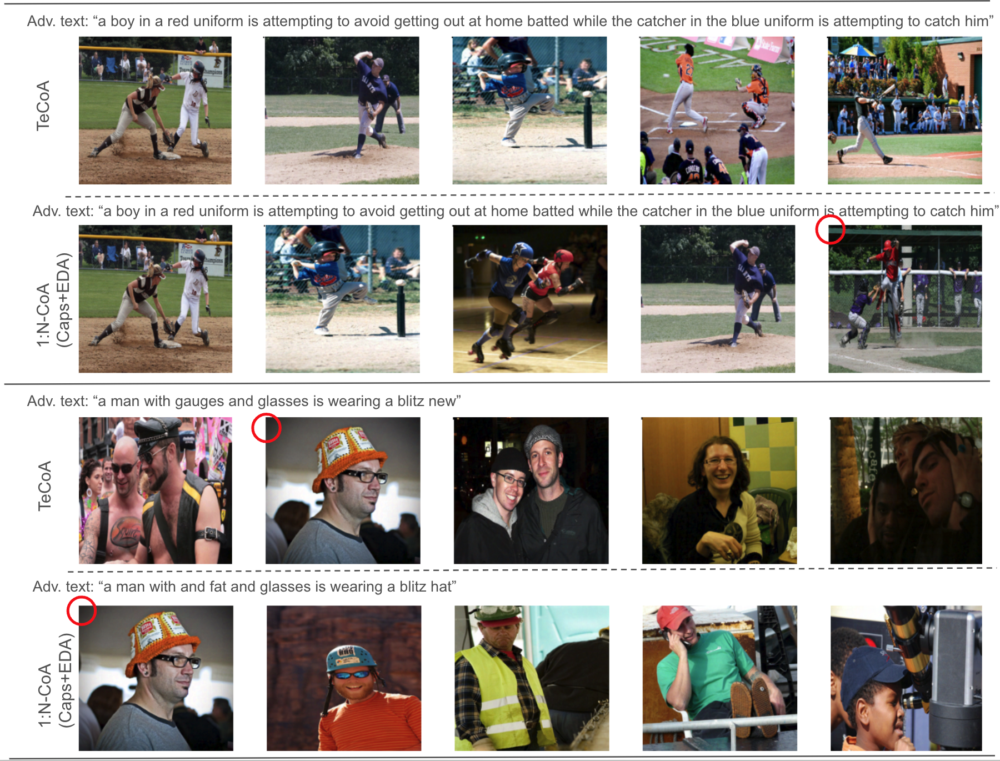

[Arxiv](https://arxiv.org/abs/2405.18770)