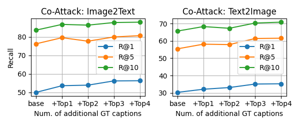
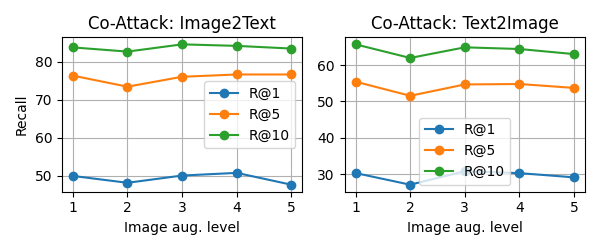
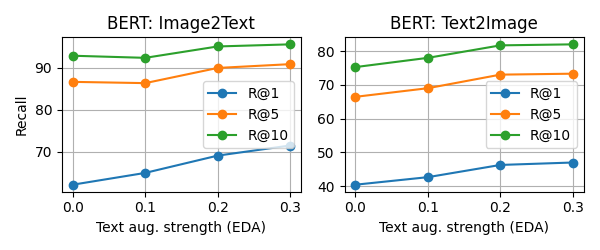

# 借助多对多关系抵御视觉-语言对抗攻击

发布时间：2024年05月29日

`Agent

这篇论文主要探讨了视觉-语言模型在图像与文本检索任务中对抗性攻击的防御策略，特别关注了如何利用多对多关系提升模型的抗干扰能力。研究内容涉及模型的具体应用和改进，以增强其在特定任务中的表现和鲁棒性，这更符合Agent类别的定义，即关注模型在特定环境或任务中的应用和性能优化。` `图像检索`

> Leveraging Many-To-Many Relationships for Defending Against Visual-Language Adversarial Attacks

# 摘要

> 最新研究表明，视觉-语言模型在图像与文本检索任务中易受对抗性攻击。然而，现有防御措施多聚焦于零样本图像分类，忽略了图像与文本的同步操控，以及检索任务中固有的多对多关系——一幅图像可有多种描述，反之亦然。为此，本文首次探讨了针对此类攻击的防御策略，特别关注如何利用多对多关系提升模型的抗干扰能力。我们发现，尽管对抗训练易针对特定的一对一图像文本对过拟合，但通过多样化的增强技术创造一对多或多对一的配对，能显著增强模型的抗干扰性。同时，我们强调，增强后的图像文本对的对齐至关重要，不当的增强反而会损害模型性能。基于此，我们提出了一种新策略，利用多对多关系，通过基础和生成模型增强，有效生成多样且高度对齐的配对。这一研究为视觉-语言任务的防御提供了新思路，并为未来研究指明了新方向。

> Recent studies have revealed that vision-language (VL) models are vulnerable to adversarial attacks for image-text retrieval (ITR). However, existing defense strategies for VL models primarily focus on zero-shot image classification, which do not consider the simultaneous manipulation of image and text, as well as the inherent many-to-many (N:N) nature of ITR, where a single image can be described in numerous ways, and vice versa. To this end, this paper studies defense strategies against adversarial attacks on VL models for ITR for the first time. Particularly, we focus on how to leverage the N:N relationship in ITR to enhance adversarial robustness. We found that, although adversarial training easily overfits to specific one-to-one (1:1) image-text pairs in the train data, diverse augmentation techniques to create one-to-many (1:N) / many-to-one (N:1) image-text pairs can significantly improve adversarial robustness in VL models. Additionally, we show that the alignment of the augmented image-text pairs is crucial for the effectiveness of the defense strategy, and that inappropriate augmentations can even degrade the model's performance. Based on these findings, we propose a novel defense strategy that leverages the N:N relationship in ITR, which effectively generates diverse yet highly-aligned N:N pairs using basic augmentations and generative model-based augmentations. This work provides a novel perspective on defending against adversarial attacks in VL tasks and opens up new research directions for future work.

[Arxiv](https://arxiv.org/abs/2405.18770)