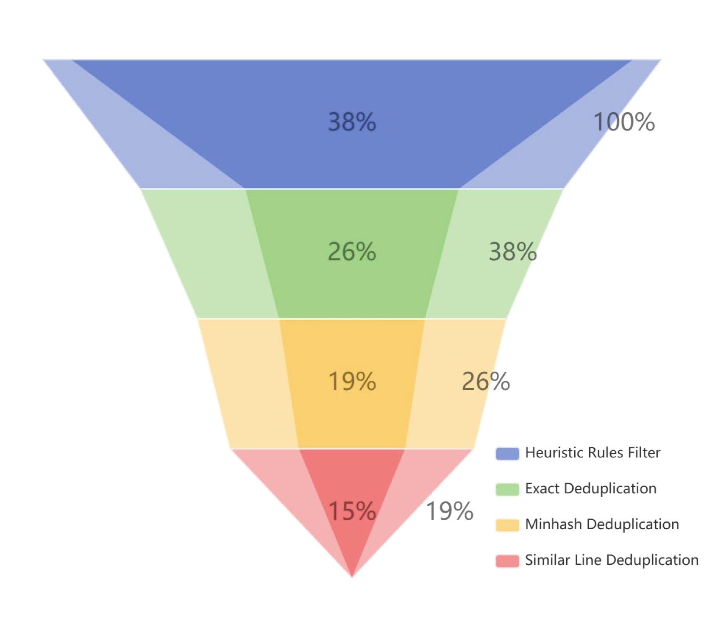

# MAP-Neo系列：高效透明的双语大型语言模型，兼具强大能力。

发布时间：2024年05月29日

`LLM应用

这篇论文主要介绍了MAP-Neo，一个70亿参数的双语大型语言模型（LLM），它是首个完全开源且性能可比的双语LLM。论文不仅开源了模型，还提供了所有重现所需的细节，包括清理后的预训练数据、数据处理流程、模型检查点及优化的训练/评估框架。这些内容主要关注于LLM的实际应用和开源实践，旨在推动LLMs的持续进步。因此，这篇论文最适合归类为LLM应用。` `人工智能`

> MAP-Neo: Highly Capable and Transparent Bilingual Large Language Model Series

# 摘要

> 近年来，大型语言模型（LLMs）在各类任务上取得了突破性进展。然而，由于商业考量，顶尖模型如GPT、Gemini和Claude的训练细节并未公开，仅通过专有接口提供服务。近期，多家机构开源了性能强劲的LLMs，如LLaMA-3，与闭源模型不相上下。尽管如此，这些开源模型仅提供了权重，关键细节如预训练数据和代码等仍未公开。为此，研究界推动了真正开放的LLMs（如Pythia、Amber、OLMo），提供了更多训练细节，推动了大型模型的科学研究。尽管如此，在推理、知识和编码任务上，这些开放模型仍不及同规模的最先进模型。因此，我们推出了MAP-Neo，一个70亿参数的双语LLM，从头训练于4.5万亿高质量令牌，是首个完全开源且性能可比的双语LLM。我们不仅开源了模型，还提供了所有重现所需的细节，包括清理后的预训练数据、数据处理流程、模型检查点及优化的训练/评估框架。我们期望MAP-Neo能强化开放研究社区，激发创新，推动LLMs的持续进步。

> Large Language Models (LLMs) have made great strides in recent years to achieve unprecedented performance across different tasks. However, due to commercial interest, the most competitive models like GPT, Gemini, and Claude have been gated behind proprietary interfaces without disclosing the training details. Recently, many institutions have open-sourced several strong LLMs like LLaMA-3, comparable to existing closed-source LLMs. However, only the model's weights are provided with most details (e.g., intermediate checkpoints, pre-training corpus, and training code, etc.) being undisclosed. To improve the transparency of LLMs, the research community has formed to open-source truly open LLMs (e.g., Pythia, Amber, OLMo), where more details (e.g., pre-training corpus and training code) are being provided. These models have greatly advanced the scientific study of these large models including their strengths, weaknesses, biases and risks. However, we observe that the existing truly open LLMs on reasoning, knowledge, and coding tasks are still inferior to existing state-of-the-art LLMs with similar model sizes. To this end, we open-source MAP-Neo, a highly capable and transparent bilingual language model with 7B parameters trained from scratch on 4.5T high-quality tokens. Our MAP-Neo is the first fully open-sourced bilingual LLM with comparable performance compared to existing state-of-the-art LLMs. Moreover, we open-source all details to reproduce our MAP-Neo, where the cleaned pre-training corpus, data cleaning pipeline, checkpoints, and well-optimized training/evaluation framework are provided. Finally, we hope our MAP-Neo will enhance and strengthen the open research community and inspire more innovations and creativities to facilitate the further improvements of LLMs.

[Arxiv](https://arxiv.org/abs/2405.19327)